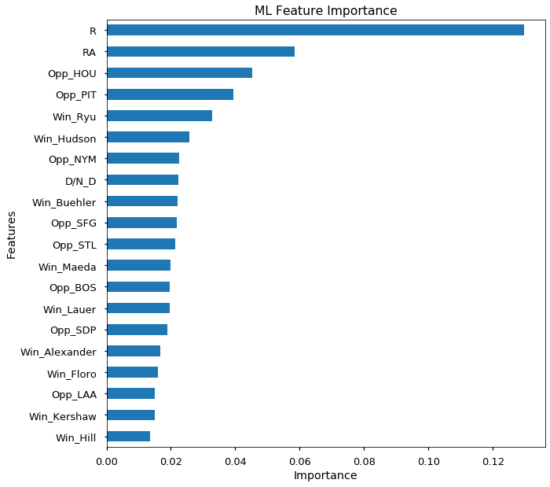
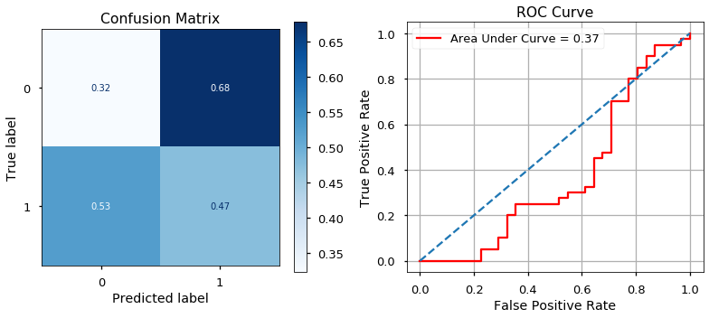
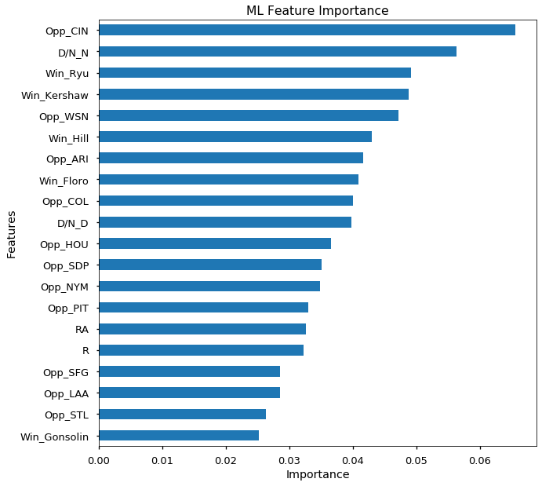

This notebook contains all the code for the modeling part of this project, which is to use previous game data to predict the likelihood of the Dodgers winning and losing their next game. The first step is importing the necessary data from the pickles were saved, which in this case will be the boxscore data. There are 4 models that will be ran, in total:
>* Random Forest
* XGBoost
* Naive Bayes
* K-Nearest Neighbors

# Boxscores

## 2018


```python
import pandas as pd
import pickle
pd.set_option('display.max_columns', 100)
pd.set_option('display.max_rows', 2000)
with open('Pickles/boxscore_2018.pickle', 'rb') as handle:
    boxscore_2018 = pickle.load(handle)
```


```python
boxscore_2018
```


<div>
<style scoped>
    .dataframe tbody tr th:only-of-type {
        vertical-align: middle;
    }

    .dataframe tbody tr th {
        vertical-align: top;
    }

    .dataframe thead th {
        text-align: right;
    }
</style>
<table border="1" class="dataframe">
  <thead>
    <tr style="text-align: right;">
      <th></th>
      <th>Opp</th>
      <th>W/L_df</th>
      <th>R</th>
      <th>RA</th>
      <th>Win</th>
      <th>Loss</th>
      <th>D/N</th>
      <th>Next_Game</th>
      <th>W/L_other</th>
    </tr>
    <tr>
      <th>Gm#</th>
      <th></th>
      <th></th>
      <th></th>
      <th></th>
      <th></th>
      <th></th>
      <th></th>
      <th></th>
      <th></th>
    </tr>
  </thead>
  <tbody>
    <tr>
      <td>1</td>
      <td>SFG</td>
      <td>L</td>
      <td>0</td>
      <td>1</td>
      <td>Blach</td>
      <td>Kershaw</td>
      <td>D</td>
      <td>2</td>
      <td>L</td>
    </tr>
    <tr>
      <td>2</td>
      <td>SFG</td>
      <td>L</td>
      <td>0</td>
      <td>1</td>
      <td>Watson</td>
      <td>Jansen</td>
      <td>N</td>
      <td>3</td>
      <td>W</td>
    </tr>
    <tr>
      <td>3</td>
      <td>SFG</td>
      <td>W</td>
      <td>5</td>
      <td>0</td>
      <td>Maeda</td>
      <td>Holland</td>
      <td>N</td>
      <td>4</td>
      <td>W</td>
    </tr>
    <tr>
      <td>4</td>
      <td>SFG</td>
      <td>W</td>
      <td>9</td>
      <td>0</td>
      <td>Hill</td>
      <td>Stratton</td>
      <td>N</td>
      <td>5</td>
      <td>NaN</td>
    </tr>
    <tr>
      <td>6</td>
      <td>ARI</td>
      <td>L</td>
      <td>1</td>
      <td>6</td>
      <td>Godley</td>
      <td>Kershaw</td>
      <td>N</td>
      <td>7</td>
      <td>L</td>
    </tr>
    <tr>
      <td>7</td>
      <td>ARI</td>
      <td>L</td>
      <td>0</td>
      <td>3</td>
      <td>Corbin</td>
      <td>Wood</td>
      <td>D</td>
      <td>8</td>
      <td>NaN</td>
    </tr>
    <tr>
      <td>9</td>
      <td>SFG</td>
      <td>W</td>
      <td>2</td>
      <td>1</td>
      <td>Fields</td>
      <td>Johnson</td>
      <td>D</td>
      <td>10</td>
      <td>W</td>
    </tr>
    <tr>
      <td>10</td>
      <td>OAK</td>
      <td>W</td>
      <td>4</td>
      <td>0</td>
      <td>Ryu</td>
      <td>Manaea</td>
      <td>N</td>
      <td>11</td>
      <td>L</td>
    </tr>
    <tr>
      <td>11</td>
      <td>OAK</td>
      <td>L</td>
      <td>6</td>
      <td>16</td>
      <td>Mengden</td>
      <td>Wood</td>
      <td>N</td>
      <td>12</td>
      <td>L</td>
    </tr>
    <tr>
      <td>12</td>
      <td>ARI</td>
      <td>L</td>
      <td>7</td>
      <td>8</td>
      <td>Greinke</td>
      <td>Maeda</td>
      <td>N</td>
      <td>13</td>
      <td>L</td>
    </tr>
    <tr>
      <td>13</td>
      <td>ARI</td>
      <td>L</td>
      <td>1</td>
      <td>9</td>
      <td>McFarland</td>
      <td>Hill</td>
      <td>N</td>
      <td>14</td>
      <td>W</td>
    </tr>
    <tr>
      <td>14</td>
      <td>ARI</td>
      <td>W</td>
      <td>7</td>
      <td>2</td>
      <td>Kershaw</td>
      <td>Godley</td>
      <td>D</td>
      <td>15</td>
      <td>W</td>
    </tr>
    <tr>
      <td>15</td>
      <td>SDP</td>
      <td>W</td>
      <td>10</td>
      <td>3</td>
      <td>Ryu</td>
      <td>Erlin</td>
      <td>N</td>
      <td>16</td>
      <td>W</td>
    </tr>
    <tr>
      <td>16</td>
      <td>SDP</td>
      <td>W</td>
      <td>7</td>
      <td>3</td>
      <td>Alexander</td>
      <td>Webb</td>
      <td>N</td>
      <td>17</td>
      <td>W</td>
    </tr>
    <tr>
      <td>17</td>
      <td>SDP</td>
      <td>W</td>
      <td>13</td>
      <td>4</td>
      <td>Maeda</td>
      <td>Perdomo</td>
      <td>N</td>
      <td>18</td>
      <td>L</td>
    </tr>
    <tr>
      <td>18</td>
      <td>WSN</td>
      <td>L</td>
      <td>2</td>
      <td>5</td>
      <td>Scherzer</td>
      <td>Kershaw</td>
      <td>N</td>
      <td>19</td>
      <td>W</td>
    </tr>
    <tr>
      <td>19</td>
      <td>WSN</td>
      <td>W</td>
      <td>4</td>
      <td>0</td>
      <td>Ryu</td>
      <td>Strasburg</td>
      <td>N</td>
      <td>20</td>
      <td>W</td>
    </tr>
    <tr>
      <td>20</td>
      <td>WSN</td>
      <td>W</td>
      <td>4</td>
      <td>3</td>
      <td>Fields</td>
      <td>Gott</td>
      <td>N</td>
      <td>21</td>
      <td>W</td>
    </tr>
    <tr>
      <td>21</td>
      <td>MIA</td>
      <td>W</td>
      <td>2</td>
      <td>1</td>
      <td>Liberatore</td>
      <td>Barraclough</td>
      <td>N</td>
      <td>22</td>
      <td>L</td>
    </tr>
    <tr>
      <td>22</td>
      <td>MIA</td>
      <td>L</td>
      <td>2</td>
      <td>3</td>
      <td>Steckenrider</td>
      <td>Baez</td>
      <td>N</td>
      <td>23</td>
      <td>L</td>
    </tr>
    <tr>
      <td>23</td>
      <td>MIA</td>
      <td>L</td>
      <td>6</td>
      <td>8</td>
      <td>Gonzalez</td>
      <td>Kershaw</td>
      <td>D</td>
      <td>24</td>
      <td>L</td>
    </tr>
    <tr>
      <td>24</td>
      <td>SFG</td>
      <td>L</td>
      <td>4</td>
      <td>6</td>
      <td>Dyson</td>
      <td>Cingrani</td>
      <td>N</td>
      <td>25</td>
      <td>W</td>
    </tr>
    <tr>
      <td>25</td>
      <td>SFG</td>
      <td>W</td>
      <td>15</td>
      <td>6</td>
      <td>Buehler</td>
      <td>Stratton</td>
      <td>D</td>
      <td>26</td>
      <td>L</td>
    </tr>
    <tr>
      <td>26</td>
      <td>SFG</td>
      <td>L</td>
      <td>3</td>
      <td>8</td>
      <td>Cueto</td>
      <td>Wood</td>
      <td>N</td>
      <td>27</td>
      <td>L</td>
    </tr>
    <tr>
      <td>27</td>
      <td>SFG</td>
      <td>L</td>
      <td>2</td>
      <td>4</td>
      <td>Blach</td>
      <td>Maeda</td>
      <td>D</td>
      <td>28</td>
      <td>L</td>
    </tr>
    <tr>
      <td>28</td>
      <td>ARI</td>
      <td>L</td>
      <td>5</td>
      <td>8</td>
      <td>Greinke</td>
      <td>Stripling</td>
      <td>N</td>
      <td>29</td>
      <td>L</td>
    </tr>
    <tr>
      <td>29</td>
      <td>ARI</td>
      <td>L</td>
      <td>3</td>
      <td>4</td>
      <td>Bracho</td>
      <td>Liberatore</td>
      <td>N</td>
      <td>30</td>
      <td>W</td>
    </tr>
    <tr>
      <td>30</td>
      <td>ARI</td>
      <td>W</td>
      <td>2</td>
      <td>1</td>
      <td>Hudson</td>
      <td>Godley</td>
      <td>N</td>
      <td>31</td>
      <td>W</td>
    </tr>
    <tr>
      <td>31</td>
      <td>ARI</td>
      <td>W</td>
      <td>5</td>
      <td>2</td>
      <td>Chargois</td>
      <td>Salas</td>
      <td>D</td>
      <td>32</td>
      <td>W</td>
    </tr>
    <tr>
      <td>32</td>
      <td>SDP</td>
      <td>W</td>
      <td>4</td>
      <td>0</td>
      <td>Buehler</td>
      <td>Lucchesi</td>
      <td>N</td>
      <td>33</td>
      <td>L</td>
    </tr>
    <tr>
      <td>33</td>
      <td>SDP</td>
      <td>L</td>
      <td>4</td>
      <td>7</td>
      <td>Yates</td>
      <td>Fields</td>
      <td>N</td>
      <td>34</td>
      <td>L</td>
    </tr>
    <tr>
      <td>34</td>
      <td>SDP</td>
      <td>L</td>
      <td>0</td>
      <td>3</td>
      <td>Lauer</td>
      <td>Cingrani</td>
      <td>D</td>
      <td>35</td>
      <td>L</td>
    </tr>
    <tr>
      <td>35</td>
      <td>ARI</td>
      <td>L</td>
      <td>5</td>
      <td>8</td>
      <td>McFarland</td>
      <td>Garcia</td>
      <td>N</td>
      <td>36</td>
      <td>W</td>
    </tr>
    <tr>
      <td>36</td>
      <td>ARI</td>
      <td>W</td>
      <td>6</td>
      <td>3</td>
      <td>Baez</td>
      <td>Salas</td>
      <td>N</td>
      <td>37</td>
      <td>L</td>
    </tr>
    <tr>
      <td>37</td>
      <td>CIN</td>
      <td>L</td>
      <td>1</td>
      <td>4</td>
      <td>Mahle</td>
      <td>Buehler</td>
      <td>N</td>
      <td>38</td>
      <td>L</td>
    </tr>
    <tr>
      <td>38</td>
      <td>CIN</td>
      <td>L</td>
      <td>2</td>
      <td>6</td>
      <td>Brice</td>
      <td>Maeda</td>
      <td>N</td>
      <td>39</td>
      <td>L</td>
    </tr>
    <tr>
      <td>39</td>
      <td>CIN</td>
      <td>L</td>
      <td>3</td>
      <td>5</td>
      <td>Bailey</td>
      <td>Chargois</td>
      <td>N</td>
      <td>40</td>
      <td>L</td>
    </tr>
    <tr>
      <td>40</td>
      <td>CIN</td>
      <td>L</td>
      <td>3</td>
      <td>5</td>
      <td>Castillo</td>
      <td>Hill</td>
      <td>D</td>
      <td>41</td>
      <td>L</td>
    </tr>
    <tr>
      <td>41</td>
      <td>MIA</td>
      <td>L</td>
      <td>2</td>
      <td>4</td>
      <td>Wittgren</td>
      <td>Wood</td>
      <td>N</td>
      <td>42</td>
      <td>L</td>
    </tr>
    <tr>
      <td>42</td>
      <td>MIA</td>
      <td>L</td>
      <td>5</td>
      <td>6</td>
      <td>Steckenrider</td>
      <td>Baez</td>
      <td>N</td>
      <td>43</td>
      <td>W</td>
    </tr>
    <tr>
      <td>43</td>
      <td>MIA</td>
      <td>W</td>
      <td>7</td>
      <td>0</td>
      <td>Maeda</td>
      <td>Smith</td>
      <td>D</td>
      <td>44</td>
      <td>W</td>
    </tr>
    <tr>
      <td>44</td>
      <td>WSN</td>
      <td>W</td>
      <td>4</td>
      <td>1</td>
      <td>Stripling</td>
      <td>Roark</td>
      <td>D</td>
      <td>45</td>
      <td>W</td>
    </tr>
    <tr>
      <td>45</td>
      <td>WSN</td>
      <td>W</td>
      <td>5</td>
      <td>4</td>
      <td>Goeddel</td>
      <td>Doolittle</td>
      <td>N</td>
      <td>46</td>
      <td>W</td>
    </tr>
    <tr>
      <td>46</td>
      <td>WSN</td>
      <td>W</td>
      <td>7</td>
      <td>2</td>
      <td>Wood</td>
      <td>Strasburg</td>
      <td>D</td>
      <td>47</td>
      <td>L</td>
    </tr>
    <tr>
      <td>47</td>
      <td>COL</td>
      <td>L</td>
      <td>1</td>
      <td>2</td>
      <td>Marquez</td>
      <td>Baez</td>
      <td>N</td>
      <td>48</td>
      <td>W</td>
    </tr>
    <tr>
      <td>48</td>
      <td>COL</td>
      <td>W</td>
      <td>5</td>
      <td>3</td>
      <td>Chargois</td>
      <td>Shaw</td>
      <td>N</td>
      <td>49</td>
      <td>W</td>
    </tr>
    <tr>
      <td>49</td>
      <td>COL</td>
      <td>W</td>
      <td>3</td>
      <td>0</td>
      <td>Maeda</td>
      <td>Freeland</td>
      <td>N</td>
      <td>50</td>
      <td>W</td>
    </tr>
    <tr>
      <td>50</td>
      <td>SDP</td>
      <td>W</td>
      <td>4</td>
      <td>1</td>
      <td>Stripling</td>
      <td>Richard</td>
      <td>N</td>
      <td>51</td>
      <td>L</td>
    </tr>
    <tr>
      <td>51</td>
      <td>SDP</td>
      <td>L</td>
      <td>5</td>
      <td>7</td>
      <td>Stammen</td>
      <td>Hudson</td>
      <td>N</td>
      <td>52</td>
      <td>W</td>
    </tr>
    <tr>
      <td>52</td>
      <td>SDP</td>
      <td>W</td>
      <td>6</td>
      <td>1</td>
      <td>Buehler</td>
      <td>Cimber</td>
      <td>D</td>
      <td>53</td>
      <td>W</td>
    </tr>
    <tr>
      <td>53</td>
      <td>PHI</td>
      <td>W</td>
      <td>5</td>
      <td>4</td>
      <td>Garcia</td>
      <td>Morgan</td>
      <td>N</td>
      <td>54</td>
      <td>L</td>
    </tr>
    <tr>
      <td>54</td>
      <td>PHI</td>
      <td>L</td>
      <td>1</td>
      <td>6</td>
      <td>Arrieta</td>
      <td>Maeda</td>
      <td>N</td>
      <td>55</td>
      <td>W</td>
    </tr>
    <tr>
      <td>55</td>
      <td>PHI</td>
      <td>W</td>
      <td>8</td>
      <td>2</td>
      <td>Stripling</td>
      <td>Eflin</td>
      <td>N</td>
      <td>56</td>
      <td>L</td>
    </tr>
    <tr>
      <td>56</td>
      <td>PHI</td>
      <td>L</td>
      <td>1</td>
      <td>2</td>
      <td>Nola</td>
      <td>Fields</td>
      <td>D</td>
      <td>57</td>
      <td>W</td>
    </tr>
    <tr>
      <td>57</td>
      <td>COL</td>
      <td>W</td>
      <td>11</td>
      <td>8</td>
      <td>Santana</td>
      <td>Pounders</td>
      <td>N</td>
      <td>58</td>
      <td>W</td>
    </tr>
    <tr>
      <td>58</td>
      <td>COL</td>
      <td>W</td>
      <td>12</td>
      <td>4</td>
      <td>Baez</td>
      <td>Shaw</td>
      <td>N</td>
      <td>59</td>
      <td>W</td>
    </tr>
    <tr>
      <td>59</td>
      <td>COL</td>
      <td>W</td>
      <td>10</td>
      <td>7</td>
      <td>Cingrani</td>
      <td>Davis</td>
      <td>D</td>
      <td>60</td>
      <td>W</td>
    </tr>
    <tr>
      <td>60</td>
      <td>PIT</td>
      <td>W</td>
      <td>5</td>
      <td>0</td>
      <td>Stripling</td>
      <td>Musgrove</td>
      <td>N</td>
      <td>61</td>
      <td>L</td>
    </tr>
    <tr>
      <td>61</td>
      <td>PIT</td>
      <td>L</td>
      <td>9</td>
      <td>11</td>
      <td>Brault</td>
      <td>Hudson</td>
      <td>N</td>
      <td>62</td>
      <td>W</td>
    </tr>
    <tr>
      <td>62</td>
      <td>PIT</td>
      <td>W</td>
      <td>8</td>
      <td>7</td>
      <td>Baez</td>
      <td>Taillon</td>
      <td>D</td>
      <td>63</td>
      <td>W</td>
    </tr>
    <tr>
      <td>63</td>
      <td>ATL</td>
      <td>W</td>
      <td>7</td>
      <td>3</td>
      <td>Buehler</td>
      <td>McCarthy</td>
      <td>N</td>
      <td>64</td>
      <td>L</td>
    </tr>
    <tr>
      <td>64</td>
      <td>ATL</td>
      <td>L</td>
      <td>3</td>
      <td>5</td>
      <td>Sanchez</td>
      <td>Wood</td>
      <td>N</td>
      <td>65</td>
      <td>W</td>
    </tr>
    <tr>
      <td>65</td>
      <td>ATL</td>
      <td>W</td>
      <td>7</td>
      <td>2</td>
      <td>Stripling</td>
      <td>Newcomb</td>
      <td>D</td>
      <td>66</td>
      <td>W</td>
    </tr>
    <tr>
      <td>66</td>
      <td>TEX</td>
      <td>W</td>
      <td>12</td>
      <td>5</td>
      <td>Paredes</td>
      <td>Colon</td>
      <td>N</td>
      <td>67</td>
      <td>NaN</td>
    </tr>
    <tr>
      <td>68</td>
      <td>SFG</td>
      <td>W</td>
      <td>3</td>
      <td>2</td>
      <td>Stripling</td>
      <td>Holland</td>
      <td>N</td>
      <td>69</td>
      <td>W</td>
    </tr>
    <tr>
      <td>69</td>
      <td>SFG</td>
      <td>W</td>
      <td>3</td>
      <td>1</td>
      <td>Wood</td>
      <td>Bumgarner</td>
      <td>N</td>
      <td>70</td>
      <td>L</td>
    </tr>
    <tr>
      <td>70</td>
      <td>SFG</td>
      <td>L</td>
      <td>1</td>
      <td>4</td>
      <td>Stratton</td>
      <td>Ferguson</td>
      <td>D</td>
      <td>71</td>
      <td>W</td>
    </tr>
    <tr>
      <td>71</td>
      <td>CHC</td>
      <td>W</td>
      <td>4</td>
      <td>3</td>
      <td>Paredes</td>
      <td>Wilson</td>
      <td>D</td>
      <td>72</td>
      <td>NaN</td>
    </tr>
    <tr>
      <td>73</td>
      <td>CHC</td>
      <td>L</td>
      <td>0</td>
      <td>4</td>
      <td>Lester</td>
      <td>Stripling</td>
      <td>D</td>
      <td>74</td>
      <td>W</td>
    </tr>
    <tr>
      <td>74</td>
      <td>NYM</td>
      <td>W</td>
      <td>5</td>
      <td>2</td>
      <td>Wood</td>
      <td>Wheeler</td>
      <td>N</td>
      <td>75</td>
      <td>W</td>
    </tr>
    <tr>
      <td>75</td>
      <td>NYM</td>
      <td>W</td>
      <td>8</td>
      <td>3</td>
      <td>Ferguson</td>
      <td>deGrom</td>
      <td>N</td>
      <td>76</td>
      <td>W</td>
    </tr>
    <tr>
      <td>76</td>
      <td>NYM</td>
      <td>W</td>
      <td>8</td>
      <td>7</td>
      <td>Hudson</td>
      <td>Flexen</td>
      <td>D</td>
      <td>77</td>
      <td>W</td>
    </tr>
    <tr>
      <td>77</td>
      <td>CHC</td>
      <td>W</td>
      <td>2</td>
      <td>1</td>
      <td>Maeda</td>
      <td>Underwood</td>
      <td>N</td>
      <td>78</td>
      <td>L</td>
    </tr>
    <tr>
      <td>78</td>
      <td>CHC</td>
      <td>L</td>
      <td>4</td>
      <td>9</td>
      <td>Lester</td>
      <td>Garcia</td>
      <td>N</td>
      <td>79</td>
      <td>W</td>
    </tr>
    <tr>
      <td>79</td>
      <td>CHC</td>
      <td>W</td>
      <td>7</td>
      <td>5</td>
      <td>Wood</td>
      <td>Hendricks</td>
      <td>N</td>
      <td>80</td>
      <td>L</td>
    </tr>
    <tr>
      <td>80</td>
      <td>CHC</td>
      <td>L</td>
      <td>5</td>
      <td>11</td>
      <td>Cishek</td>
      <td>Buehler</td>
      <td>D</td>
      <td>81</td>
      <td>L</td>
    </tr>
    <tr>
      <td>81</td>
      <td>COL</td>
      <td>L</td>
      <td>1</td>
      <td>3</td>
      <td>Anderson</td>
      <td>Hill</td>
      <td>N</td>
      <td>82</td>
      <td>L</td>
    </tr>
    <tr>
      <td>82</td>
      <td>COL</td>
      <td>L</td>
      <td>1</td>
      <td>3</td>
      <td>Marquez</td>
      <td>Maeda</td>
      <td>D</td>
      <td>83</td>
      <td>W</td>
    </tr>
    <tr>
      <td>83</td>
      <td>COL</td>
      <td>W</td>
      <td>6</td>
      <td>4</td>
      <td>Hudson</td>
      <td>Ottavino</td>
      <td>D</td>
      <td>84</td>
      <td>W</td>
    </tr>
    <tr>
      <td>84</td>
      <td>PIT</td>
      <td>W</td>
      <td>17</td>
      <td>1</td>
      <td>Wood</td>
      <td>Kingham</td>
      <td>N</td>
      <td>85</td>
      <td>W</td>
    </tr>
    <tr>
      <td>85</td>
      <td>PIT</td>
      <td>W</td>
      <td>8</td>
      <td>3</td>
      <td>Kershaw</td>
      <td>Nova</td>
      <td>N</td>
      <td>86</td>
      <td>W</td>
    </tr>
    <tr>
      <td>86</td>
      <td>PIT</td>
      <td>W</td>
      <td>6</td>
      <td>4</td>
      <td>Hill</td>
      <td>Holmes</td>
      <td>N</td>
      <td>87</td>
      <td>NaN</td>
    </tr>
    <tr>
      <td>88</td>
      <td>LAA</td>
      <td>W</td>
      <td>3</td>
      <td>1</td>
      <td>Stripling</td>
      <td>Cole</td>
      <td>D</td>
      <td>89</td>
      <td>L</td>
    </tr>
    <tr>
      <td>89</td>
      <td>LAA</td>
      <td>L</td>
      <td>3</td>
      <td>4</td>
      <td>Heaney</td>
      <td>Chargois</td>
      <td>N</td>
      <td>90</td>
      <td>W</td>
    </tr>
    <tr>
      <td>90</td>
      <td>SDP</td>
      <td>W</td>
      <td>8</td>
      <td>2</td>
      <td>Kershaw</td>
      <td>Perdomo</td>
      <td>N</td>
      <td>91</td>
      <td>L</td>
    </tr>
    <tr>
      <td>91</td>
      <td>SDP</td>
      <td>L</td>
      <td>1</td>
      <td>4</td>
      <td>Lauer</td>
      <td>Hill</td>
      <td>N</td>
      <td>92</td>
      <td>W</td>
    </tr>
    <tr>
      <td>92</td>
      <td>SDP</td>
      <td>W</td>
      <td>4</td>
      <td>2</td>
      <td>Maeda</td>
      <td>Lucchesi</td>
      <td>N</td>
      <td>93</td>
      <td>W</td>
    </tr>
    <tr>
      <td>93</td>
      <td>SDP</td>
      <td>W</td>
      <td>3</td>
      <td>2</td>
      <td>Stripling</td>
      <td>Ross</td>
      <td>N</td>
      <td>94</td>
      <td>W</td>
    </tr>
    <tr>
      <td>94</td>
      <td>LAA</td>
      <td>W</td>
      <td>3</td>
      <td>2</td>
      <td>Ferguson</td>
      <td>Bedrosian</td>
      <td>N</td>
      <td>95</td>
      <td>L</td>
    </tr>
    <tr>
      <td>95</td>
      <td>LAA</td>
      <td>L</td>
      <td>4</td>
      <td>5</td>
      <td>Alvarez</td>
      <td>Jansen</td>
      <td>D</td>
      <td>96</td>
      <td>W</td>
    </tr>
    <tr>
      <td>96</td>
      <td>LAA</td>
      <td>W</td>
      <td>5</td>
      <td>3</td>
      <td>Maeda</td>
      <td>Cole</td>
      <td>D</td>
      <td>97</td>
      <td>W</td>
    </tr>
    <tr>
      <td>97</td>
      <td>MIL</td>
      <td>W</td>
      <td>6</td>
      <td>4</td>
      <td>Hill</td>
      <td>Williams</td>
      <td>N</td>
      <td>98</td>
      <td>L</td>
    </tr>
    <tr>
      <td>98</td>
      <td>MIL</td>
      <td>L</td>
      <td>2</td>
      <td>4</td>
      <td>Burnes</td>
      <td>Kershaw</td>
      <td>N</td>
      <td>99</td>
      <td>W</td>
    </tr>
    <tr>
      <td>99</td>
      <td>MIL</td>
      <td>W</td>
      <td>11</td>
      <td>2</td>
      <td>Wood</td>
      <td>Suter</td>
      <td>D</td>
      <td>100</td>
      <td>W</td>
    </tr>
    <tr>
      <td>100</td>
      <td>PHI</td>
      <td>W</td>
      <td>7</td>
      <td>6</td>
      <td>Alexander</td>
      <td>Dominguez</td>
      <td>N</td>
      <td>101</td>
      <td>NaN</td>
    </tr>
    <tr>
      <td>102</td>
      <td>PHI</td>
      <td>L</td>
      <td>3</td>
      <td>7</td>
      <td>Arrieta</td>
      <td>Buehler</td>
      <td>D</td>
      <td>103</td>
      <td>W</td>
    </tr>
    <tr>
      <td>103</td>
      <td>ATL</td>
      <td>W</td>
      <td>8</td>
      <td>2</td>
      <td>Hill</td>
      <td>Sanchez</td>
      <td>N</td>
      <td>104</td>
      <td>W</td>
    </tr>
    <tr>
      <td>104</td>
      <td>ATL</td>
      <td>W</td>
      <td>4</td>
      <td>1</td>
      <td>Kershaw</td>
      <td>Foltynewicz</td>
      <td>N</td>
      <td>105</td>
      <td>W</td>
    </tr>
    <tr>
      <td>105</td>
      <td>ATL</td>
      <td>W</td>
      <td>5</td>
      <td>1</td>
      <td>Wood</td>
      <td>Fried</td>
      <td>N</td>
      <td>106</td>
      <td>L</td>
    </tr>
    <tr>
      <td>106</td>
      <td>ATL</td>
      <td>L</td>
      <td>1</td>
      <td>4</td>
      <td>Newcomb</td>
      <td>Stripling</td>
      <td>D</td>
      <td>107</td>
      <td>L</td>
    </tr>
    <tr>
      <td>107</td>
      <td>MIL</td>
      <td>L</td>
      <td>2</td>
      <td>5</td>
      <td>Hader</td>
      <td>Maeda</td>
      <td>N</td>
      <td>108</td>
      <td>L</td>
    </tr>
    <tr>
      <td>108</td>
      <td>MIL</td>
      <td>L</td>
      <td>0</td>
      <td>1</td>
      <td>Miley</td>
      <td>Buehler</td>
      <td>N</td>
      <td>109</td>
      <td>NaN</td>
    </tr>
    <tr>
      <td>110</td>
      <td>MIL</td>
      <td>W</td>
      <td>21</td>
      <td>5</td>
      <td>Kershaw</td>
      <td>Chacin</td>
      <td>N</td>
      <td>111</td>
      <td>L</td>
    </tr>
    <tr>
      <td>111</td>
      <td>HOU</td>
      <td>L</td>
      <td>1</td>
      <td>2</td>
      <td>Verlander</td>
      <td>Wood</td>
      <td>N</td>
      <td>112</td>
      <td>L</td>
    </tr>
    <tr>
      <td>112</td>
      <td>HOU</td>
      <td>L</td>
      <td>0</td>
      <td>14</td>
      <td>Peacock</td>
      <td>Maeda</td>
      <td>N</td>
      <td>113</td>
      <td>W</td>
    </tr>
    <tr>
      <td>113</td>
      <td>HOU</td>
      <td>W</td>
      <td>3</td>
      <td>2</td>
      <td>Buehler</td>
      <td>Cole</td>
      <td>D</td>
      <td>114</td>
      <td>W</td>
    </tr>
    <tr>
      <td>114</td>
      <td>OAK</td>
      <td>W</td>
      <td>4</td>
      <td>2</td>
      <td>Hill</td>
      <td>Manaea</td>
      <td>N</td>
      <td>115</td>
      <td>L</td>
    </tr>
    <tr>
      <td>115</td>
      <td>OAK</td>
      <td>L</td>
      <td>2</td>
      <td>3</td>
      <td>Familia</td>
      <td>Chargois</td>
      <td>N</td>
      <td>116</td>
      <td>W</td>
    </tr>
    <tr>
      <td>116</td>
      <td>COL</td>
      <td>W</td>
      <td>8</td>
      <td>5</td>
      <td>Ferguson</td>
      <td>Davis</td>
      <td>N</td>
      <td>117</td>
      <td>L</td>
    </tr>
    <tr>
      <td>117</td>
      <td>COL</td>
      <td>L</td>
      <td>4</td>
      <td>5</td>
      <td>McGee</td>
      <td>Rosscup</td>
      <td>N</td>
      <td>118</td>
      <td>NaN</td>
    </tr>
    <tr>
      <td>120</td>
      <td>SFG</td>
      <td>L</td>
      <td>2</td>
      <td>5</td>
      <td>Black</td>
      <td>Alexander</td>
      <td>N</td>
      <td>121</td>
      <td>L</td>
    </tr>
    <tr>
      <td>121</td>
      <td>SFG</td>
      <td>L</td>
      <td>1</td>
      <td>2</td>
      <td>Dyson</td>
      <td>Maeda</td>
      <td>N</td>
      <td>122</td>
      <td>NaN</td>
    </tr>
    <tr>
      <td>123</td>
      <td>SEA</td>
      <td>W</td>
      <td>11</td>
      <td>1</td>
      <td>Buehler</td>
      <td>LeBlanc</td>
      <td>N</td>
      <td>124</td>
      <td>NaN</td>
    </tr>
    <tr>
      <td>125</td>
      <td>SEA</td>
      <td>W</td>
      <td>12</td>
      <td>1</td>
      <td>Kershaw</td>
      <td>Elias</td>
      <td>D</td>
      <td>126</td>
      <td>L</td>
    </tr>
    <tr>
      <td>126</td>
      <td>STL</td>
      <td>L</td>
      <td>3</td>
      <td>5</td>
      <td>Cecil</td>
      <td>Jansen</td>
      <td>N</td>
      <td>127</td>
      <td>L</td>
    </tr>
    <tr>
      <td>127</td>
      <td>STL</td>
      <td>L</td>
      <td>2</td>
      <td>5</td>
      <td>Weaver</td>
      <td>Ryu</td>
      <td>N</td>
      <td>128</td>
      <td>L</td>
    </tr>
    <tr>
      <td>128</td>
      <td>STL</td>
      <td>L</td>
      <td>1</td>
      <td>3</td>
      <td>Hudson</td>
      <td>Jansen</td>
      <td>N</td>
      <td>129</td>
      <td>W</td>
    </tr>
    <tr>
      <td>129</td>
      <td>SDP</td>
      <td>W</td>
      <td>11</td>
      <td>1</td>
      <td>Hill</td>
      <td>Richard</td>
      <td>N</td>
      <td>130</td>
      <td>NaN</td>
    </tr>
    <tr>
      <td>131</td>
      <td>SDP</td>
      <td>W</td>
      <td>7</td>
      <td>3</td>
      <td>Ryu</td>
      <td>Erlin</td>
      <td>D</td>
      <td>132</td>
      <td>W</td>
    </tr>
    <tr>
      <td>132</td>
      <td>TEX</td>
      <td>W</td>
      <td>8</td>
      <td>4</td>
      <td>Ferguson</td>
      <td>Jurado</td>
      <td>N</td>
      <td>133</td>
      <td>W</td>
    </tr>
    <tr>
      <td>133</td>
      <td>TEX</td>
      <td>W</td>
      <td>3</td>
      <td>1</td>
      <td>Wood</td>
      <td>Minor</td>
      <td>N</td>
      <td>134</td>
      <td>L</td>
    </tr>
    <tr>
      <td>134</td>
      <td>ARI</td>
      <td>L</td>
      <td>1</td>
      <td>3</td>
      <td>Ray</td>
      <td>Hill</td>
      <td>N</td>
      <td>135</td>
      <td>W</td>
    </tr>
    <tr>
      <td>135</td>
      <td>ARI</td>
      <td>W</td>
      <td>3</td>
      <td>2</td>
      <td>Floro</td>
      <td>Greinke</td>
      <td>N</td>
      <td>136</td>
      <td>W</td>
    </tr>
    <tr>
      <td>136</td>
      <td>ARI</td>
      <td>W</td>
      <td>3</td>
      <td>2</td>
      <td>Maeda</td>
      <td>Bradley</td>
      <td>N</td>
      <td>137</td>
      <td>NaN</td>
    </tr>
    <tr>
      <td>138</td>
      <td>NYM</td>
      <td>L</td>
      <td>2</td>
      <td>4</td>
      <td>Smith</td>
      <td>Maeda</td>
      <td>N</td>
      <td>139</td>
      <td>W</td>
    </tr>
    <tr>
      <td>139</td>
      <td>NYM</td>
      <td>W</td>
      <td>11</td>
      <td>4</td>
      <td>Hill</td>
      <td>Vargas</td>
      <td>N</td>
      <td>140</td>
      <td>L</td>
    </tr>
    <tr>
      <td>140</td>
      <td>NYM</td>
      <td>L</td>
      <td>3</td>
      <td>7</td>
      <td>Wheeler</td>
      <td>Ryu</td>
      <td>D</td>
      <td>141</td>
      <td>W</td>
    </tr>
    <tr>
      <td>141</td>
      <td>COL</td>
      <td>W</td>
      <td>4</td>
      <td>2</td>
      <td>Kershaw</td>
      <td>Rusin</td>
      <td>N</td>
      <td>142</td>
      <td>L</td>
    </tr>
    <tr>
      <td>142</td>
      <td>COL</td>
      <td>L</td>
      <td>2</td>
      <td>4</td>
      <td>Freeland</td>
      <td>Buehler</td>
      <td>N</td>
      <td>143</td>
      <td>W</td>
    </tr>
    <tr>
      <td>143</td>
      <td>COL</td>
      <td>W</td>
      <td>9</td>
      <td>6</td>
      <td>Hill</td>
      <td>Anderson</td>
      <td>D</td>
      <td>144</td>
      <td>L</td>
    </tr>
    <tr>
      <td>144</td>
      <td>CIN</td>
      <td>L</td>
      <td>6</td>
      <td>10</td>
      <td>Hughes</td>
      <td>Wood</td>
      <td>N</td>
      <td>145</td>
      <td>L</td>
    </tr>
    <tr>
      <td>145</td>
      <td>CIN</td>
      <td>L</td>
      <td>1</td>
      <td>3</td>
      <td>Castillo</td>
      <td>Ryu</td>
      <td>N</td>
      <td>146</td>
      <td>W</td>
    </tr>
    <tr>
      <td>146</td>
      <td>CIN</td>
      <td>W</td>
      <td>8</td>
      <td>1</td>
      <td>Ferguson</td>
      <td>DeSclafani</td>
      <td>D</td>
      <td>147</td>
      <td>W</td>
    </tr>
    <tr>
      <td>147</td>
      <td>STL</td>
      <td>W</td>
      <td>9</td>
      <td>7</td>
      <td>Kershaw</td>
      <td>Gomber</td>
      <td>N</td>
      <td>148</td>
      <td>W</td>
    </tr>
    <tr>
      <td>148</td>
      <td>STL</td>
      <td>W</td>
      <td>3</td>
      <td>0</td>
      <td>Buehler</td>
      <td>Flaherty</td>
      <td>N</td>
      <td>149</td>
      <td>W</td>
    </tr>
    <tr>
      <td>149</td>
      <td>STL</td>
      <td>W</td>
      <td>17</td>
      <td>4</td>
      <td>Hill</td>
      <td>Gant</td>
      <td>D</td>
      <td>150</td>
      <td>L</td>
    </tr>
    <tr>
      <td>150</td>
      <td>STL</td>
      <td>L</td>
      <td>0</td>
      <td>5</td>
      <td>Wainwright</td>
      <td>Stripling</td>
      <td>N</td>
      <td>151</td>
      <td>W</td>
    </tr>
    <tr>
      <td>151</td>
      <td>COL</td>
      <td>W</td>
      <td>8</td>
      <td>2</td>
      <td>Ryu</td>
      <td>Gray</td>
      <td>N</td>
      <td>152</td>
      <td>NaN</td>
    </tr>
    <tr>
      <td>153</td>
      <td>COL</td>
      <td>W</td>
      <td>5</td>
      <td>2</td>
      <td>Ferguson</td>
      <td>Oberg</td>
      <td>N</td>
      <td>154</td>
      <td>L</td>
    </tr>
    <tr>
      <td>154</td>
      <td>SDP</td>
      <td>L</td>
      <td>3</td>
      <td>5</td>
      <td>Lauer</td>
      <td>Stripling</td>
      <td>N</td>
      <td>155</td>
      <td>W</td>
    </tr>
    <tr>
      <td>155</td>
      <td>SDP</td>
      <td>W</td>
      <td>7</td>
      <td>2</td>
      <td>Hill</td>
      <td>Nix</td>
      <td>N</td>
      <td>156</td>
      <td>W</td>
    </tr>
    <tr>
      <td>156</td>
      <td>SDP</td>
      <td>W</td>
      <td>14</td>
      <td>0</td>
      <td>Ryu</td>
      <td>Lucchesi</td>
      <td>D</td>
      <td>157</td>
      <td>W</td>
    </tr>
    <tr>
      <td>157</td>
      <td>ARI</td>
      <td>W</td>
      <td>7</td>
      <td>4</td>
      <td>Kershaw</td>
      <td>Chafin</td>
      <td>N</td>
      <td>158</td>
      <td>NaN</td>
    </tr>
    <tr>
      <td>159</td>
      <td>ARI</td>
      <td>L</td>
      <td>2</td>
      <td>7</td>
      <td>Greinke</td>
      <td>Stripling</td>
      <td>N</td>
      <td>160</td>
      <td>W</td>
    </tr>
    <tr>
      <td>160</td>
      <td>SFG</td>
      <td>W</td>
      <td>3</td>
      <td>1</td>
      <td>Ryu</td>
      <td>Bumgarner</td>
      <td>N</td>
      <td>161</td>
      <td>W</td>
    </tr>
    <tr>
      <td>161</td>
      <td>SFG</td>
      <td>W</td>
      <td>10</td>
      <td>6</td>
      <td>Wood</td>
      <td>Melancon</td>
      <td>D</td>
      <td>162</td>
      <td>W</td>
    </tr>
    <tr>
      <td>162</td>
      <td>SFG</td>
      <td>W</td>
      <td>15</td>
      <td>0</td>
      <td>Hill</td>
      <td>Suarez</td>
      <td>D</td>
      <td>163</td>
      <td>W</td>
    </tr>
    <tr>
      <td>163</td>
      <td>COL</td>
      <td>W</td>
      <td>5</td>
      <td>2</td>
      <td>Buehler</td>
      <td>Marquez</td>
      <td>D</td>
      <td>164</td>
      <td>NaN</td>
    </tr>
  </tbody>
</table>
</div>


## 2019


```python
with open('Pickles/boxscore_2019.pickle', 'rb') as handle:
    boxscore_2019 = pickle.load(handle)
```


```python
boxscore_2019
```


<div>
<style scoped>
    .dataframe tbody tr th:only-of-type {
        vertical-align: middle;
    }

    .dataframe tbody tr th {
        vertical-align: top;
    }

    .dataframe thead th {
        text-align: right;
    }
</style>
<table border="1" class="dataframe">
  <thead>
    <tr style="text-align: right;">
      <th></th>
      <th>Opp</th>
      <th>W/L_df</th>
      <th>R</th>
      <th>RA</th>
      <th>Win</th>
      <th>Loss</th>
      <th>D/N</th>
      <th>Next_Game</th>
      <th>W/L_other</th>
    </tr>
    <tr>
      <th>Gm#</th>
      <th></th>
      <th></th>
      <th></th>
      <th></th>
      <th></th>
      <th></th>
      <th></th>
      <th></th>
      <th></th>
    </tr>
  </thead>
  <tbody>
    <tr>
      <td>1</td>
      <td>ARI</td>
      <td>W</td>
      <td>12</td>
      <td>5</td>
      <td>Ryu</td>
      <td>Greinke</td>
      <td>D</td>
      <td>2</td>
      <td>L</td>
    </tr>
    <tr>
      <td>2</td>
      <td>ARI</td>
      <td>L</td>
      <td>4</td>
      <td>5</td>
      <td>Andriese</td>
      <td>Garcia</td>
      <td>N</td>
      <td>3</td>
      <td>W</td>
    </tr>
    <tr>
      <td>3</td>
      <td>ARI</td>
      <td>W</td>
      <td>18</td>
      <td>5</td>
      <td>Maeda</td>
      <td>Godley</td>
      <td>N</td>
      <td>4</td>
      <td>W</td>
    </tr>
    <tr>
      <td>4</td>
      <td>ARI</td>
      <td>W</td>
      <td>8</td>
      <td>7</td>
      <td>Floro</td>
      <td>Hirano</td>
      <td>D</td>
      <td>5</td>
      <td>L</td>
    </tr>
    <tr>
      <td>5</td>
      <td>SFG</td>
      <td>L</td>
      <td>2</td>
      <td>4</td>
      <td>Gott</td>
      <td>Kelly</td>
      <td>N</td>
      <td>6</td>
      <td>W</td>
    </tr>
    <tr>
      <td>6</td>
      <td>SFG</td>
      <td>W</td>
      <td>6</td>
      <td>5</td>
      <td>Ryu</td>
      <td>Bumgarner</td>
      <td>N</td>
      <td>7</td>
      <td>W</td>
    </tr>
    <tr>
      <td>7</td>
      <td>SFG</td>
      <td>W</td>
      <td>5</td>
      <td>3</td>
      <td>Alexander</td>
      <td>Moronta</td>
      <td>N</td>
      <td>8</td>
      <td>W</td>
    </tr>
    <tr>
      <td>8</td>
      <td>COL</td>
      <td>W</td>
      <td>10</td>
      <td>6</td>
      <td>Maeda</td>
      <td>Anderson</td>
      <td>D</td>
      <td>9</td>
      <td>W</td>
    </tr>
    <tr>
      <td>9</td>
      <td>COL</td>
      <td>W</td>
      <td>7</td>
      <td>2</td>
      <td>Buehler</td>
      <td>Gray</td>
      <td>N</td>
      <td>10</td>
      <td>W</td>
    </tr>
    <tr>
      <td>10</td>
      <td>COL</td>
      <td>W</td>
      <td>12</td>
      <td>6</td>
      <td>Kelly</td>
      <td>Bettis</td>
      <td>N</td>
      <td>11</td>
      <td>L</td>
    </tr>
    <tr>
      <td>11</td>
      <td>STL</td>
      <td>L</td>
      <td>3</td>
      <td>4</td>
      <td>Mikolas</td>
      <td>Kelly</td>
      <td>N</td>
      <td>12</td>
      <td>L</td>
    </tr>
    <tr>
      <td>12</td>
      <td>STL</td>
      <td>L</td>
      <td>0</td>
      <td>4</td>
      <td>Brebbia</td>
      <td>Stripling</td>
      <td>N</td>
      <td>13</td>
      <td>L</td>
    </tr>
    <tr>
      <td>13</td>
      <td>STL</td>
      <td>L</td>
      <td>2</td>
      <td>7</td>
      <td>Flaherty</td>
      <td>Maeda</td>
      <td>N</td>
      <td>14</td>
      <td>L</td>
    </tr>
    <tr>
      <td>14</td>
      <td>STL</td>
      <td>L</td>
      <td>7</td>
      <td>11</td>
      <td>Gallegos</td>
      <td>Baez</td>
      <td>D</td>
      <td>15</td>
      <td>L</td>
    </tr>
    <tr>
      <td>15</td>
      <td>MIL</td>
      <td>L</td>
      <td>5</td>
      <td>8</td>
      <td>Albers</td>
      <td>Urias</td>
      <td>N</td>
      <td>16</td>
      <td>L</td>
    </tr>
    <tr>
      <td>16</td>
      <td>MIL</td>
      <td>L</td>
      <td>1</td>
      <td>4</td>
      <td>Davies</td>
      <td>Ferguson</td>
      <td>N</td>
      <td>17</td>
      <td>W</td>
    </tr>
    <tr>
      <td>17</td>
      <td>MIL</td>
      <td>W</td>
      <td>7</td>
      <td>1</td>
      <td>Stripling</td>
      <td>Chacin</td>
      <td>D</td>
      <td>18</td>
      <td>NaN</td>
    </tr>
    <tr>
      <td>19</td>
      <td>CIN</td>
      <td>W</td>
      <td>6</td>
      <td>1</td>
      <td>Maeda</td>
      <td>Mahle</td>
      <td>N</td>
      <td>20</td>
      <td>W</td>
    </tr>
    <tr>
      <td>20</td>
      <td>CIN</td>
      <td>W</td>
      <td>3</td>
      <td>2</td>
      <td>Buehler</td>
      <td>Gray</td>
      <td>D</td>
      <td>21</td>
      <td>W</td>
    </tr>
    <tr>
      <td>21</td>
      <td>MIL</td>
      <td>W</td>
      <td>3</td>
      <td>1</td>
      <td>Urias</td>
      <td>Albers</td>
      <td>N</td>
      <td>22</td>
      <td>W</td>
    </tr>
    <tr>
      <td>22</td>
      <td>MIL</td>
      <td>W</td>
      <td>5</td>
      <td>3</td>
      <td>Baez</td>
      <td>Hader</td>
      <td>N</td>
      <td>23</td>
      <td>L</td>
    </tr>
    <tr>
      <td>23</td>
      <td>MIL</td>
      <td>L</td>
      <td>0</td>
      <td>5</td>
      <td>Anderson</td>
      <td>Ryu</td>
      <td>N</td>
      <td>24</td>
      <td>W</td>
    </tr>
    <tr>
      <td>24</td>
      <td>MIL</td>
      <td>W</td>
      <td>6</td>
      <td>5</td>
      <td>Jansen</td>
      <td>Hader</td>
      <td>D</td>
      <td>25</td>
      <td>L</td>
    </tr>
    <tr>
      <td>25</td>
      <td>CHC</td>
      <td>L</td>
      <td>2</td>
      <td>7</td>
      <td>Quintana</td>
      <td>Maeda</td>
      <td>N</td>
      <td>26</td>
      <td>L</td>
    </tr>
    <tr>
      <td>26</td>
      <td>CHC</td>
      <td>L</td>
      <td>6</td>
      <td>7</td>
      <td>Brach</td>
      <td>Alexander</td>
      <td>N</td>
      <td>27</td>
      <td>W</td>
    </tr>
    <tr>
      <td>27</td>
      <td>CHC</td>
      <td>W</td>
      <td>2</td>
      <td>1</td>
      <td>Baez</td>
      <td>Lester</td>
      <td>D</td>
      <td>28</td>
      <td>W</td>
    </tr>
    <tr>
      <td>28</td>
      <td>PIT</td>
      <td>W</td>
      <td>6</td>
      <td>2</td>
      <td>Ryu</td>
      <td>Archer</td>
      <td>N</td>
      <td>29</td>
      <td>W</td>
    </tr>
    <tr>
      <td>29</td>
      <td>PIT</td>
      <td>W</td>
      <td>3</td>
      <td>1</td>
      <td>Kershaw</td>
      <td>Musgrove</td>
      <td>N</td>
      <td>30</td>
      <td>W</td>
    </tr>
    <tr>
      <td>30</td>
      <td>PIT</td>
      <td>W</td>
      <td>7</td>
      <td>6</td>
      <td>Urias</td>
      <td>Rodriguez</td>
      <td>D</td>
      <td>31</td>
      <td>L</td>
    </tr>
    <tr>
      <td>31</td>
      <td>SFG</td>
      <td>L</td>
      <td>2</td>
      <td>3</td>
      <td>Dyson</td>
      <td>Stripling</td>
      <td>N</td>
      <td>32</td>
      <td>W</td>
    </tr>
    <tr>
      <td>32</td>
      <td>SFG</td>
      <td>W</td>
      <td>10</td>
      <td>3</td>
      <td>Buehler</td>
      <td>Pomeranz</td>
      <td>N</td>
      <td>33</td>
      <td>NaN</td>
    </tr>
    <tr>
      <td>34</td>
      <td>SDP</td>
      <td>W</td>
      <td>4</td>
      <td>3</td>
      <td>Alexander</td>
      <td>Yates</td>
      <td>N</td>
      <td>35</td>
      <td>W</td>
    </tr>
    <tr>
      <td>35</td>
      <td>SDP</td>
      <td>W</td>
      <td>7</td>
      <td>6</td>
      <td>Stripling</td>
      <td>Yates</td>
      <td>N</td>
      <td>36</td>
      <td>NaN</td>
    </tr>
    <tr>
      <td>37</td>
      <td>ATL</td>
      <td>W</td>
      <td>5</td>
      <td>3</td>
      <td>Buehler</td>
      <td>Gausman</td>
      <td>N</td>
      <td>38</td>
      <td>W</td>
    </tr>
    <tr>
      <td>38</td>
      <td>ATL</td>
      <td>W</td>
      <td>9</td>
      <td>0</td>
      <td>Ryu</td>
      <td>Fried</td>
      <td>N</td>
      <td>39</td>
      <td>W</td>
    </tr>
    <tr>
      <td>39</td>
      <td>ATL</td>
      <td>W</td>
      <td>9</td>
      <td>4</td>
      <td>Kershaw</td>
      <td>Foltynewicz</td>
      <td>N</td>
      <td>40</td>
      <td>L</td>
    </tr>
    <tr>
      <td>40</td>
      <td>WSN</td>
      <td>L</td>
      <td>0</td>
      <td>6</td>
      <td>Corbin</td>
      <td>Hill</td>
      <td>N</td>
      <td>41</td>
      <td>W</td>
    </tr>
    <tr>
      <td>41</td>
      <td>WSN</td>
      <td>W</td>
      <td>5</td>
      <td>0</td>
      <td>Maeda</td>
      <td>Sanchez</td>
      <td>N</td>
      <td>42</td>
      <td>L</td>
    </tr>
    <tr>
      <td>42</td>
      <td>WSN</td>
      <td>L</td>
      <td>2</td>
      <td>5</td>
      <td>Scherzer</td>
      <td>Baez</td>
      <td>N</td>
      <td>43</td>
      <td>W</td>
    </tr>
    <tr>
      <td>43</td>
      <td>WSN</td>
      <td>W</td>
      <td>6</td>
      <td>0</td>
      <td>Ryu</td>
      <td>Strasburg</td>
      <td>D</td>
      <td>44</td>
      <td>W</td>
    </tr>
    <tr>
      <td>44</td>
      <td>SDP</td>
      <td>W</td>
      <td>6</td>
      <td>3</td>
      <td>Kershaw</td>
      <td>Paddack</td>
      <td>N</td>
      <td>45</td>
      <td>W</td>
    </tr>
    <tr>
      <td>45</td>
      <td>SDP</td>
      <td>W</td>
      <td>2</td>
      <td>0</td>
      <td>Maeda</td>
      <td>Strahm</td>
      <td>N</td>
      <td>46</td>
      <td>W</td>
    </tr>
    <tr>
      <td>46</td>
      <td>CIN</td>
      <td>W</td>
      <td>6</td>
      <td>0</td>
      <td>Hill</td>
      <td>DeSclafani</td>
      <td>N</td>
      <td>47</td>
      <td>L</td>
    </tr>
    <tr>
      <td>47</td>
      <td>CIN</td>
      <td>L</td>
      <td>0</td>
      <td>4</td>
      <td>Mahle</td>
      <td>Buehler</td>
      <td>D</td>
      <td>48</td>
      <td>W</td>
    </tr>
    <tr>
      <td>48</td>
      <td>CIN</td>
      <td>W</td>
      <td>8</td>
      <td>3</td>
      <td>Ryu</td>
      <td>Roark</td>
      <td>D</td>
      <td>49</td>
      <td>W</td>
    </tr>
    <tr>
      <td>49</td>
      <td>TBR</td>
      <td>W</td>
      <td>7</td>
      <td>3</td>
      <td>Kershaw</td>
      <td>Wood</td>
      <td>N</td>
      <td>50</td>
      <td>L</td>
    </tr>
    <tr>
      <td>50</td>
      <td>TBR</td>
      <td>L</td>
      <td>1</td>
      <td>8</td>
      <td>Pagan</td>
      <td>Floro</td>
      <td>N</td>
      <td>51</td>
      <td>W</td>
    </tr>
    <tr>
      <td>51</td>
      <td>PIT</td>
      <td>W</td>
      <td>10</td>
      <td>2</td>
      <td>Buehler</td>
      <td>Feliz</td>
      <td>N</td>
      <td>52</td>
      <td>W</td>
    </tr>
    <tr>
      <td>52</td>
      <td>PIT</td>
      <td>W</td>
      <td>7</td>
      <td>2</td>
      <td>Ryu</td>
      <td>Musgrove</td>
      <td>N</td>
      <td>53</td>
      <td>W</td>
    </tr>
    <tr>
      <td>53</td>
      <td>PIT</td>
      <td>W</td>
      <td>11</td>
      <td>7</td>
      <td>Maeda</td>
      <td>Archer</td>
      <td>D</td>
      <td>54</td>
      <td>W</td>
    </tr>
    <tr>
      <td>54</td>
      <td>NYM</td>
      <td>W</td>
      <td>9</td>
      <td>5</td>
      <td>Kershaw</td>
      <td>Bashlor</td>
      <td>N</td>
      <td>55</td>
      <td>L</td>
    </tr>
    <tr>
      <td>55</td>
      <td>NYM</td>
      <td>L</td>
      <td>3</td>
      <td>7</td>
      <td>Matz</td>
      <td>Garcia</td>
      <td>N</td>
      <td>56</td>
      <td>NaN</td>
    </tr>
    <tr>
      <td>57</td>
      <td>NYM</td>
      <td>W</td>
      <td>2</td>
      <td>0</td>
      <td>Ryu</td>
      <td>Vargas</td>
      <td>N</td>
      <td>58</td>
      <td>W</td>
    </tr>
    <tr>
      <td>58</td>
      <td>PHI</td>
      <td>W</td>
      <td>6</td>
      <td>3</td>
      <td>Maeda</td>
      <td>Arrieta</td>
      <td>N</td>
      <td>59</td>
      <td>NaN</td>
    </tr>
    <tr>
      <td>60</td>
      <td>PHI</td>
      <td>W</td>
      <td>8</td>
      <td>0</td>
      <td>Hill</td>
      <td>Velasquez</td>
      <td>D</td>
      <td>61</td>
      <td>W</td>
    </tr>
    <tr>
      <td>61</td>
      <td>ARI</td>
      <td>W</td>
      <td>3</td>
      <td>1</td>
      <td>Buehler</td>
      <td>Ray</td>
      <td>N</td>
      <td>62</td>
      <td>W</td>
    </tr>
    <tr>
      <td>62</td>
      <td>ARI</td>
      <td>W</td>
      <td>9</td>
      <td>0</td>
      <td>Ryu</td>
      <td>Clarke</td>
      <td>N</td>
      <td>63</td>
      <td>NaN</td>
    </tr>
    <tr>
      <td>64</td>
      <td>SFG</td>
      <td>L</td>
      <td>1</td>
      <td>2</td>
      <td>Moronta</td>
      <td>Kershaw</td>
      <td>N</td>
      <td>65</td>
      <td>W</td>
    </tr>
    <tr>
      <td>65</td>
      <td>SFG</td>
      <td>W</td>
      <td>7</td>
      <td>2</td>
      <td>Hill</td>
      <td>Samardzija</td>
      <td>D</td>
      <td>66</td>
      <td>W</td>
    </tr>
    <tr>
      <td>66</td>
      <td>SFG</td>
      <td>W</td>
      <td>1</td>
      <td>0</td>
      <td>Buehler</td>
      <td>Bumgarner</td>
      <td>D</td>
      <td>67</td>
      <td>L</td>
    </tr>
    <tr>
      <td>67</td>
      <td>LAA</td>
      <td>L</td>
      <td>3</td>
      <td>5</td>
      <td>Buttrey</td>
      <td>Kelly</td>
      <td>N</td>
      <td>68</td>
      <td>L</td>
    </tr>
    <tr>
      <td>68</td>
      <td>LAA</td>
      <td>L</td>
      <td>3</td>
      <td>5</td>
      <td>Pena</td>
      <td>Maeda</td>
      <td>N</td>
      <td>69</td>
      <td>W</td>
    </tr>
    <tr>
      <td>69</td>
      <td>CHC</td>
      <td>W</td>
      <td>7</td>
      <td>3</td>
      <td>Kershaw</td>
      <td>Lester</td>
      <td>N</td>
      <td>70</td>
      <td>W</td>
    </tr>
    <tr>
      <td>70</td>
      <td>CHC</td>
      <td>W</td>
      <td>5</td>
      <td>3</td>
      <td>Hill</td>
      <td>Hendricks</td>
      <td>N</td>
      <td>71</td>
      <td>L</td>
    </tr>
    <tr>
      <td>71</td>
      <td>CHC</td>
      <td>L</td>
      <td>1</td>
      <td>2</td>
      <td>Ryan</td>
      <td>Jansen</td>
      <td>N</td>
      <td>72</td>
      <td>W</td>
    </tr>
    <tr>
      <td>72</td>
      <td>CHC</td>
      <td>W</td>
      <td>3</td>
      <td>2</td>
      <td>Stripling</td>
      <td>Cishek</td>
      <td>D</td>
      <td>73</td>
      <td>L</td>
    </tr>
    <tr>
      <td>73</td>
      <td>SFG</td>
      <td>L</td>
      <td>2</td>
      <td>3</td>
      <td>Beede</td>
      <td>Maeda</td>
      <td>N</td>
      <td>74</td>
      <td>W</td>
    </tr>
    <tr>
      <td>74</td>
      <td>SFG</td>
      <td>W</td>
      <td>9</td>
      <td>0</td>
      <td>Kershaw</td>
      <td>Anderson</td>
      <td>N</td>
      <td>75</td>
      <td>W</td>
    </tr>
    <tr>
      <td>75</td>
      <td>SFG</td>
      <td>W</td>
      <td>9</td>
      <td>2</td>
      <td>Floro</td>
      <td>Pomeranz</td>
      <td>N</td>
      <td>76</td>
      <td>W</td>
    </tr>
    <tr>
      <td>76</td>
      <td>SFG</td>
      <td>W</td>
      <td>9</td>
      <td>8</td>
      <td>Chargois</td>
      <td>Bumgarner</td>
      <td>N</td>
      <td>77</td>
      <td>NaN</td>
    </tr>
    <tr>
      <td>80</td>
      <td>ARI</td>
      <td>L</td>
      <td>5</td>
      <td>8</td>
      <td>López</td>
      <td>Floro</td>
      <td>N</td>
      <td>81</td>
      <td>W</td>
    </tr>
    <tr>
      <td>81</td>
      <td>ARI</td>
      <td>W</td>
      <td>3</td>
      <td>2</td>
      <td>Urias</td>
      <td>Ray</td>
      <td>N</td>
      <td>82</td>
      <td>L</td>
    </tr>
    <tr>
      <td>82</td>
      <td>ARI</td>
      <td>L</td>
      <td>2</td>
      <td>8</td>
      <td>Clarke</td>
      <td>Gonsolin</td>
      <td>D</td>
      <td>83</td>
      <td>W</td>
    </tr>
    <tr>
      <td>83</td>
      <td>COL</td>
      <td>W</td>
      <td>12</td>
      <td>8</td>
      <td>Baez</td>
      <td>Davis</td>
      <td>N</td>
      <td>84</td>
      <td>L</td>
    </tr>
    <tr>
      <td>84</td>
      <td>COL</td>
      <td>L</td>
      <td>9</td>
      <td>13</td>
      <td>Senzatela</td>
      <td>Ryu</td>
      <td>N</td>
      <td>85</td>
      <td>L</td>
    </tr>
    <tr>
      <td>85</td>
      <td>COL</td>
      <td>L</td>
      <td>3</td>
      <td>5</td>
      <td>Gray</td>
      <td>Kershaw</td>
      <td>N</td>
      <td>86</td>
      <td>W</td>
    </tr>
    <tr>
      <td>86</td>
      <td>COL</td>
      <td>W</td>
      <td>10</td>
      <td>5</td>
      <td>Floro</td>
      <td>Bettis</td>
      <td>D</td>
      <td>87</td>
      <td>NaN</td>
    </tr>
    <tr>
      <td>89</td>
      <td>SDP</td>
      <td>W</td>
      <td>5</td>
      <td>1</td>
      <td>Ryu</td>
      <td>Lamet</td>
      <td>N</td>
      <td>90</td>
      <td>L</td>
    </tr>
    <tr>
      <td>90</td>
      <td>SDP</td>
      <td>L</td>
      <td>2</td>
      <td>3</td>
      <td>Stammen</td>
      <td>Garcia</td>
      <td>N</td>
      <td>91</td>
      <td>L</td>
    </tr>
    <tr>
      <td>91</td>
      <td>SDP</td>
      <td>L</td>
      <td>1</td>
      <td>3</td>
      <td>Wingenter</td>
      <td>Maeda</td>
      <td>N</td>
      <td>92</td>
      <td>L</td>
    </tr>
    <tr>
      <td>92</td>
      <td>SDP</td>
      <td>L</td>
      <td>3</td>
      <td>5</td>
      <td>Lucchesi</td>
      <td>Stripling</td>
      <td>D</td>
      <td>93</td>
      <td>L</td>
    </tr>
    <tr>
      <td>93</td>
      <td>BOS</td>
      <td>L</td>
      <td>1</td>
      <td>8</td>
      <td>Rodriguez</td>
      <td>Maeda</td>
      <td>N</td>
      <td>94</td>
      <td>W</td>
    </tr>
    <tr>
      <td>94</td>
      <td>BOS</td>
      <td>W</td>
      <td>11</td>
      <td>2</td>
      <td>Stripling</td>
      <td>Sale</td>
      <td>N</td>
      <td>95</td>
      <td>W</td>
    </tr>
    <tr>
      <td>95</td>
      <td>BOS</td>
      <td>W</td>
      <td>7</td>
      <td>4</td>
      <td>Floro</td>
      <td>Velazquez</td>
      <td>N</td>
      <td>96</td>
      <td>W</td>
    </tr>
    <tr>
      <td>96</td>
      <td>PHI</td>
      <td>W</td>
      <td>16</td>
      <td>2</td>
      <td>Kershaw</td>
      <td>Eflin</td>
      <td>N</td>
      <td>97</td>
      <td>NaN</td>
    </tr>
    <tr>
      <td>98</td>
      <td>PHI</td>
      <td>W</td>
      <td>7</td>
      <td>2</td>
      <td>Baez</td>
      <td>Nicasio</td>
      <td>N</td>
      <td>99</td>
      <td>L</td>
    </tr>
    <tr>
      <td>99</td>
      <td>PHI</td>
      <td>L</td>
      <td>6</td>
      <td>7</td>
      <td>Suarez</td>
      <td>Floro</td>
      <td>D</td>
      <td>100</td>
      <td>W</td>
    </tr>
    <tr>
      <td>100</td>
      <td>MIA</td>
      <td>W</td>
      <td>2</td>
      <td>1</td>
      <td>Ryu</td>
      <td>Gallen</td>
      <td>N</td>
      <td>101</td>
      <td>W</td>
    </tr>
    <tr>
      <td>101</td>
      <td>MIA</td>
      <td>W</td>
      <td>10</td>
      <td>6</td>
      <td>Baez</td>
      <td>Hernandez</td>
      <td>N</td>
      <td>102</td>
      <td>W</td>
    </tr>
    <tr>
      <td>102</td>
      <td>MIA</td>
      <td>W</td>
      <td>9</td>
      <td>0</td>
      <td>Buehler</td>
      <td>Yamamoto</td>
      <td>D</td>
      <td>103</td>
      <td>L</td>
    </tr>
    <tr>
      <td>103</td>
      <td>LAA</td>
      <td>L</td>
      <td>4</td>
      <td>5</td>
      <td>Pena</td>
      <td>Maeda</td>
      <td>N</td>
      <td>104</td>
      <td>L</td>
    </tr>
    <tr>
      <td>104</td>
      <td>LAA</td>
      <td>L</td>
      <td>2</td>
      <td>3</td>
      <td>Barria</td>
      <td>Stripling</td>
      <td>N</td>
      <td>105</td>
      <td>W</td>
    </tr>
    <tr>
      <td>105</td>
      <td>WSN</td>
      <td>W</td>
      <td>4</td>
      <td>2</td>
      <td>Kelly</td>
      <td>Sipp</td>
      <td>N</td>
      <td>106</td>
      <td>W</td>
    </tr>
    <tr>
      <td>106</td>
      <td>WSN</td>
      <td>W</td>
      <td>9</td>
      <td>3</td>
      <td>Kershaw</td>
      <td>Ross</td>
      <td>D</td>
      <td>107</td>
      <td>L</td>
    </tr>
    <tr>
      <td>107</td>
      <td>WSN</td>
      <td>L</td>
      <td>4</td>
      <td>11</td>
      <td>Strasburg</td>
      <td>Buehler</td>
      <td>D</td>
      <td>108</td>
      <td>L</td>
    </tr>
    <tr>
      <td>108</td>
      <td>COL</td>
      <td>L</td>
      <td>1</td>
      <td>9</td>
      <td>Gray</td>
      <td>Maeda</td>
      <td>N</td>
      <td>109</td>
      <td>W</td>
    </tr>
    <tr>
      <td>109</td>
      <td>COL</td>
      <td>W</td>
      <td>9</td>
      <td>4</td>
      <td>Sadler</td>
      <td>Freeland</td>
      <td>N</td>
      <td>110</td>
      <td>W</td>
    </tr>
    <tr>
      <td>110</td>
      <td>COL</td>
      <td>W</td>
      <td>5</td>
      <td>1</td>
      <td>Kelly</td>
      <td>Davis</td>
      <td>D</td>
      <td>111</td>
      <td>W</td>
    </tr>
    <tr>
      <td>111</td>
      <td>SDP</td>
      <td>W</td>
      <td>8</td>
      <td>2</td>
      <td>Kershaw</td>
      <td>Lucchesi</td>
      <td>N</td>
      <td>112</td>
      <td>L</td>
    </tr>
    <tr>
      <td>112</td>
      <td>SDP</td>
      <td>L</td>
      <td>2</td>
      <td>5</td>
      <td>Lauer</td>
      <td>May</td>
      <td>N</td>
      <td>113</td>
      <td>W</td>
    </tr>
    <tr>
      <td>113</td>
      <td>SDP</td>
      <td>W</td>
      <td>4</td>
      <td>1</td>
      <td>Buehler</td>
      <td>Quantrill</td>
      <td>N</td>
      <td>114</td>
      <td>NaN</td>
    </tr>
    <tr>
      <td>115</td>
      <td>STL</td>
      <td>W</td>
      <td>8</td>
      <td>0</td>
      <td>Gonsolin</td>
      <td>Wacha</td>
      <td>N</td>
      <td>116</td>
      <td>W</td>
    </tr>
    <tr>
      <td>116</td>
      <td>STL</td>
      <td>W</td>
      <td>3</td>
      <td>1</td>
      <td>Kershaw</td>
      <td>Mikolas</td>
      <td>N</td>
      <td>117</td>
      <td>NaN</td>
    </tr>
    <tr>
      <td>118</td>
      <td>ARI</td>
      <td>L</td>
      <td>2</td>
      <td>3</td>
      <td>Chafin</td>
      <td>Urias</td>
      <td>N</td>
      <td>119</td>
      <td>W</td>
    </tr>
    <tr>
      <td>119</td>
      <td>ARI</td>
      <td>W</td>
      <td>4</td>
      <td>0</td>
      <td>Maeda</td>
      <td>Young</td>
      <td>N</td>
      <td>120</td>
      <td>W</td>
    </tr>
    <tr>
      <td>120</td>
      <td>ARI</td>
      <td>W</td>
      <td>9</td>
      <td>3</td>
      <td>Ryu</td>
      <td>Leake</td>
      <td>D</td>
      <td>121</td>
      <td>W</td>
    </tr>
    <tr>
      <td>121</td>
      <td>MIA</td>
      <td>W</td>
      <td>15</td>
      <td>1</td>
      <td>May</td>
      <td>Yamamoto</td>
      <td>N</td>
      <td>122</td>
      <td>W</td>
    </tr>
    <tr>
      <td>122</td>
      <td>MIA</td>
      <td>W</td>
      <td>9</td>
      <td>1</td>
      <td>Kershaw</td>
      <td>Hernandez</td>
      <td>N</td>
      <td>123</td>
      <td>L</td>
    </tr>
    <tr>
      <td>123</td>
      <td>MIA</td>
      <td>L</td>
      <td>7</td>
      <td>13</td>
      <td>Smith</td>
      <td>Buehler</td>
      <td>D</td>
      <td>124</td>
      <td>W</td>
    </tr>
    <tr>
      <td>124</td>
      <td>ATL</td>
      <td>W</td>
      <td>8</td>
      <td>3</td>
      <td>Kolarek</td>
      <td>Newcomb</td>
      <td>N</td>
      <td>125</td>
      <td>L</td>
    </tr>
    <tr>
      <td>125</td>
      <td>ATL</td>
      <td>L</td>
      <td>3</td>
      <td>4</td>
      <td>Newcomb</td>
      <td>Ryu</td>
      <td>N</td>
      <td>126</td>
      <td>L</td>
    </tr>
    <tr>
      <td>126</td>
      <td>ATL</td>
      <td>L</td>
      <td>3</td>
      <td>5</td>
      <td>Swarzak</td>
      <td>May</td>
      <td>D</td>
      <td>127</td>
      <td>W</td>
    </tr>
    <tr>
      <td>127</td>
      <td>TOR</td>
      <td>W</td>
      <td>16</td>
      <td>3</td>
      <td>Kershaw</td>
      <td>Reid-Foley</td>
      <td>N</td>
      <td>128</td>
      <td>NaN</td>
    </tr>
    <tr>
      <td>130</td>
      <td>NYY</td>
      <td>L</td>
      <td>2</td>
      <td>10</td>
      <td>Paxton</td>
      <td>Ryu</td>
      <td>N</td>
      <td>131</td>
      <td>W</td>
    </tr>
    <tr>
      <td>131</td>
      <td>NYY</td>
      <td>W</td>
      <td>2</td>
      <td>1</td>
      <td>Gonsolin</td>
      <td>Sabathia</td>
      <td>D</td>
      <td>132</td>
      <td>L</td>
    </tr>
    <tr>
      <td>132</td>
      <td>NYY</td>
      <td>L</td>
      <td>1</td>
      <td>5</td>
      <td>German</td>
      <td>Kershaw</td>
      <td>D</td>
      <td>133</td>
      <td>L</td>
    </tr>
    <tr>
      <td>133</td>
      <td>SDP</td>
      <td>L</td>
      <td>3</td>
      <td>4</td>
      <td>Lauer</td>
      <td>May</td>
      <td>N</td>
      <td>134</td>
      <td>W</td>
    </tr>
    <tr>
      <td>134</td>
      <td>SDP</td>
      <td>W</td>
      <td>9</td>
      <td>0</td>
      <td>Buehler</td>
      <td>Quantrill</td>
      <td>N</td>
      <td>135</td>
      <td>W</td>
    </tr>
    <tr>
      <td>135</td>
      <td>SDP</td>
      <td>W</td>
      <td>6</td>
      <td>4</td>
      <td>Jansen</td>
      <td>Yates</td>
      <td>N</td>
      <td>136</td>
      <td>L</td>
    </tr>
    <tr>
      <td>136</td>
      <td>ARI</td>
      <td>L</td>
      <td>5</td>
      <td>11</td>
      <td>Andriese</td>
      <td>Ryu</td>
      <td>N</td>
      <td>137</td>
      <td>L</td>
    </tr>
    <tr>
      <td>137</td>
      <td>ARI</td>
      <td>L</td>
      <td>4</td>
      <td>5</td>
      <td>Bradley</td>
      <td>Garcia</td>
      <td>N</td>
      <td>138</td>
      <td>L</td>
    </tr>
    <tr>
      <td>138</td>
      <td>ARI</td>
      <td>L</td>
      <td>5</td>
      <td>6</td>
      <td>Ray</td>
      <td>Kershaw</td>
      <td>N</td>
      <td>139</td>
      <td>W</td>
    </tr>
    <tr>
      <td>139</td>
      <td>ARI</td>
      <td>W</td>
      <td>4</td>
      <td>3</td>
      <td>Sadler</td>
      <td>Clarke</td>
      <td>D</td>
      <td>140</td>
      <td>W</td>
    </tr>
    <tr>
      <td>140</td>
      <td>COL</td>
      <td>W</td>
      <td>16</td>
      <td>9</td>
      <td>Buehler</td>
      <td>Lambert</td>
      <td>N</td>
      <td>141</td>
      <td>W</td>
    </tr>
    <tr>
      <td>141</td>
      <td>COL</td>
      <td>W</td>
      <td>5</td>
      <td>3</td>
      <td>Ferguson</td>
      <td>Shaw</td>
      <td>N</td>
      <td>142</td>
      <td>W</td>
    </tr>
    <tr>
      <td>142</td>
      <td>COL</td>
      <td>W</td>
      <td>7</td>
      <td>3</td>
      <td>Kolarek</td>
      <td>Senzatela</td>
      <td>N</td>
      <td>143</td>
      <td>L</td>
    </tr>
    <tr>
      <td>143</td>
      <td>SFG</td>
      <td>L</td>
      <td>4</td>
      <td>5</td>
      <td>Samardzija</td>
      <td>Kershaw</td>
      <td>N</td>
      <td>144</td>
      <td>L</td>
    </tr>
    <tr>
      <td>144</td>
      <td>SFG</td>
      <td>L</td>
      <td>0</td>
      <td>1</td>
      <td>Beede</td>
      <td>Gonsolin</td>
      <td>N</td>
      <td>145</td>
      <td>W</td>
    </tr>
    <tr>
      <td>145</td>
      <td>SFG</td>
      <td>W</td>
      <td>5</td>
      <td>0</td>
      <td>Maeda</td>
      <td>Rodriguez</td>
      <td>D</td>
      <td>146</td>
      <td>W</td>
    </tr>
    <tr>
      <td>146</td>
      <td>BAL</td>
      <td>W</td>
      <td>7</td>
      <td>3</td>
      <td>Buehler</td>
      <td>Blach</td>
      <td>N</td>
      <td>147</td>
      <td>L</td>
    </tr>
    <tr>
      <td>147</td>
      <td>BAL</td>
      <td>L</td>
      <td>3</td>
      <td>7</td>
      <td>Armstrong</td>
      <td>Ferguson</td>
      <td>N</td>
      <td>148</td>
      <td>W</td>
    </tr>
    <tr>
      <td>148</td>
      <td>BAL</td>
      <td>W</td>
      <td>4</td>
      <td>2</td>
      <td>Gonsolin</td>
      <td>Bundy</td>
      <td>N</td>
      <td>149</td>
      <td>W</td>
    </tr>
    <tr>
      <td>149</td>
      <td>NYM</td>
      <td>W</td>
      <td>9</td>
      <td>2</td>
      <td>Kershaw</td>
      <td>Syndergaard</td>
      <td>N</td>
      <td>150</td>
      <td>L</td>
    </tr>
    <tr>
      <td>150</td>
      <td>NYM</td>
      <td>L</td>
      <td>0</td>
      <td>3</td>
      <td>Lugo</td>
      <td>Kelly</td>
      <td>N</td>
      <td>151</td>
      <td>W</td>
    </tr>
    <tr>
      <td>151</td>
      <td>NYM</td>
      <td>W</td>
      <td>3</td>
      <td>2</td>
      <td>Jansen</td>
      <td>Lugo</td>
      <td>N</td>
      <td>152</td>
      <td>W</td>
    </tr>
    <tr>
      <td>152</td>
      <td>TBR</td>
      <td>W</td>
      <td>7</td>
      <td>5</td>
      <td>Maeda</td>
      <td>Fairbanks</td>
      <td>N</td>
      <td>153</td>
      <td>L</td>
    </tr>
    <tr>
      <td>153</td>
      <td>TBR</td>
      <td>L</td>
      <td>7</td>
      <td>8</td>
      <td>Poche</td>
      <td>Sborz</td>
      <td>N</td>
      <td>154</td>
      <td>W</td>
    </tr>
    <tr>
      <td>154</td>
      <td>COL</td>
      <td>W</td>
      <td>12</td>
      <td>5</td>
      <td>Kershaw</td>
      <td>Lambert</td>
      <td>N</td>
      <td>155</td>
      <td>L</td>
    </tr>
    <tr>
      <td>155</td>
      <td>COL</td>
      <td>L</td>
      <td>2</td>
      <td>4</td>
      <td>Gonzalez</td>
      <td>Buehler</td>
      <td>N</td>
      <td>156</td>
      <td>W</td>
    </tr>
    <tr>
      <td>156</td>
      <td>COL</td>
      <td>W</td>
      <td>7</td>
      <td>4</td>
      <td>Ryu</td>
      <td>Senzatela</td>
      <td>D</td>
      <td>157</td>
      <td>W</td>
    </tr>
    <tr>
      <td>157</td>
      <td>SDP</td>
      <td>W</td>
      <td>6</td>
      <td>3</td>
      <td>Gonsolin</td>
      <td>Bolanos</td>
      <td>N</td>
      <td>158</td>
      <td>W</td>
    </tr>
    <tr>
      <td>158</td>
      <td>SDP</td>
      <td>W</td>
      <td>6</td>
      <td>4</td>
      <td>Floro</td>
      <td>Bednar</td>
      <td>N</td>
      <td>159</td>
      <td>W</td>
    </tr>
    <tr>
      <td>159</td>
      <td>SDP</td>
      <td>W</td>
      <td>1</td>
      <td>0</td>
      <td>Kershaw</td>
      <td>Lucchesi</td>
      <td>D</td>
      <td>160</td>
      <td>W</td>
    </tr>
    <tr>
      <td>160</td>
      <td>SFG</td>
      <td>W</td>
      <td>9</td>
      <td>2</td>
      <td>Buehler</td>
      <td>Cueto</td>
      <td>N</td>
      <td>161</td>
      <td>W</td>
    </tr>
    <tr>
      <td>161</td>
      <td>SFG</td>
      <td>W</td>
      <td>2</td>
      <td>0</td>
      <td>Ryu</td>
      <td>Webb</td>
      <td>D</td>
      <td>162</td>
      <td>W</td>
    </tr>
    <tr>
      <td>162</td>
      <td>SFG</td>
      <td>W</td>
      <td>9</td>
      <td>0</td>
      <td>May</td>
      <td>Rodriguez</td>
      <td>D</td>
      <td>163</td>
      <td>NaN</td>
    </tr>
  </tbody>
</table>
</div>


As mentioned previously, since the 2020 season is currently ongoing, the data will need to be updated often, so that all the information is as current as possible.

## 2020


```python
boxscore = pd.read_html('https://www.baseball-reference.com/teams/LAD/2020-schedule-scores.shtml')
box_score = boxscore[0]
box_score = box_score.set_index('Gm#')
box_score.drop(['Unnamed: 2', 'Unnamed: 4', 'Inn', 'Rank', 'Time', 'Attendance', 'Streak', 'Orig. Scheduled', 
                'Save'], axis=1, inplace=True)
box_score.drop(['Gm#'], axis=0, inplace=True)
box_score = box_score[0:60]
next_game = range(2,box_score.shape[0]+2)
box_score['Next_Game'] = next_game

box_score = box_score.loc[box_score['W/L'] != 'W-wo']
box_score = box_score.loc[box_score['W/L'] != 'L-wo']

box_score
```


<div>
<style scoped>
    .dataframe tbody tr th:only-of-type {
        vertical-align: middle;
    }

    .dataframe tbody tr th {
        vertical-align: top;
    }

    .dataframe thead th {
        text-align: right;
    }
</style>
<table border="1" class="dataframe">
  <thead>
    <tr style="text-align: right;">
      <th></th>
      <th>Date</th>
      <th>Tm</th>
      <th>Opp</th>
      <th>W/L</th>
      <th>R</th>
      <th>RA</th>
      <th>W-L</th>
      <th>GB</th>
      <th>Win</th>
      <th>Loss</th>
      <th>D/N</th>
      <th>Next_Game</th>
    </tr>
    <tr>
      <th>Gm#</th>
      <th></th>
      <th></th>
      <th></th>
      <th></th>
      <th></th>
      <th></th>
      <th></th>
      <th></th>
      <th></th>
      <th></th>
      <th></th>
      <th></th>
    </tr>
  </thead>
  <tbody>
    <tr>
      <td>1</td>
      <td>Thursday, Jul 23</td>
      <td>LAD</td>
      <td>SFG</td>
      <td>W</td>
      <td>8</td>
      <td>1</td>
      <td>1-0</td>
      <td>up 0.5</td>
      <td>Kolarek</td>
      <td>Rogers</td>
      <td>N</td>
      <td>2</td>
    </tr>
    <tr>
      <td>2</td>
      <td>Friday, Jul 24</td>
      <td>LAD</td>
      <td>SFG</td>
      <td>W</td>
      <td>9</td>
      <td>1</td>
      <td>2-0</td>
      <td>up 0.5</td>
      <td>Stripling</td>
      <td>Anderson</td>
      <td>N</td>
      <td>3</td>
    </tr>
    <tr>
      <td>3</td>
      <td>Saturday, Jul 25</td>
      <td>LAD</td>
      <td>SFG</td>
      <td>L</td>
      <td>4</td>
      <td>5</td>
      <td>2-1</td>
      <td>0.5</td>
      <td>Baragar</td>
      <td>Wood</td>
      <td>D</td>
      <td>4</td>
    </tr>
    <tr>
      <td>4</td>
      <td>Sunday, Jul 26</td>
      <td>LAD</td>
      <td>SFG</td>
      <td>L</td>
      <td>1</td>
      <td>3</td>
      <td>2-2</td>
      <td>0.5</td>
      <td>Peralta</td>
      <td>Graterol</td>
      <td>N</td>
      <td>5</td>
    </tr>
    <tr>
      <td>5</td>
      <td>Tuesday, Jul 28</td>
      <td>LAD</td>
      <td>HOU</td>
      <td>W</td>
      <td>5</td>
      <td>2</td>
      <td>3-2</td>
      <td>1.0</td>
      <td>Kolarek</td>
      <td>Valdez</td>
      <td>N</td>
      <td>6</td>
    </tr>
    <tr>
      <td>6</td>
      <td>Wednesday, Jul 29</td>
      <td>LAD</td>
      <td>HOU</td>
      <td>W</td>
      <td>4</td>
      <td>2</td>
      <td>4-2</td>
      <td>0.5</td>
      <td>Santana</td>
      <td>Sneed</td>
      <td>N</td>
      <td>7</td>
    </tr>
    <tr>
      <td>7</td>
      <td>Thursday, Jul 30</td>
      <td>LAD</td>
      <td>ARI</td>
      <td>W</td>
      <td>6</td>
      <td>3</td>
      <td>5-2</td>
      <td>Tied</td>
      <td>Stripling</td>
      <td>Ray</td>
      <td>N</td>
      <td>8</td>
    </tr>
    <tr>
      <td>8</td>
      <td>Friday, Jul 31</td>
      <td>LAD</td>
      <td>ARI</td>
      <td>L</td>
      <td>3</td>
      <td>5</td>
      <td>5-3</td>
      <td>1.0</td>
      <td>Rondon</td>
      <td>Treinen</td>
      <td>N</td>
      <td>9</td>
    </tr>
    <tr>
      <td>9</td>
      <td>Saturday, Aug 1</td>
      <td>LAD</td>
      <td>ARI</td>
      <td>W</td>
      <td>11</td>
      <td>2</td>
      <td>6-3</td>
      <td>Tied</td>
      <td>Urias</td>
      <td>Weaver</td>
      <td>N</td>
      <td>10</td>
    </tr>
    <tr>
      <td>10</td>
      <td>Sunday, Aug 2</td>
      <td>LAD</td>
      <td>ARI</td>
      <td>W</td>
      <td>3</td>
      <td>0</td>
      <td>7-3</td>
      <td>Tied</td>
      <td>Kershaw</td>
      <td>Kelly</td>
      <td>D</td>
      <td>11</td>
    </tr>
    <tr>
      <td>11</td>
      <td>Monday, Aug 3</td>
      <td>LAD</td>
      <td>SDP</td>
      <td>L</td>
      <td>4</td>
      <td>5</td>
      <td>7-4</td>
      <td>1.0</td>
      <td>Paddack</td>
      <td>Graterol</td>
      <td>N</td>
      <td>12</td>
    </tr>
    <tr>
      <td>12</td>
      <td>Tuesday, Aug 4</td>
      <td>LAD</td>
      <td>SDP</td>
      <td>W</td>
      <td>5</td>
      <td>2</td>
      <td>8-4</td>
      <td>1.0</td>
      <td>May</td>
      <td>Stammen</td>
      <td>N</td>
      <td>13</td>
    </tr>
    <tr>
      <td>13</td>
      <td>Wednesday, Aug 5</td>
      <td>LAD</td>
      <td>SDP</td>
      <td>W</td>
      <td>7</td>
      <td>6</td>
      <td>9-4</td>
      <td>Tied</td>
      <td>Stripling</td>
      <td>Richards</td>
      <td>N</td>
      <td>14</td>
    </tr>
    <tr>
      <td>14</td>
      <td>Friday, Aug 7</td>
      <td>LAD</td>
      <td>SFG</td>
      <td>W</td>
      <td>7</td>
      <td>2</td>
      <td>10-4</td>
      <td>0.5</td>
      <td>Floro</td>
      <td>Samardzija</td>
      <td>N</td>
      <td>15</td>
    </tr>
    <tr>
      <td>15</td>
      <td>Saturday, Aug 8</td>
      <td>LAD</td>
      <td>SFG</td>
      <td>L</td>
      <td>4</td>
      <td>5</td>
      <td>10-5</td>
      <td>1.5</td>
      <td>Cueto</td>
      <td>Kershaw</td>
      <td>N</td>
      <td>16</td>
    </tr>
    <tr>
      <td>16</td>
      <td>Sunday, Aug 9</td>
      <td>LAD</td>
      <td>SFG</td>
      <td>W</td>
      <td>6</td>
      <td>2</td>
      <td>11-5</td>
      <td>0.5</td>
      <td>McGee</td>
      <td>Rogers</td>
      <td>D</td>
      <td>17</td>
    </tr>
    <tr>
      <td>17</td>
      <td>Monday, Aug 10</td>
      <td>LAD</td>
      <td>SDP</td>
      <td>L</td>
      <td>1</td>
      <td>2</td>
      <td>11-6</td>
      <td>0.5</td>
      <td>Quantrill</td>
      <td>May</td>
      <td>N</td>
      <td>18</td>
    </tr>
    <tr>
      <td>18</td>
      <td>Tuesday, Aug 11</td>
      <td>LAD</td>
      <td>SDP</td>
      <td>L</td>
      <td>2</td>
      <td>6</td>
      <td>11-7</td>
      <td>1.5</td>
      <td>Richards</td>
      <td>Stripling</td>
      <td>N</td>
      <td>19</td>
    </tr>
    <tr>
      <td>19</td>
      <td>Wednesday, Aug 12</td>
      <td>LAD</td>
      <td>SDP</td>
      <td>W</td>
      <td>6</td>
      <td>0</td>
      <td>12-7</td>
      <td>0.5</td>
      <td>Treinen</td>
      <td>Davies</td>
      <td>N</td>
      <td>20</td>
    </tr>
    <tr>
      <td>20</td>
      <td>Thursday, Aug 13</td>
      <td>LAD</td>
      <td>SDP</td>
      <td>W</td>
      <td>11</td>
      <td>2</td>
      <td>13-7</td>
      <td>Tied</td>
      <td>Urias</td>
      <td>Paddack</td>
      <td>N</td>
      <td>21</td>
    </tr>
    <tr>
      <td>21</td>
      <td>Friday, Aug 14</td>
      <td>LAD</td>
      <td>LAA</td>
      <td>W</td>
      <td>7</td>
      <td>4</td>
      <td>14-7</td>
      <td>up 1.0</td>
      <td>Kershaw</td>
      <td>Sandoval</td>
      <td>N</td>
      <td>22</td>
    </tr>
    <tr>
      <td>22</td>
      <td>Saturday, Aug 15</td>
      <td>LAD</td>
      <td>LAA</td>
      <td>W</td>
      <td>6</td>
      <td>5</td>
      <td>15-7</td>
      <td>up 2.0</td>
      <td>McGee</td>
      <td>Middleton</td>
      <td>N</td>
      <td>23</td>
    </tr>
    <tr>
      <td>23</td>
      <td>Sunday, Aug 16</td>
      <td>LAD</td>
      <td>LAA</td>
      <td>W</td>
      <td>8</td>
      <td>3</td>
      <td>16-7</td>
      <td>up 2.0</td>
      <td>Alexander</td>
      <td>Teheran</td>
      <td>D</td>
      <td>24</td>
    </tr>
    <tr>
      <td>24</td>
      <td>Monday, Aug 17</td>
      <td>LAD</td>
      <td>SEA</td>
      <td>W</td>
      <td>11</td>
      <td>9</td>
      <td>17-7</td>
      <td>up 3.0</td>
      <td>Ferguson</td>
      <td>Magill</td>
      <td>N</td>
      <td>25</td>
    </tr>
    <tr>
      <td>25</td>
      <td>Tuesday, Aug 18</td>
      <td>LAD</td>
      <td>SEA</td>
      <td>W</td>
      <td>2</td>
      <td>1</td>
      <td>18-7</td>
      <td>up 4.0</td>
      <td>Treinen</td>
      <td>Altavilla</td>
      <td>D</td>
      <td>26</td>
    </tr>
    <tr>
      <td>26</td>
      <td>Wednesday, Aug 19</td>
      <td>LAD</td>
      <td>SEA</td>
      <td>L</td>
      <td>4</td>
      <td>6</td>
      <td>18-8</td>
      <td>up 4.0</td>
      <td>Walker</td>
      <td>Santana</td>
      <td>N</td>
      <td>27</td>
    </tr>
    <tr>
      <td>27</td>
      <td>Thursday, Aug 20</td>
      <td>LAD</td>
      <td>SEA</td>
      <td>W</td>
      <td>6</td>
      <td>1</td>
      <td>19-8</td>
      <td>up 4.0</td>
      <td>Kershaw</td>
      <td>Kikuchi</td>
      <td>D</td>
      <td>28</td>
    </tr>
    <tr>
      <td>28</td>
      <td>Friday, Aug 21</td>
      <td>LAD</td>
      <td>COL</td>
      <td>W</td>
      <td>5</td>
      <td>1</td>
      <td>20-8</td>
      <td>up 4.0</td>
      <td>Buehler</td>
      <td>Gray</td>
      <td>N</td>
      <td>29</td>
    </tr>
    <tr>
      <td>30</td>
      <td>Sunday, Aug 23</td>
      <td>LAD</td>
      <td>COL</td>
      <td>W</td>
      <td>11</td>
      <td>3</td>
      <td>22-8</td>
      <td>up 4.0</td>
      <td>Gonzalez</td>
      <td>Senzatela</td>
      <td>D</td>
      <td>31</td>
    </tr>
    <tr>
      <td>32</td>
      <td>Thursday, Aug 27 (1)</td>
      <td>LAD</td>
      <td>SFG</td>
      <td>W</td>
      <td>7</td>
      <td>0</td>
      <td>23-9</td>
      <td>up 5.0</td>
      <td>Kershaw</td>
      <td>Webb</td>
      <td>D</td>
      <td>33</td>
    </tr>
    <tr>
      <td>33</td>
      <td>Thursday, Aug 27 (2)</td>
      <td>LAD</td>
      <td>SFG</td>
      <td>W</td>
      <td>2</td>
      <td>0</td>
      <td>24-9</td>
      <td>up 5.0</td>
      <td>Gonzalez</td>
      <td>Gausman</td>
      <td>D</td>
      <td>34</td>
    </tr>
    <tr>
      <td>34</td>
      <td>Friday, Aug 28</td>
      <td>LAD</td>
      <td>TEX</td>
      <td>L</td>
      <td>2</td>
      <td>6</td>
      <td>24-10</td>
      <td>up 4.0</td>
      <td>Hernandez</td>
      <td>McGee</td>
      <td>N</td>
      <td>35</td>
    </tr>
    <tr>
      <td>35</td>
      <td>Saturday, Aug 29</td>
      <td>LAD</td>
      <td>TEX</td>
      <td>W</td>
      <td>7</td>
      <td>4</td>
      <td>25-10</td>
      <td>up 5.0</td>
      <td>Treinen</td>
      <td>Lynn</td>
      <td>N</td>
      <td>36</td>
    </tr>
    <tr>
      <td>36</td>
      <td>Sunday, Aug 30</td>
      <td>LAD</td>
      <td>TEX</td>
      <td>W</td>
      <td>7</td>
      <td>2</td>
      <td>26-10</td>
      <td>up 5.0</td>
      <td>Alexander</td>
      <td>Gibson</td>
      <td>D</td>
      <td>37</td>
    </tr>
    <tr>
      <td>37</td>
      <td>Tuesday, Sep 1</td>
      <td>LAD</td>
      <td>ARI</td>
      <td>W</td>
      <td>6</td>
      <td>3</td>
      <td>27-10</td>
      <td>up 5.0</td>
      <td>Urias</td>
      <td>Young</td>
      <td>N</td>
      <td>38</td>
    </tr>
    <tr>
      <td>39</td>
      <td>Thursday, Sep 3</td>
      <td>LAD</td>
      <td>ARI</td>
      <td>W</td>
      <td>5</td>
      <td>1</td>
      <td>29-10</td>
      <td>up 6.0</td>
      <td>Kershaw</td>
      <td>Weaver</td>
      <td>N</td>
      <td>40</td>
    </tr>
    <tr>
      <td>40</td>
      <td>Friday, Sep 4</td>
      <td>LAD</td>
      <td>COL</td>
      <td>W</td>
      <td>10</td>
      <td>6</td>
      <td>30-10</td>
      <td>up 6.0</td>
      <td>Ferguson</td>
      <td>Estevez</td>
      <td>N</td>
      <td>41</td>
    </tr>
    <tr>
      <td>41</td>
      <td>Saturday, Sep 5</td>
      <td>LAD</td>
      <td>COL</td>
      <td>L</td>
      <td>2</td>
      <td>5</td>
      <td>30-11</td>
      <td>up 6.0</td>
      <td>Almonte</td>
      <td>Treinen</td>
      <td>N</td>
      <td>42</td>
    </tr>
    <tr>
      <td>42</td>
      <td>Sunday, Sep 6</td>
      <td>LAD</td>
      <td>COL</td>
      <td>L</td>
      <td>6</td>
      <td>7</td>
      <td>30-12</td>
      <td>up 5.0</td>
      <td>Almonte</td>
      <td>Ferguson</td>
      <td>N</td>
      <td>43</td>
    </tr>
    <tr>
      <td>43</td>
      <td>Tuesday, Sep 8</td>
      <td>LAD</td>
      <td>ARI</td>
      <td>W</td>
      <td>10</td>
      <td>9</td>
      <td>31-12</td>
      <td>up 4.5</td>
      <td>Jansen</td>
      <td>López</td>
      <td>N</td>
      <td>44</td>
    </tr>
    <tr>
      <td>44</td>
      <td>Wednesday, Sep 9</td>
      <td>LAD</td>
      <td>ARI</td>
      <td>W</td>
      <td>6</td>
      <td>4</td>
      <td>32-12</td>
      <td>up 4.5</td>
      <td>McGee</td>
      <td>Ginkel</td>
      <td>N</td>
      <td>45</td>
    </tr>
    <tr>
      <td>45</td>
      <td>Thursday, Sep 10</td>
      <td>LAD</td>
      <td>ARI</td>
      <td>L</td>
      <td>2</td>
      <td>5</td>
      <td>32-13</td>
      <td>up 3.5</td>
      <td>Smith</td>
      <td>Gonsolin</td>
      <td>N</td>
      <td>46</td>
    </tr>
    <tr>
      <td>46</td>
      <td>Saturday, Sep 12</td>
      <td>LAD</td>
      <td>HOU</td>
      <td>L</td>
      <td>5</td>
      <td>7</td>
      <td>32-14</td>
      <td>up 3.0</td>
      <td>James</td>
      <td>Jansen</td>
      <td>N</td>
      <td>47</td>
    </tr>
    <tr>
      <td>47</td>
      <td>Sunday, Sep 13</td>
      <td>LAD</td>
      <td>HOU</td>
      <td>W</td>
      <td>8</td>
      <td>1</td>
      <td>33-14</td>
      <td>up 2.5</td>
      <td>Gonzalez</td>
      <td>Greinke</td>
      <td>N</td>
      <td>48</td>
    </tr>
    <tr>
      <td>48</td>
      <td>Monday, Sep 14</td>
      <td>LAD</td>
      <td>SDP</td>
      <td>L</td>
      <td>2</td>
      <td>7</td>
      <td>33-15</td>
      <td>up 1.5</td>
      <td>Lamet</td>
      <td>Kershaw</td>
      <td>N</td>
      <td>49</td>
    </tr>
    <tr>
      <td>49</td>
      <td>Tuesday, Sep 15</td>
      <td>LAD</td>
      <td>SDP</td>
      <td>W</td>
      <td>3</td>
      <td>1</td>
      <td>34-15</td>
      <td>up 2.5</td>
      <td>Gonsolin</td>
      <td>Davies</td>
      <td>N</td>
      <td>50</td>
    </tr>
    <tr>
      <td>50</td>
      <td>Wednesday, Sep 16</td>
      <td>LAD</td>
      <td>SDP</td>
      <td>W</td>
      <td>7</td>
      <td>5</td>
      <td>35-15</td>
      <td>up 3.5</td>
      <td>Kolarek</td>
      <td>Morejón</td>
      <td>D</td>
      <td>51</td>
    </tr>
    <tr>
      <td>51</td>
      <td>Thursday, Sep 17</td>
      <td>LAD</td>
      <td>COL</td>
      <td>W</td>
      <td>9</td>
      <td>3</td>
      <td>36-15</td>
      <td>up 4.0</td>
      <td>Floro</td>
      <td>Freeland</td>
      <td>N</td>
      <td>52</td>
    </tr>
    <tr>
      <td>52</td>
      <td>Friday, Sep 18</td>
      <td>LAD</td>
      <td>COL</td>
      <td>W</td>
      <td>15</td>
      <td>6</td>
      <td>37-15</td>
      <td>up 4.0</td>
      <td>White</td>
      <td>Castellani</td>
      <td>N</td>
      <td>53</td>
    </tr>
    <tr>
      <td>53</td>
      <td>Saturday, Sep 19</td>
      <td>LAD</td>
      <td>COL</td>
      <td>W</td>
      <td>6</td>
      <td>1</td>
      <td>38-15</td>
      <td>up 5.0</td>
      <td>Kershaw</td>
      <td>Gonzalez</td>
      <td>N</td>
      <td>54</td>
    </tr>
    <tr>
      <td>54</td>
      <td>Sunday, Sep 20</td>
      <td>LAD</td>
      <td>COL</td>
      <td>L</td>
      <td>3</td>
      <td>6</td>
      <td>38-16</td>
      <td>up 4.0</td>
      <td>Senzatela</td>
      <td>Gonsolin</td>
      <td>D</td>
      <td>55</td>
    </tr>
    <tr>
      <td>55</td>
      <td>Tuesday, Sep 22</td>
      <td>LAD</td>
      <td>OAK</td>
      <td>W</td>
      <td>7</td>
      <td>2</td>
      <td>39-16</td>
      <td>up 5.0</td>
      <td>May</td>
      <td>Montas</td>
      <td>N</td>
      <td>56</td>
    </tr>
    <tr>
      <td>56</td>
      <td>Wednesday, Sep 23</td>
      <td>LAD</td>
      <td>OAK</td>
      <td>L</td>
      <td>4</td>
      <td>6</td>
      <td>39-17</td>
      <td>up 5.0</td>
      <td>Diekman</td>
      <td>Treinen</td>
      <td>N</td>
      <td>57</td>
    </tr>
    <tr>
      <td>57</td>
      <td>Thursday, Sep 24</td>
      <td>LAD</td>
      <td>OAK</td>
      <td>W</td>
      <td>5</td>
      <td>1</td>
      <td>40-17</td>
      <td>up 5.5</td>
      <td>Floro</td>
      <td>Fiers</td>
      <td>N</td>
      <td>58</td>
    </tr>
    <tr>
      <td>58</td>
      <td>Friday, Sep 25</td>
      <td>LAD</td>
      <td>LAA</td>
      <td>W</td>
      <td>9</td>
      <td>5</td>
      <td>41-17</td>
      <td>up 6.0</td>
      <td>Graterol</td>
      <td>Andriese</td>
      <td>N</td>
      <td>59</td>
    </tr>
    <tr>
      <td>59</td>
      <td>Saturday, Sep 26</td>
      <td>LAD</td>
      <td>LAA</td>
      <td>W</td>
      <td>7</td>
      <td>6</td>
      <td>42-17</td>
      <td>up 6.0</td>
      <td>Gonsolin</td>
      <td>Robles</td>
      <td>N</td>
      <td>60</td>
    </tr>
    <tr>
      <td>60</td>
      <td>Sunday, Sep 27</td>
      <td>LAD</td>
      <td>LAA</td>
      <td>W</td>
      <td>5</td>
      <td>0</td>
      <td>43-17</td>
      <td>up 6.0</td>
      <td>May</td>
      <td>Sandoval</td>
      <td>D</td>
      <td>61</td>
    </tr>
  </tbody>
</table>
</div>


```python
next_game_outcome_2020 = box_score.drop(['Date', 'Tm', 'Opp', 'R', 'RA', 'W-L', 'GB', 'Win', 'Loss', 'D/N', 
                                         'Next_Game'], axis=1)
next_game_outcome_2020 = next_game_outcome_2020.loc[next_game_outcome_2020['W/L'] != 'W-wo']
next_game_outcome_2020 = next_game_outcome_2020.loc[next_game_outcome_2020['W/L'] != 'L-wo']
next_game_outcome_2020.index = next_game_outcome_2020.index.astype('int64')
next_game_outcome_2020
```


<div>
<style scoped>
    .dataframe tbody tr th:only-of-type {
        vertical-align: middle;
    }

    .dataframe tbody tr th {
        vertical-align: top;
    }

    .dataframe thead th {
        text-align: right;
    }
</style>
<table border="1" class="dataframe">
  <thead>
    <tr style="text-align: right;">
      <th></th>
      <th>W/L</th>
    </tr>
    <tr>
      <th>Gm#</th>
      <th></th>
    </tr>
  </thead>
  <tbody>
    <tr>
      <td>1</td>
      <td>W</td>
    </tr>
    <tr>
      <td>2</td>
      <td>W</td>
    </tr>
    <tr>
      <td>3</td>
      <td>L</td>
    </tr>
    <tr>
      <td>4</td>
      <td>L</td>
    </tr>
    <tr>
      <td>5</td>
      <td>W</td>
    </tr>
    <tr>
      <td>6</td>
      <td>W</td>
    </tr>
    <tr>
      <td>7</td>
      <td>W</td>
    </tr>
    <tr>
      <td>8</td>
      <td>L</td>
    </tr>
    <tr>
      <td>9</td>
      <td>W</td>
    </tr>
    <tr>
      <td>10</td>
      <td>W</td>
    </tr>
    <tr>
      <td>11</td>
      <td>L</td>
    </tr>
    <tr>
      <td>12</td>
      <td>W</td>
    </tr>
    <tr>
      <td>13</td>
      <td>W</td>
    </tr>
    <tr>
      <td>14</td>
      <td>W</td>
    </tr>
    <tr>
      <td>15</td>
      <td>L</td>
    </tr>
    <tr>
      <td>16</td>
      <td>W</td>
    </tr>
    <tr>
      <td>17</td>
      <td>L</td>
    </tr>
    <tr>
      <td>18</td>
      <td>L</td>
    </tr>
    <tr>
      <td>19</td>
      <td>W</td>
    </tr>
    <tr>
      <td>20</td>
      <td>W</td>
    </tr>
    <tr>
      <td>21</td>
      <td>W</td>
    </tr>
    <tr>
      <td>22</td>
      <td>W</td>
    </tr>
    <tr>
      <td>23</td>
      <td>W</td>
    </tr>
    <tr>
      <td>24</td>
      <td>W</td>
    </tr>
    <tr>
      <td>25</td>
      <td>W</td>
    </tr>
    <tr>
      <td>26</td>
      <td>L</td>
    </tr>
    <tr>
      <td>27</td>
      <td>W</td>
    </tr>
    <tr>
      <td>28</td>
      <td>W</td>
    </tr>
    <tr>
      <td>30</td>
      <td>W</td>
    </tr>
    <tr>
      <td>32</td>
      <td>W</td>
    </tr>
    <tr>
      <td>33</td>
      <td>W</td>
    </tr>
    <tr>
      <td>34</td>
      <td>L</td>
    </tr>
    <tr>
      <td>35</td>
      <td>W</td>
    </tr>
    <tr>
      <td>36</td>
      <td>W</td>
    </tr>
    <tr>
      <td>37</td>
      <td>W</td>
    </tr>
    <tr>
      <td>39</td>
      <td>W</td>
    </tr>
    <tr>
      <td>40</td>
      <td>W</td>
    </tr>
    <tr>
      <td>41</td>
      <td>L</td>
    </tr>
    <tr>
      <td>42</td>
      <td>L</td>
    </tr>
    <tr>
      <td>43</td>
      <td>W</td>
    </tr>
    <tr>
      <td>44</td>
      <td>W</td>
    </tr>
    <tr>
      <td>45</td>
      <td>L</td>
    </tr>
    <tr>
      <td>46</td>
      <td>L</td>
    </tr>
    <tr>
      <td>47</td>
      <td>W</td>
    </tr>
    <tr>
      <td>48</td>
      <td>L</td>
    </tr>
    <tr>
      <td>49</td>
      <td>W</td>
    </tr>
    <tr>
      <td>50</td>
      <td>W</td>
    </tr>
    <tr>
      <td>51</td>
      <td>W</td>
    </tr>
    <tr>
      <td>52</td>
      <td>W</td>
    </tr>
    <tr>
      <td>53</td>
      <td>W</td>
    </tr>
    <tr>
      <td>54</td>
      <td>L</td>
    </tr>
    <tr>
      <td>55</td>
      <td>W</td>
    </tr>
    <tr>
      <td>56</td>
      <td>L</td>
    </tr>
    <tr>
      <td>57</td>
      <td>W</td>
    </tr>
    <tr>
      <td>58</td>
      <td>W</td>
    </tr>
    <tr>
      <td>59</td>
      <td>W</td>
    </tr>
    <tr>
      <td>60</td>
      <td>W</td>
    </tr>
  </tbody>
</table>
</div>


```python
boxscore_2020 = box_score.join(next_game_outcome_2020, on='Next_Game', lsuffix='_df', rsuffix='_other')
boxscore_2020 = boxscore_2020.drop(['Date', 'Tm', 'W-L', 'GB'], axis=1)
boxscore_2020
```


<div>
<style scoped>
    .dataframe tbody tr th:only-of-type {
        vertical-align: middle;
    }

    .dataframe tbody tr th {
        vertical-align: top;
    }

    .dataframe thead th {
        text-align: right;
    }
</style>
<table border="1" class="dataframe">
  <thead>
    <tr style="text-align: right;">
      <th></th>
      <th>Opp</th>
      <th>W/L_df</th>
      <th>R</th>
      <th>RA</th>
      <th>Win</th>
      <th>Loss</th>
      <th>D/N</th>
      <th>Next_Game</th>
      <th>W/L_other</th>
    </tr>
    <tr>
      <th>Gm#</th>
      <th></th>
      <th></th>
      <th></th>
      <th></th>
      <th></th>
      <th></th>
      <th></th>
      <th></th>
      <th></th>
    </tr>
  </thead>
  <tbody>
    <tr>
      <td>1</td>
      <td>SFG</td>
      <td>W</td>
      <td>8</td>
      <td>1</td>
      <td>Kolarek</td>
      <td>Rogers</td>
      <td>N</td>
      <td>2</td>
      <td>W</td>
    </tr>
    <tr>
      <td>2</td>
      <td>SFG</td>
      <td>W</td>
      <td>9</td>
      <td>1</td>
      <td>Stripling</td>
      <td>Anderson</td>
      <td>N</td>
      <td>3</td>
      <td>L</td>
    </tr>
    <tr>
      <td>3</td>
      <td>SFG</td>
      <td>L</td>
      <td>4</td>
      <td>5</td>
      <td>Baragar</td>
      <td>Wood</td>
      <td>D</td>
      <td>4</td>
      <td>L</td>
    </tr>
    <tr>
      <td>4</td>
      <td>SFG</td>
      <td>L</td>
      <td>1</td>
      <td>3</td>
      <td>Peralta</td>
      <td>Graterol</td>
      <td>N</td>
      <td>5</td>
      <td>W</td>
    </tr>
    <tr>
      <td>5</td>
      <td>HOU</td>
      <td>W</td>
      <td>5</td>
      <td>2</td>
      <td>Kolarek</td>
      <td>Valdez</td>
      <td>N</td>
      <td>6</td>
      <td>W</td>
    </tr>
    <tr>
      <td>6</td>
      <td>HOU</td>
      <td>W</td>
      <td>4</td>
      <td>2</td>
      <td>Santana</td>
      <td>Sneed</td>
      <td>N</td>
      <td>7</td>
      <td>W</td>
    </tr>
    <tr>
      <td>7</td>
      <td>ARI</td>
      <td>W</td>
      <td>6</td>
      <td>3</td>
      <td>Stripling</td>
      <td>Ray</td>
      <td>N</td>
      <td>8</td>
      <td>L</td>
    </tr>
    <tr>
      <td>8</td>
      <td>ARI</td>
      <td>L</td>
      <td>3</td>
      <td>5</td>
      <td>Rondon</td>
      <td>Treinen</td>
      <td>N</td>
      <td>9</td>
      <td>W</td>
    </tr>
    <tr>
      <td>9</td>
      <td>ARI</td>
      <td>W</td>
      <td>11</td>
      <td>2</td>
      <td>Urias</td>
      <td>Weaver</td>
      <td>N</td>
      <td>10</td>
      <td>W</td>
    </tr>
    <tr>
      <td>10</td>
      <td>ARI</td>
      <td>W</td>
      <td>3</td>
      <td>0</td>
      <td>Kershaw</td>
      <td>Kelly</td>
      <td>D</td>
      <td>11</td>
      <td>L</td>
    </tr>
    <tr>
      <td>11</td>
      <td>SDP</td>
      <td>L</td>
      <td>4</td>
      <td>5</td>
      <td>Paddack</td>
      <td>Graterol</td>
      <td>N</td>
      <td>12</td>
      <td>W</td>
    </tr>
    <tr>
      <td>12</td>
      <td>SDP</td>
      <td>W</td>
      <td>5</td>
      <td>2</td>
      <td>May</td>
      <td>Stammen</td>
      <td>N</td>
      <td>13</td>
      <td>W</td>
    </tr>
    <tr>
      <td>13</td>
      <td>SDP</td>
      <td>W</td>
      <td>7</td>
      <td>6</td>
      <td>Stripling</td>
      <td>Richards</td>
      <td>N</td>
      <td>14</td>
      <td>W</td>
    </tr>
    <tr>
      <td>14</td>
      <td>SFG</td>
      <td>W</td>
      <td>7</td>
      <td>2</td>
      <td>Floro</td>
      <td>Samardzija</td>
      <td>N</td>
      <td>15</td>
      <td>L</td>
    </tr>
    <tr>
      <td>15</td>
      <td>SFG</td>
      <td>L</td>
      <td>4</td>
      <td>5</td>
      <td>Cueto</td>
      <td>Kershaw</td>
      <td>N</td>
      <td>16</td>
      <td>W</td>
    </tr>
    <tr>
      <td>16</td>
      <td>SFG</td>
      <td>W</td>
      <td>6</td>
      <td>2</td>
      <td>McGee</td>
      <td>Rogers</td>
      <td>D</td>
      <td>17</td>
      <td>L</td>
    </tr>
    <tr>
      <td>17</td>
      <td>SDP</td>
      <td>L</td>
      <td>1</td>
      <td>2</td>
      <td>Quantrill</td>
      <td>May</td>
      <td>N</td>
      <td>18</td>
      <td>L</td>
    </tr>
    <tr>
      <td>18</td>
      <td>SDP</td>
      <td>L</td>
      <td>2</td>
      <td>6</td>
      <td>Richards</td>
      <td>Stripling</td>
      <td>N</td>
      <td>19</td>
      <td>W</td>
    </tr>
    <tr>
      <td>19</td>
      <td>SDP</td>
      <td>W</td>
      <td>6</td>
      <td>0</td>
      <td>Treinen</td>
      <td>Davies</td>
      <td>N</td>
      <td>20</td>
      <td>W</td>
    </tr>
    <tr>
      <td>20</td>
      <td>SDP</td>
      <td>W</td>
      <td>11</td>
      <td>2</td>
      <td>Urias</td>
      <td>Paddack</td>
      <td>N</td>
      <td>21</td>
      <td>W</td>
    </tr>
    <tr>
      <td>21</td>
      <td>LAA</td>
      <td>W</td>
      <td>7</td>
      <td>4</td>
      <td>Kershaw</td>
      <td>Sandoval</td>
      <td>N</td>
      <td>22</td>
      <td>W</td>
    </tr>
    <tr>
      <td>22</td>
      <td>LAA</td>
      <td>W</td>
      <td>6</td>
      <td>5</td>
      <td>McGee</td>
      <td>Middleton</td>
      <td>N</td>
      <td>23</td>
      <td>W</td>
    </tr>
    <tr>
      <td>23</td>
      <td>LAA</td>
      <td>W</td>
      <td>8</td>
      <td>3</td>
      <td>Alexander</td>
      <td>Teheran</td>
      <td>D</td>
      <td>24</td>
      <td>W</td>
    </tr>
    <tr>
      <td>24</td>
      <td>SEA</td>
      <td>W</td>
      <td>11</td>
      <td>9</td>
      <td>Ferguson</td>
      <td>Magill</td>
      <td>N</td>
      <td>25</td>
      <td>W</td>
    </tr>
    <tr>
      <td>25</td>
      <td>SEA</td>
      <td>W</td>
      <td>2</td>
      <td>1</td>
      <td>Treinen</td>
      <td>Altavilla</td>
      <td>D</td>
      <td>26</td>
      <td>L</td>
    </tr>
    <tr>
      <td>26</td>
      <td>SEA</td>
      <td>L</td>
      <td>4</td>
      <td>6</td>
      <td>Walker</td>
      <td>Santana</td>
      <td>N</td>
      <td>27</td>
      <td>W</td>
    </tr>
    <tr>
      <td>27</td>
      <td>SEA</td>
      <td>W</td>
      <td>6</td>
      <td>1</td>
      <td>Kershaw</td>
      <td>Kikuchi</td>
      <td>D</td>
      <td>28</td>
      <td>W</td>
    </tr>
    <tr>
      <td>28</td>
      <td>COL</td>
      <td>W</td>
      <td>5</td>
      <td>1</td>
      <td>Buehler</td>
      <td>Gray</td>
      <td>N</td>
      <td>29</td>
      <td>NaN</td>
    </tr>
    <tr>
      <td>30</td>
      <td>COL</td>
      <td>W</td>
      <td>11</td>
      <td>3</td>
      <td>Gonzalez</td>
      <td>Senzatela</td>
      <td>D</td>
      <td>31</td>
      <td>NaN</td>
    </tr>
    <tr>
      <td>32</td>
      <td>SFG</td>
      <td>W</td>
      <td>7</td>
      <td>0</td>
      <td>Kershaw</td>
      <td>Webb</td>
      <td>D</td>
      <td>33</td>
      <td>W</td>
    </tr>
    <tr>
      <td>33</td>
      <td>SFG</td>
      <td>W</td>
      <td>2</td>
      <td>0</td>
      <td>Gonzalez</td>
      <td>Gausman</td>
      <td>D</td>
      <td>34</td>
      <td>L</td>
    </tr>
    <tr>
      <td>34</td>
      <td>TEX</td>
      <td>L</td>
      <td>2</td>
      <td>6</td>
      <td>Hernandez</td>
      <td>McGee</td>
      <td>N</td>
      <td>35</td>
      <td>W</td>
    </tr>
    <tr>
      <td>35</td>
      <td>TEX</td>
      <td>W</td>
      <td>7</td>
      <td>4</td>
      <td>Treinen</td>
      <td>Lynn</td>
      <td>N</td>
      <td>36</td>
      <td>W</td>
    </tr>
    <tr>
      <td>36</td>
      <td>TEX</td>
      <td>W</td>
      <td>7</td>
      <td>2</td>
      <td>Alexander</td>
      <td>Gibson</td>
      <td>D</td>
      <td>37</td>
      <td>W</td>
    </tr>
    <tr>
      <td>37</td>
      <td>ARI</td>
      <td>W</td>
      <td>6</td>
      <td>3</td>
      <td>Urias</td>
      <td>Young</td>
      <td>N</td>
      <td>38</td>
      <td>NaN</td>
    </tr>
    <tr>
      <td>39</td>
      <td>ARI</td>
      <td>W</td>
      <td>5</td>
      <td>1</td>
      <td>Kershaw</td>
      <td>Weaver</td>
      <td>N</td>
      <td>40</td>
      <td>W</td>
    </tr>
    <tr>
      <td>40</td>
      <td>COL</td>
      <td>W</td>
      <td>10</td>
      <td>6</td>
      <td>Ferguson</td>
      <td>Estevez</td>
      <td>N</td>
      <td>41</td>
      <td>L</td>
    </tr>
    <tr>
      <td>41</td>
      <td>COL</td>
      <td>L</td>
      <td>2</td>
      <td>5</td>
      <td>Almonte</td>
      <td>Treinen</td>
      <td>N</td>
      <td>42</td>
      <td>L</td>
    </tr>
    <tr>
      <td>42</td>
      <td>COL</td>
      <td>L</td>
      <td>6</td>
      <td>7</td>
      <td>Almonte</td>
      <td>Ferguson</td>
      <td>N</td>
      <td>43</td>
      <td>W</td>
    </tr>
    <tr>
      <td>43</td>
      <td>ARI</td>
      <td>W</td>
      <td>10</td>
      <td>9</td>
      <td>Jansen</td>
      <td>López</td>
      <td>N</td>
      <td>44</td>
      <td>W</td>
    </tr>
    <tr>
      <td>44</td>
      <td>ARI</td>
      <td>W</td>
      <td>6</td>
      <td>4</td>
      <td>McGee</td>
      <td>Ginkel</td>
      <td>N</td>
      <td>45</td>
      <td>L</td>
    </tr>
    <tr>
      <td>45</td>
      <td>ARI</td>
      <td>L</td>
      <td>2</td>
      <td>5</td>
      <td>Smith</td>
      <td>Gonsolin</td>
      <td>N</td>
      <td>46</td>
      <td>L</td>
    </tr>
    <tr>
      <td>46</td>
      <td>HOU</td>
      <td>L</td>
      <td>5</td>
      <td>7</td>
      <td>James</td>
      <td>Jansen</td>
      <td>N</td>
      <td>47</td>
      <td>W</td>
    </tr>
    <tr>
      <td>47</td>
      <td>HOU</td>
      <td>W</td>
      <td>8</td>
      <td>1</td>
      <td>Gonzalez</td>
      <td>Greinke</td>
      <td>N</td>
      <td>48</td>
      <td>L</td>
    </tr>
    <tr>
      <td>48</td>
      <td>SDP</td>
      <td>L</td>
      <td>2</td>
      <td>7</td>
      <td>Lamet</td>
      <td>Kershaw</td>
      <td>N</td>
      <td>49</td>
      <td>W</td>
    </tr>
    <tr>
      <td>49</td>
      <td>SDP</td>
      <td>W</td>
      <td>3</td>
      <td>1</td>
      <td>Gonsolin</td>
      <td>Davies</td>
      <td>N</td>
      <td>50</td>
      <td>W</td>
    </tr>
    <tr>
      <td>50</td>
      <td>SDP</td>
      <td>W</td>
      <td>7</td>
      <td>5</td>
      <td>Kolarek</td>
      <td>Morejón</td>
      <td>D</td>
      <td>51</td>
      <td>W</td>
    </tr>
    <tr>
      <td>51</td>
      <td>COL</td>
      <td>W</td>
      <td>9</td>
      <td>3</td>
      <td>Floro</td>
      <td>Freeland</td>
      <td>N</td>
      <td>52</td>
      <td>W</td>
    </tr>
    <tr>
      <td>52</td>
      <td>COL</td>
      <td>W</td>
      <td>15</td>
      <td>6</td>
      <td>White</td>
      <td>Castellani</td>
      <td>N</td>
      <td>53</td>
      <td>W</td>
    </tr>
    <tr>
      <td>53</td>
      <td>COL</td>
      <td>W</td>
      <td>6</td>
      <td>1</td>
      <td>Kershaw</td>
      <td>Gonzalez</td>
      <td>N</td>
      <td>54</td>
      <td>L</td>
    </tr>
    <tr>
      <td>54</td>
      <td>COL</td>
      <td>L</td>
      <td>3</td>
      <td>6</td>
      <td>Senzatela</td>
      <td>Gonsolin</td>
      <td>D</td>
      <td>55</td>
      <td>W</td>
    </tr>
    <tr>
      <td>55</td>
      <td>OAK</td>
      <td>W</td>
      <td>7</td>
      <td>2</td>
      <td>May</td>
      <td>Montas</td>
      <td>N</td>
      <td>56</td>
      <td>L</td>
    </tr>
    <tr>
      <td>56</td>
      <td>OAK</td>
      <td>L</td>
      <td>4</td>
      <td>6</td>
      <td>Diekman</td>
      <td>Treinen</td>
      <td>N</td>
      <td>57</td>
      <td>W</td>
    </tr>
    <tr>
      <td>57</td>
      <td>OAK</td>
      <td>W</td>
      <td>5</td>
      <td>1</td>
      <td>Floro</td>
      <td>Fiers</td>
      <td>N</td>
      <td>58</td>
      <td>W</td>
    </tr>
    <tr>
      <td>58</td>
      <td>LAA</td>
      <td>W</td>
      <td>9</td>
      <td>5</td>
      <td>Graterol</td>
      <td>Andriese</td>
      <td>N</td>
      <td>59</td>
      <td>W</td>
    </tr>
    <tr>
      <td>59</td>
      <td>LAA</td>
      <td>W</td>
      <td>7</td>
      <td>6</td>
      <td>Gonsolin</td>
      <td>Robles</td>
      <td>N</td>
      <td>60</td>
      <td>W</td>
    </tr>
    <tr>
      <td>60</td>
      <td>LAA</td>
      <td>W</td>
      <td>5</td>
      <td>0</td>
      <td>May</td>
      <td>Sandoval</td>
      <td>D</td>
      <td>61</td>
      <td>NaN</td>
    </tr>
  </tbody>
</table>
</div>


```python
all_boxscores = [boxscore_2020, boxscore_2019, boxscore_2018]
boxscore_df = pd.concat(all_boxscores)
boxscore_df
```


<div>
<style scoped>
    .dataframe tbody tr th:only-of-type {
        vertical-align: middle;
    }

    .dataframe tbody tr th {
        vertical-align: top;
    }

    .dataframe thead th {
        text-align: right;
    }
</style>
<table border="1" class="dataframe">
  <thead>
    <tr style="text-align: right;">
      <th></th>
      <th>Opp</th>
      <th>W/L_df</th>
      <th>R</th>
      <th>RA</th>
      <th>Win</th>
      <th>Loss</th>
      <th>D/N</th>
      <th>Next_Game</th>
      <th>W/L_other</th>
    </tr>
    <tr>
      <th>Gm#</th>
      <th></th>
      <th></th>
      <th></th>
      <th></th>
      <th></th>
      <th></th>
      <th></th>
      <th></th>
      <th></th>
    </tr>
  </thead>
  <tbody>
    <tr>
      <td>1</td>
      <td>SFG</td>
      <td>W</td>
      <td>8</td>
      <td>1</td>
      <td>Kolarek</td>
      <td>Rogers</td>
      <td>N</td>
      <td>2</td>
      <td>W</td>
    </tr>
    <tr>
      <td>2</td>
      <td>SFG</td>
      <td>W</td>
      <td>9</td>
      <td>1</td>
      <td>Stripling</td>
      <td>Anderson</td>
      <td>N</td>
      <td>3</td>
      <td>L</td>
    </tr>
    <tr>
      <td>3</td>
      <td>SFG</td>
      <td>L</td>
      <td>4</td>
      <td>5</td>
      <td>Baragar</td>
      <td>Wood</td>
      <td>D</td>
      <td>4</td>
      <td>L</td>
    </tr>
    <tr>
      <td>4</td>
      <td>SFG</td>
      <td>L</td>
      <td>1</td>
      <td>3</td>
      <td>Peralta</td>
      <td>Graterol</td>
      <td>N</td>
      <td>5</td>
      <td>W</td>
    </tr>
    <tr>
      <td>5</td>
      <td>HOU</td>
      <td>W</td>
      <td>5</td>
      <td>2</td>
      <td>Kolarek</td>
      <td>Valdez</td>
      <td>N</td>
      <td>6</td>
      <td>W</td>
    </tr>
    <tr>
      <td>6</td>
      <td>HOU</td>
      <td>W</td>
      <td>4</td>
      <td>2</td>
      <td>Santana</td>
      <td>Sneed</td>
      <td>N</td>
      <td>7</td>
      <td>W</td>
    </tr>
    <tr>
      <td>7</td>
      <td>ARI</td>
      <td>W</td>
      <td>6</td>
      <td>3</td>
      <td>Stripling</td>
      <td>Ray</td>
      <td>N</td>
      <td>8</td>
      <td>L</td>
    </tr>
    <tr>
      <td>8</td>
      <td>ARI</td>
      <td>L</td>
      <td>3</td>
      <td>5</td>
      <td>Rondon</td>
      <td>Treinen</td>
      <td>N</td>
      <td>9</td>
      <td>W</td>
    </tr>
    <tr>
      <td>9</td>
      <td>ARI</td>
      <td>W</td>
      <td>11</td>
      <td>2</td>
      <td>Urias</td>
      <td>Weaver</td>
      <td>N</td>
      <td>10</td>
      <td>W</td>
    </tr>
    <tr>
      <td>10</td>
      <td>ARI</td>
      <td>W</td>
      <td>3</td>
      <td>0</td>
      <td>Kershaw</td>
      <td>Kelly</td>
      <td>D</td>
      <td>11</td>
      <td>L</td>
    </tr>
    <tr>
      <td>11</td>
      <td>SDP</td>
      <td>L</td>
      <td>4</td>
      <td>5</td>
      <td>Paddack</td>
      <td>Graterol</td>
      <td>N</td>
      <td>12</td>
      <td>W</td>
    </tr>
    <tr>
      <td>12</td>
      <td>SDP</td>
      <td>W</td>
      <td>5</td>
      <td>2</td>
      <td>May</td>
      <td>Stammen</td>
      <td>N</td>
      <td>13</td>
      <td>W</td>
    </tr>
    <tr>
      <td>13</td>
      <td>SDP</td>
      <td>W</td>
      <td>7</td>
      <td>6</td>
      <td>Stripling</td>
      <td>Richards</td>
      <td>N</td>
      <td>14</td>
      <td>W</td>
    </tr>
    <tr>
      <td>14</td>
      <td>SFG</td>
      <td>W</td>
      <td>7</td>
      <td>2</td>
      <td>Floro</td>
      <td>Samardzija</td>
      <td>N</td>
      <td>15</td>
      <td>L</td>
    </tr>
    <tr>
      <td>15</td>
      <td>SFG</td>
      <td>L</td>
      <td>4</td>
      <td>5</td>
      <td>Cueto</td>
      <td>Kershaw</td>
      <td>N</td>
      <td>16</td>
      <td>W</td>
    </tr>
    <tr>
      <td>16</td>
      <td>SFG</td>
      <td>W</td>
      <td>6</td>
      <td>2</td>
      <td>McGee</td>
      <td>Rogers</td>
      <td>D</td>
      <td>17</td>
      <td>L</td>
    </tr>
    <tr>
      <td>17</td>
      <td>SDP</td>
      <td>L</td>
      <td>1</td>
      <td>2</td>
      <td>Quantrill</td>
      <td>May</td>
      <td>N</td>
      <td>18</td>
      <td>L</td>
    </tr>
    <tr>
      <td>18</td>
      <td>SDP</td>
      <td>L</td>
      <td>2</td>
      <td>6</td>
      <td>Richards</td>
      <td>Stripling</td>
      <td>N</td>
      <td>19</td>
      <td>W</td>
    </tr>
    <tr>
      <td>19</td>
      <td>SDP</td>
      <td>W</td>
      <td>6</td>
      <td>0</td>
      <td>Treinen</td>
      <td>Davies</td>
      <td>N</td>
      <td>20</td>
      <td>W</td>
    </tr>
    <tr>
      <td>20</td>
      <td>SDP</td>
      <td>W</td>
      <td>11</td>
      <td>2</td>
      <td>Urias</td>
      <td>Paddack</td>
      <td>N</td>
      <td>21</td>
      <td>W</td>
    </tr>
    <tr>
      <td>21</td>
      <td>LAA</td>
      <td>W</td>
      <td>7</td>
      <td>4</td>
      <td>Kershaw</td>
      <td>Sandoval</td>
      <td>N</td>
      <td>22</td>
      <td>W</td>
    </tr>
    <tr>
      <td>22</td>
      <td>LAA</td>
      <td>W</td>
      <td>6</td>
      <td>5</td>
      <td>McGee</td>
      <td>Middleton</td>
      <td>N</td>
      <td>23</td>
      <td>W</td>
    </tr>
    <tr>
      <td>23</td>
      <td>LAA</td>
      <td>W</td>
      <td>8</td>
      <td>3</td>
      <td>Alexander</td>
      <td>Teheran</td>
      <td>D</td>
      <td>24</td>
      <td>W</td>
    </tr>
    <tr>
      <td>24</td>
      <td>SEA</td>
      <td>W</td>
      <td>11</td>
      <td>9</td>
      <td>Ferguson</td>
      <td>Magill</td>
      <td>N</td>
      <td>25</td>
      <td>W</td>
    </tr>
    <tr>
      <td>25</td>
      <td>SEA</td>
      <td>W</td>
      <td>2</td>
      <td>1</td>
      <td>Treinen</td>
      <td>Altavilla</td>
      <td>D</td>
      <td>26</td>
      <td>L</td>
    </tr>
    <tr>
      <td>26</td>
      <td>SEA</td>
      <td>L</td>
      <td>4</td>
      <td>6</td>
      <td>Walker</td>
      <td>Santana</td>
      <td>N</td>
      <td>27</td>
      <td>W</td>
    </tr>
    <tr>
      <td>27</td>
      <td>SEA</td>
      <td>W</td>
      <td>6</td>
      <td>1</td>
      <td>Kershaw</td>
      <td>Kikuchi</td>
      <td>D</td>
      <td>28</td>
      <td>W</td>
    </tr>
    <tr>
      <td>28</td>
      <td>COL</td>
      <td>W</td>
      <td>5</td>
      <td>1</td>
      <td>Buehler</td>
      <td>Gray</td>
      <td>N</td>
      <td>29</td>
      <td>NaN</td>
    </tr>
    <tr>
      <td>30</td>
      <td>COL</td>
      <td>W</td>
      <td>11</td>
      <td>3</td>
      <td>Gonzalez</td>
      <td>Senzatela</td>
      <td>D</td>
      <td>31</td>
      <td>NaN</td>
    </tr>
    <tr>
      <td>32</td>
      <td>SFG</td>
      <td>W</td>
      <td>7</td>
      <td>0</td>
      <td>Kershaw</td>
      <td>Webb</td>
      <td>D</td>
      <td>33</td>
      <td>W</td>
    </tr>
    <tr>
      <td>33</td>
      <td>SFG</td>
      <td>W</td>
      <td>2</td>
      <td>0</td>
      <td>Gonzalez</td>
      <td>Gausman</td>
      <td>D</td>
      <td>34</td>
      <td>L</td>
    </tr>
    <tr>
      <td>34</td>
      <td>TEX</td>
      <td>L</td>
      <td>2</td>
      <td>6</td>
      <td>Hernandez</td>
      <td>McGee</td>
      <td>N</td>
      <td>35</td>
      <td>W</td>
    </tr>
    <tr>
      <td>35</td>
      <td>TEX</td>
      <td>W</td>
      <td>7</td>
      <td>4</td>
      <td>Treinen</td>
      <td>Lynn</td>
      <td>N</td>
      <td>36</td>
      <td>W</td>
    </tr>
    <tr>
      <td>36</td>
      <td>TEX</td>
      <td>W</td>
      <td>7</td>
      <td>2</td>
      <td>Alexander</td>
      <td>Gibson</td>
      <td>D</td>
      <td>37</td>
      <td>W</td>
    </tr>
    <tr>
      <td>37</td>
      <td>ARI</td>
      <td>W</td>
      <td>6</td>
      <td>3</td>
      <td>Urias</td>
      <td>Young</td>
      <td>N</td>
      <td>38</td>
      <td>NaN</td>
    </tr>
    <tr>
      <td>39</td>
      <td>ARI</td>
      <td>W</td>
      <td>5</td>
      <td>1</td>
      <td>Kershaw</td>
      <td>Weaver</td>
      <td>N</td>
      <td>40</td>
      <td>W</td>
    </tr>
    <tr>
      <td>40</td>
      <td>COL</td>
      <td>W</td>
      <td>10</td>
      <td>6</td>
      <td>Ferguson</td>
      <td>Estevez</td>
      <td>N</td>
      <td>41</td>
      <td>L</td>
    </tr>
    <tr>
      <td>41</td>
      <td>COL</td>
      <td>L</td>
      <td>2</td>
      <td>5</td>
      <td>Almonte</td>
      <td>Treinen</td>
      <td>N</td>
      <td>42</td>
      <td>L</td>
    </tr>
    <tr>
      <td>42</td>
      <td>COL</td>
      <td>L</td>
      <td>6</td>
      <td>7</td>
      <td>Almonte</td>
      <td>Ferguson</td>
      <td>N</td>
      <td>43</td>
      <td>W</td>
    </tr>
    <tr>
      <td>43</td>
      <td>ARI</td>
      <td>W</td>
      <td>10</td>
      <td>9</td>
      <td>Jansen</td>
      <td>López</td>
      <td>N</td>
      <td>44</td>
      <td>W</td>
    </tr>
    <tr>
      <td>44</td>
      <td>ARI</td>
      <td>W</td>
      <td>6</td>
      <td>4</td>
      <td>McGee</td>
      <td>Ginkel</td>
      <td>N</td>
      <td>45</td>
      <td>L</td>
    </tr>
    <tr>
      <td>45</td>
      <td>ARI</td>
      <td>L</td>
      <td>2</td>
      <td>5</td>
      <td>Smith</td>
      <td>Gonsolin</td>
      <td>N</td>
      <td>46</td>
      <td>L</td>
    </tr>
    <tr>
      <td>46</td>
      <td>HOU</td>
      <td>L</td>
      <td>5</td>
      <td>7</td>
      <td>James</td>
      <td>Jansen</td>
      <td>N</td>
      <td>47</td>
      <td>W</td>
    </tr>
    <tr>
      <td>47</td>
      <td>HOU</td>
      <td>W</td>
      <td>8</td>
      <td>1</td>
      <td>Gonzalez</td>
      <td>Greinke</td>
      <td>N</td>
      <td>48</td>
      <td>L</td>
    </tr>
    <tr>
      <td>48</td>
      <td>SDP</td>
      <td>L</td>
      <td>2</td>
      <td>7</td>
      <td>Lamet</td>
      <td>Kershaw</td>
      <td>N</td>
      <td>49</td>
      <td>W</td>
    </tr>
    <tr>
      <td>49</td>
      <td>SDP</td>
      <td>W</td>
      <td>3</td>
      <td>1</td>
      <td>Gonsolin</td>
      <td>Davies</td>
      <td>N</td>
      <td>50</td>
      <td>W</td>
    </tr>
    <tr>
      <td>50</td>
      <td>SDP</td>
      <td>W</td>
      <td>7</td>
      <td>5</td>
      <td>Kolarek</td>
      <td>Morejón</td>
      <td>D</td>
      <td>51</td>
      <td>W</td>
    </tr>
    <tr>
      <td>51</td>
      <td>COL</td>
      <td>W</td>
      <td>9</td>
      <td>3</td>
      <td>Floro</td>
      <td>Freeland</td>
      <td>N</td>
      <td>52</td>
      <td>W</td>
    </tr>
    <tr>
      <td>52</td>
      <td>COL</td>
      <td>W</td>
      <td>15</td>
      <td>6</td>
      <td>White</td>
      <td>Castellani</td>
      <td>N</td>
      <td>53</td>
      <td>W</td>
    </tr>
    <tr>
      <td>53</td>
      <td>COL</td>
      <td>W</td>
      <td>6</td>
      <td>1</td>
      <td>Kershaw</td>
      <td>Gonzalez</td>
      <td>N</td>
      <td>54</td>
      <td>L</td>
    </tr>
    <tr>
      <td>54</td>
      <td>COL</td>
      <td>L</td>
      <td>3</td>
      <td>6</td>
      <td>Senzatela</td>
      <td>Gonsolin</td>
      <td>D</td>
      <td>55</td>
      <td>W</td>
    </tr>
    <tr>
      <td>55</td>
      <td>OAK</td>
      <td>W</td>
      <td>7</td>
      <td>2</td>
      <td>May</td>
      <td>Montas</td>
      <td>N</td>
      <td>56</td>
      <td>L</td>
    </tr>
    <tr>
      <td>56</td>
      <td>OAK</td>
      <td>L</td>
      <td>4</td>
      <td>6</td>
      <td>Diekman</td>
      <td>Treinen</td>
      <td>N</td>
      <td>57</td>
      <td>W</td>
    </tr>
    <tr>
      <td>57</td>
      <td>OAK</td>
      <td>W</td>
      <td>5</td>
      <td>1</td>
      <td>Floro</td>
      <td>Fiers</td>
      <td>N</td>
      <td>58</td>
      <td>W</td>
    </tr>
    <tr>
      <td>58</td>
      <td>LAA</td>
      <td>W</td>
      <td>9</td>
      <td>5</td>
      <td>Graterol</td>
      <td>Andriese</td>
      <td>N</td>
      <td>59</td>
      <td>W</td>
    </tr>
    <tr>
      <td>59</td>
      <td>LAA</td>
      <td>W</td>
      <td>7</td>
      <td>6</td>
      <td>Gonsolin</td>
      <td>Robles</td>
      <td>N</td>
      <td>60</td>
      <td>W</td>
    </tr>
    <tr>
      <td>60</td>
      <td>LAA</td>
      <td>W</td>
      <td>5</td>
      <td>0</td>
      <td>May</td>
      <td>Sandoval</td>
      <td>D</td>
      <td>61</td>
      <td>NaN</td>
    </tr>
    <tr>
      <td>1</td>
      <td>ARI</td>
      <td>W</td>
      <td>12</td>
      <td>5</td>
      <td>Ryu</td>
      <td>Greinke</td>
      <td>D</td>
      <td>2</td>
      <td>L</td>
    </tr>
    <tr>
      <td>2</td>
      <td>ARI</td>
      <td>L</td>
      <td>4</td>
      <td>5</td>
      <td>Andriese</td>
      <td>Garcia</td>
      <td>N</td>
      <td>3</td>
      <td>W</td>
    </tr>
    <tr>
      <td>3</td>
      <td>ARI</td>
      <td>W</td>
      <td>18</td>
      <td>5</td>
      <td>Maeda</td>
      <td>Godley</td>
      <td>N</td>
      <td>4</td>
      <td>W</td>
    </tr>
    <tr>
      <td>4</td>
      <td>ARI</td>
      <td>W</td>
      <td>8</td>
      <td>7</td>
      <td>Floro</td>
      <td>Hirano</td>
      <td>D</td>
      <td>5</td>
      <td>L</td>
    </tr>
    <tr>
      <td>5</td>
      <td>SFG</td>
      <td>L</td>
      <td>2</td>
      <td>4</td>
      <td>Gott</td>
      <td>Kelly</td>
      <td>N</td>
      <td>6</td>
      <td>W</td>
    </tr>
    <tr>
      <td>6</td>
      <td>SFG</td>
      <td>W</td>
      <td>6</td>
      <td>5</td>
      <td>Ryu</td>
      <td>Bumgarner</td>
      <td>N</td>
      <td>7</td>
      <td>W</td>
    </tr>
    <tr>
      <td>7</td>
      <td>SFG</td>
      <td>W</td>
      <td>5</td>
      <td>3</td>
      <td>Alexander</td>
      <td>Moronta</td>
      <td>N</td>
      <td>8</td>
      <td>W</td>
    </tr>
    <tr>
      <td>8</td>
      <td>COL</td>
      <td>W</td>
      <td>10</td>
      <td>6</td>
      <td>Maeda</td>
      <td>Anderson</td>
      <td>D</td>
      <td>9</td>
      <td>W</td>
    </tr>
    <tr>
      <td>9</td>
      <td>COL</td>
      <td>W</td>
      <td>7</td>
      <td>2</td>
      <td>Buehler</td>
      <td>Gray</td>
      <td>N</td>
      <td>10</td>
      <td>W</td>
    </tr>
    <tr>
      <td>10</td>
      <td>COL</td>
      <td>W</td>
      <td>12</td>
      <td>6</td>
      <td>Kelly</td>
      <td>Bettis</td>
      <td>N</td>
      <td>11</td>
      <td>L</td>
    </tr>
    <tr>
      <td>11</td>
      <td>STL</td>
      <td>L</td>
      <td>3</td>
      <td>4</td>
      <td>Mikolas</td>
      <td>Kelly</td>
      <td>N</td>
      <td>12</td>
      <td>L</td>
    </tr>
    <tr>
      <td>12</td>
      <td>STL</td>
      <td>L</td>
      <td>0</td>
      <td>4</td>
      <td>Brebbia</td>
      <td>Stripling</td>
      <td>N</td>
      <td>13</td>
      <td>L</td>
    </tr>
    <tr>
      <td>13</td>
      <td>STL</td>
      <td>L</td>
      <td>2</td>
      <td>7</td>
      <td>Flaherty</td>
      <td>Maeda</td>
      <td>N</td>
      <td>14</td>
      <td>L</td>
    </tr>
    <tr>
      <td>14</td>
      <td>STL</td>
      <td>L</td>
      <td>7</td>
      <td>11</td>
      <td>Gallegos</td>
      <td>Baez</td>
      <td>D</td>
      <td>15</td>
      <td>L</td>
    </tr>
    <tr>
      <td>15</td>
      <td>MIL</td>
      <td>L</td>
      <td>5</td>
      <td>8</td>
      <td>Albers</td>
      <td>Urias</td>
      <td>N</td>
      <td>16</td>
      <td>L</td>
    </tr>
    <tr>
      <td>16</td>
      <td>MIL</td>
      <td>L</td>
      <td>1</td>
      <td>4</td>
      <td>Davies</td>
      <td>Ferguson</td>
      <td>N</td>
      <td>17</td>
      <td>W</td>
    </tr>
    <tr>
      <td>17</td>
      <td>MIL</td>
      <td>W</td>
      <td>7</td>
      <td>1</td>
      <td>Stripling</td>
      <td>Chacin</td>
      <td>D</td>
      <td>18</td>
      <td>NaN</td>
    </tr>
    <tr>
      <td>19</td>
      <td>CIN</td>
      <td>W</td>
      <td>6</td>
      <td>1</td>
      <td>Maeda</td>
      <td>Mahle</td>
      <td>N</td>
      <td>20</td>
      <td>W</td>
    </tr>
    <tr>
      <td>20</td>
      <td>CIN</td>
      <td>W</td>
      <td>3</td>
      <td>2</td>
      <td>Buehler</td>
      <td>Gray</td>
      <td>D</td>
      <td>21</td>
      <td>W</td>
    </tr>
    <tr>
      <td>21</td>
      <td>MIL</td>
      <td>W</td>
      <td>3</td>
      <td>1</td>
      <td>Urias</td>
      <td>Albers</td>
      <td>N</td>
      <td>22</td>
      <td>W</td>
    </tr>
    <tr>
      <td>22</td>
      <td>MIL</td>
      <td>W</td>
      <td>5</td>
      <td>3</td>
      <td>Baez</td>
      <td>Hader</td>
      <td>N</td>
      <td>23</td>
      <td>L</td>
    </tr>
    <tr>
      <td>23</td>
      <td>MIL</td>
      <td>L</td>
      <td>0</td>
      <td>5</td>
      <td>Anderson</td>
      <td>Ryu</td>
      <td>N</td>
      <td>24</td>
      <td>W</td>
    </tr>
    <tr>
      <td>24</td>
      <td>MIL</td>
      <td>W</td>
      <td>6</td>
      <td>5</td>
      <td>Jansen</td>
      <td>Hader</td>
      <td>D</td>
      <td>25</td>
      <td>L</td>
    </tr>
    <tr>
      <td>25</td>
      <td>CHC</td>
      <td>L</td>
      <td>2</td>
      <td>7</td>
      <td>Quintana</td>
      <td>Maeda</td>
      <td>N</td>
      <td>26</td>
      <td>L</td>
    </tr>
    <tr>
      <td>26</td>
      <td>CHC</td>
      <td>L</td>
      <td>6</td>
      <td>7</td>
      <td>Brach</td>
      <td>Alexander</td>
      <td>N</td>
      <td>27</td>
      <td>W</td>
    </tr>
    <tr>
      <td>27</td>
      <td>CHC</td>
      <td>W</td>
      <td>2</td>
      <td>1</td>
      <td>Baez</td>
      <td>Lester</td>
      <td>D</td>
      <td>28</td>
      <td>W</td>
    </tr>
    <tr>
      <td>28</td>
      <td>PIT</td>
      <td>W</td>
      <td>6</td>
      <td>2</td>
      <td>Ryu</td>
      <td>Archer</td>
      <td>N</td>
      <td>29</td>
      <td>W</td>
    </tr>
    <tr>
      <td>29</td>
      <td>PIT</td>
      <td>W</td>
      <td>3</td>
      <td>1</td>
      <td>Kershaw</td>
      <td>Musgrove</td>
      <td>N</td>
      <td>30</td>
      <td>W</td>
    </tr>
    <tr>
      <td>30</td>
      <td>PIT</td>
      <td>W</td>
      <td>7</td>
      <td>6</td>
      <td>Urias</td>
      <td>Rodriguez</td>
      <td>D</td>
      <td>31</td>
      <td>L</td>
    </tr>
    <tr>
      <td>31</td>
      <td>SFG</td>
      <td>L</td>
      <td>2</td>
      <td>3</td>
      <td>Dyson</td>
      <td>Stripling</td>
      <td>N</td>
      <td>32</td>
      <td>W</td>
    </tr>
    <tr>
      <td>32</td>
      <td>SFG</td>
      <td>W</td>
      <td>10</td>
      <td>3</td>
      <td>Buehler</td>
      <td>Pomeranz</td>
      <td>N</td>
      <td>33</td>
      <td>NaN</td>
    </tr>
    <tr>
      <td>34</td>
      <td>SDP</td>
      <td>W</td>
      <td>4</td>
      <td>3</td>
      <td>Alexander</td>
      <td>Yates</td>
      <td>N</td>
      <td>35</td>
      <td>W</td>
    </tr>
    <tr>
      <td>35</td>
      <td>SDP</td>
      <td>W</td>
      <td>7</td>
      <td>6</td>
      <td>Stripling</td>
      <td>Yates</td>
      <td>N</td>
      <td>36</td>
      <td>NaN</td>
    </tr>
    <tr>
      <td>37</td>
      <td>ATL</td>
      <td>W</td>
      <td>5</td>
      <td>3</td>
      <td>Buehler</td>
      <td>Gausman</td>
      <td>N</td>
      <td>38</td>
      <td>W</td>
    </tr>
    <tr>
      <td>38</td>
      <td>ATL</td>
      <td>W</td>
      <td>9</td>
      <td>0</td>
      <td>Ryu</td>
      <td>Fried</td>
      <td>N</td>
      <td>39</td>
      <td>W</td>
    </tr>
    <tr>
      <td>39</td>
      <td>ATL</td>
      <td>W</td>
      <td>9</td>
      <td>4</td>
      <td>Kershaw</td>
      <td>Foltynewicz</td>
      <td>N</td>
      <td>40</td>
      <td>L</td>
    </tr>
    <tr>
      <td>40</td>
      <td>WSN</td>
      <td>L</td>
      <td>0</td>
      <td>6</td>
      <td>Corbin</td>
      <td>Hill</td>
      <td>N</td>
      <td>41</td>
      <td>W</td>
    </tr>
    <tr>
      <td>41</td>
      <td>WSN</td>
      <td>W</td>
      <td>5</td>
      <td>0</td>
      <td>Maeda</td>
      <td>Sanchez</td>
      <td>N</td>
      <td>42</td>
      <td>L</td>
    </tr>
    <tr>
      <td>42</td>
      <td>WSN</td>
      <td>L</td>
      <td>2</td>
      <td>5</td>
      <td>Scherzer</td>
      <td>Baez</td>
      <td>N</td>
      <td>43</td>
      <td>W</td>
    </tr>
    <tr>
      <td>43</td>
      <td>WSN</td>
      <td>W</td>
      <td>6</td>
      <td>0</td>
      <td>Ryu</td>
      <td>Strasburg</td>
      <td>D</td>
      <td>44</td>
      <td>W</td>
    </tr>
    <tr>
      <td>44</td>
      <td>SDP</td>
      <td>W</td>
      <td>6</td>
      <td>3</td>
      <td>Kershaw</td>
      <td>Paddack</td>
      <td>N</td>
      <td>45</td>
      <td>W</td>
    </tr>
    <tr>
      <td>45</td>
      <td>SDP</td>
      <td>W</td>
      <td>2</td>
      <td>0</td>
      <td>Maeda</td>
      <td>Strahm</td>
      <td>N</td>
      <td>46</td>
      <td>W</td>
    </tr>
    <tr>
      <td>46</td>
      <td>CIN</td>
      <td>W</td>
      <td>6</td>
      <td>0</td>
      <td>Hill</td>
      <td>DeSclafani</td>
      <td>N</td>
      <td>47</td>
      <td>L</td>
    </tr>
    <tr>
      <td>47</td>
      <td>CIN</td>
      <td>L</td>
      <td>0</td>
      <td>4</td>
      <td>Mahle</td>
      <td>Buehler</td>
      <td>D</td>
      <td>48</td>
      <td>W</td>
    </tr>
    <tr>
      <td>48</td>
      <td>CIN</td>
      <td>W</td>
      <td>8</td>
      <td>3</td>
      <td>Ryu</td>
      <td>Roark</td>
      <td>D</td>
      <td>49</td>
      <td>W</td>
    </tr>
    <tr>
      <td>49</td>
      <td>TBR</td>
      <td>W</td>
      <td>7</td>
      <td>3</td>
      <td>Kershaw</td>
      <td>Wood</td>
      <td>N</td>
      <td>50</td>
      <td>L</td>
    </tr>
    <tr>
      <td>50</td>
      <td>TBR</td>
      <td>L</td>
      <td>1</td>
      <td>8</td>
      <td>Pagan</td>
      <td>Floro</td>
      <td>N</td>
      <td>51</td>
      <td>W</td>
    </tr>
    <tr>
      <td>51</td>
      <td>PIT</td>
      <td>W</td>
      <td>10</td>
      <td>2</td>
      <td>Buehler</td>
      <td>Feliz</td>
      <td>N</td>
      <td>52</td>
      <td>W</td>
    </tr>
    <tr>
      <td>52</td>
      <td>PIT</td>
      <td>W</td>
      <td>7</td>
      <td>2</td>
      <td>Ryu</td>
      <td>Musgrove</td>
      <td>N</td>
      <td>53</td>
      <td>W</td>
    </tr>
    <tr>
      <td>53</td>
      <td>PIT</td>
      <td>W</td>
      <td>11</td>
      <td>7</td>
      <td>Maeda</td>
      <td>Archer</td>
      <td>D</td>
      <td>54</td>
      <td>W</td>
    </tr>
    <tr>
      <td>54</td>
      <td>NYM</td>
      <td>W</td>
      <td>9</td>
      <td>5</td>
      <td>Kershaw</td>
      <td>Bashlor</td>
      <td>N</td>
      <td>55</td>
      <td>L</td>
    </tr>
    <tr>
      <td>55</td>
      <td>NYM</td>
      <td>L</td>
      <td>3</td>
      <td>7</td>
      <td>Matz</td>
      <td>Garcia</td>
      <td>N</td>
      <td>56</td>
      <td>NaN</td>
    </tr>
    <tr>
      <td>57</td>
      <td>NYM</td>
      <td>W</td>
      <td>2</td>
      <td>0</td>
      <td>Ryu</td>
      <td>Vargas</td>
      <td>N</td>
      <td>58</td>
      <td>W</td>
    </tr>
    <tr>
      <td>58</td>
      <td>PHI</td>
      <td>W</td>
      <td>6</td>
      <td>3</td>
      <td>Maeda</td>
      <td>Arrieta</td>
      <td>N</td>
      <td>59</td>
      <td>NaN</td>
    </tr>
    <tr>
      <td>60</td>
      <td>PHI</td>
      <td>W</td>
      <td>8</td>
      <td>0</td>
      <td>Hill</td>
      <td>Velasquez</td>
      <td>D</td>
      <td>61</td>
      <td>W</td>
    </tr>
    <tr>
      <td>61</td>
      <td>ARI</td>
      <td>W</td>
      <td>3</td>
      <td>1</td>
      <td>Buehler</td>
      <td>Ray</td>
      <td>N</td>
      <td>62</td>
      <td>W</td>
    </tr>
    <tr>
      <td>62</td>
      <td>ARI</td>
      <td>W</td>
      <td>9</td>
      <td>0</td>
      <td>Ryu</td>
      <td>Clarke</td>
      <td>N</td>
      <td>63</td>
      <td>NaN</td>
    </tr>
    <tr>
      <td>64</td>
      <td>SFG</td>
      <td>L</td>
      <td>1</td>
      <td>2</td>
      <td>Moronta</td>
      <td>Kershaw</td>
      <td>N</td>
      <td>65</td>
      <td>W</td>
    </tr>
    <tr>
      <td>65</td>
      <td>SFG</td>
      <td>W</td>
      <td>7</td>
      <td>2</td>
      <td>Hill</td>
      <td>Samardzija</td>
      <td>D</td>
      <td>66</td>
      <td>W</td>
    </tr>
    <tr>
      <td>66</td>
      <td>SFG</td>
      <td>W</td>
      <td>1</td>
      <td>0</td>
      <td>Buehler</td>
      <td>Bumgarner</td>
      <td>D</td>
      <td>67</td>
      <td>L</td>
    </tr>
    <tr>
      <td>67</td>
      <td>LAA</td>
      <td>L</td>
      <td>3</td>
      <td>5</td>
      <td>Buttrey</td>
      <td>Kelly</td>
      <td>N</td>
      <td>68</td>
      <td>L</td>
    </tr>
    <tr>
      <td>68</td>
      <td>LAA</td>
      <td>L</td>
      <td>3</td>
      <td>5</td>
      <td>Pena</td>
      <td>Maeda</td>
      <td>N</td>
      <td>69</td>
      <td>W</td>
    </tr>
    <tr>
      <td>69</td>
      <td>CHC</td>
      <td>W</td>
      <td>7</td>
      <td>3</td>
      <td>Kershaw</td>
      <td>Lester</td>
      <td>N</td>
      <td>70</td>
      <td>W</td>
    </tr>
    <tr>
      <td>70</td>
      <td>CHC</td>
      <td>W</td>
      <td>5</td>
      <td>3</td>
      <td>Hill</td>
      <td>Hendricks</td>
      <td>N</td>
      <td>71</td>
      <td>L</td>
    </tr>
    <tr>
      <td>71</td>
      <td>CHC</td>
      <td>L</td>
      <td>1</td>
      <td>2</td>
      <td>Ryan</td>
      <td>Jansen</td>
      <td>N</td>
      <td>72</td>
      <td>W</td>
    </tr>
    <tr>
      <td>72</td>
      <td>CHC</td>
      <td>W</td>
      <td>3</td>
      <td>2</td>
      <td>Stripling</td>
      <td>Cishek</td>
      <td>D</td>
      <td>73</td>
      <td>L</td>
    </tr>
    <tr>
      <td>73</td>
      <td>SFG</td>
      <td>L</td>
      <td>2</td>
      <td>3</td>
      <td>Beede</td>
      <td>Maeda</td>
      <td>N</td>
      <td>74</td>
      <td>W</td>
    </tr>
    <tr>
      <td>74</td>
      <td>SFG</td>
      <td>W</td>
      <td>9</td>
      <td>0</td>
      <td>Kershaw</td>
      <td>Anderson</td>
      <td>N</td>
      <td>75</td>
      <td>W</td>
    </tr>
    <tr>
      <td>75</td>
      <td>SFG</td>
      <td>W</td>
      <td>9</td>
      <td>2</td>
      <td>Floro</td>
      <td>Pomeranz</td>
      <td>N</td>
      <td>76</td>
      <td>W</td>
    </tr>
    <tr>
      <td>76</td>
      <td>SFG</td>
      <td>W</td>
      <td>9</td>
      <td>8</td>
      <td>Chargois</td>
      <td>Bumgarner</td>
      <td>N</td>
      <td>77</td>
      <td>NaN</td>
    </tr>
    <tr>
      <td>80</td>
      <td>ARI</td>
      <td>L</td>
      <td>5</td>
      <td>8</td>
      <td>López</td>
      <td>Floro</td>
      <td>N</td>
      <td>81</td>
      <td>W</td>
    </tr>
    <tr>
      <td>81</td>
      <td>ARI</td>
      <td>W</td>
      <td>3</td>
      <td>2</td>
      <td>Urias</td>
      <td>Ray</td>
      <td>N</td>
      <td>82</td>
      <td>L</td>
    </tr>
    <tr>
      <td>82</td>
      <td>ARI</td>
      <td>L</td>
      <td>2</td>
      <td>8</td>
      <td>Clarke</td>
      <td>Gonsolin</td>
      <td>D</td>
      <td>83</td>
      <td>W</td>
    </tr>
    <tr>
      <td>83</td>
      <td>COL</td>
      <td>W</td>
      <td>12</td>
      <td>8</td>
      <td>Baez</td>
      <td>Davis</td>
      <td>N</td>
      <td>84</td>
      <td>L</td>
    </tr>
    <tr>
      <td>84</td>
      <td>COL</td>
      <td>L</td>
      <td>9</td>
      <td>13</td>
      <td>Senzatela</td>
      <td>Ryu</td>
      <td>N</td>
      <td>85</td>
      <td>L</td>
    </tr>
    <tr>
      <td>85</td>
      <td>COL</td>
      <td>L</td>
      <td>3</td>
      <td>5</td>
      <td>Gray</td>
      <td>Kershaw</td>
      <td>N</td>
      <td>86</td>
      <td>W</td>
    </tr>
    <tr>
      <td>86</td>
      <td>COL</td>
      <td>W</td>
      <td>10</td>
      <td>5</td>
      <td>Floro</td>
      <td>Bettis</td>
      <td>D</td>
      <td>87</td>
      <td>NaN</td>
    </tr>
    <tr>
      <td>89</td>
      <td>SDP</td>
      <td>W</td>
      <td>5</td>
      <td>1</td>
      <td>Ryu</td>
      <td>Lamet</td>
      <td>N</td>
      <td>90</td>
      <td>L</td>
    </tr>
    <tr>
      <td>90</td>
      <td>SDP</td>
      <td>L</td>
      <td>2</td>
      <td>3</td>
      <td>Stammen</td>
      <td>Garcia</td>
      <td>N</td>
      <td>91</td>
      <td>L</td>
    </tr>
    <tr>
      <td>91</td>
      <td>SDP</td>
      <td>L</td>
      <td>1</td>
      <td>3</td>
      <td>Wingenter</td>
      <td>Maeda</td>
      <td>N</td>
      <td>92</td>
      <td>L</td>
    </tr>
    <tr>
      <td>92</td>
      <td>SDP</td>
      <td>L</td>
      <td>3</td>
      <td>5</td>
      <td>Lucchesi</td>
      <td>Stripling</td>
      <td>D</td>
      <td>93</td>
      <td>L</td>
    </tr>
    <tr>
      <td>93</td>
      <td>BOS</td>
      <td>L</td>
      <td>1</td>
      <td>8</td>
      <td>Rodriguez</td>
      <td>Maeda</td>
      <td>N</td>
      <td>94</td>
      <td>W</td>
    </tr>
    <tr>
      <td>94</td>
      <td>BOS</td>
      <td>W</td>
      <td>11</td>
      <td>2</td>
      <td>Stripling</td>
      <td>Sale</td>
      <td>N</td>
      <td>95</td>
      <td>W</td>
    </tr>
    <tr>
      <td>95</td>
      <td>BOS</td>
      <td>W</td>
      <td>7</td>
      <td>4</td>
      <td>Floro</td>
      <td>Velazquez</td>
      <td>N</td>
      <td>96</td>
      <td>W</td>
    </tr>
    <tr>
      <td>96</td>
      <td>PHI</td>
      <td>W</td>
      <td>16</td>
      <td>2</td>
      <td>Kershaw</td>
      <td>Eflin</td>
      <td>N</td>
      <td>97</td>
      <td>NaN</td>
    </tr>
    <tr>
      <td>98</td>
      <td>PHI</td>
      <td>W</td>
      <td>7</td>
      <td>2</td>
      <td>Baez</td>
      <td>Nicasio</td>
      <td>N</td>
      <td>99</td>
      <td>L</td>
    </tr>
    <tr>
      <td>99</td>
      <td>PHI</td>
      <td>L</td>
      <td>6</td>
      <td>7</td>
      <td>Suarez</td>
      <td>Floro</td>
      <td>D</td>
      <td>100</td>
      <td>W</td>
    </tr>
    <tr>
      <td>100</td>
      <td>MIA</td>
      <td>W</td>
      <td>2</td>
      <td>1</td>
      <td>Ryu</td>
      <td>Gallen</td>
      <td>N</td>
      <td>101</td>
      <td>W</td>
    </tr>
    <tr>
      <td>101</td>
      <td>MIA</td>
      <td>W</td>
      <td>10</td>
      <td>6</td>
      <td>Baez</td>
      <td>Hernandez</td>
      <td>N</td>
      <td>102</td>
      <td>W</td>
    </tr>
    <tr>
      <td>102</td>
      <td>MIA</td>
      <td>W</td>
      <td>9</td>
      <td>0</td>
      <td>Buehler</td>
      <td>Yamamoto</td>
      <td>D</td>
      <td>103</td>
      <td>L</td>
    </tr>
    <tr>
      <td>103</td>
      <td>LAA</td>
      <td>L</td>
      <td>4</td>
      <td>5</td>
      <td>Pena</td>
      <td>Maeda</td>
      <td>N</td>
      <td>104</td>
      <td>L</td>
    </tr>
    <tr>
      <td>104</td>
      <td>LAA</td>
      <td>L</td>
      <td>2</td>
      <td>3</td>
      <td>Barria</td>
      <td>Stripling</td>
      <td>N</td>
      <td>105</td>
      <td>W</td>
    </tr>
    <tr>
      <td>105</td>
      <td>WSN</td>
      <td>W</td>
      <td>4</td>
      <td>2</td>
      <td>Kelly</td>
      <td>Sipp</td>
      <td>N</td>
      <td>106</td>
      <td>W</td>
    </tr>
    <tr>
      <td>106</td>
      <td>WSN</td>
      <td>W</td>
      <td>9</td>
      <td>3</td>
      <td>Kershaw</td>
      <td>Ross</td>
      <td>D</td>
      <td>107</td>
      <td>L</td>
    </tr>
    <tr>
      <td>107</td>
      <td>WSN</td>
      <td>L</td>
      <td>4</td>
      <td>11</td>
      <td>Strasburg</td>
      <td>Buehler</td>
      <td>D</td>
      <td>108</td>
      <td>L</td>
    </tr>
    <tr>
      <td>108</td>
      <td>COL</td>
      <td>L</td>
      <td>1</td>
      <td>9</td>
      <td>Gray</td>
      <td>Maeda</td>
      <td>N</td>
      <td>109</td>
      <td>W</td>
    </tr>
    <tr>
      <td>109</td>
      <td>COL</td>
      <td>W</td>
      <td>9</td>
      <td>4</td>
      <td>Sadler</td>
      <td>Freeland</td>
      <td>N</td>
      <td>110</td>
      <td>W</td>
    </tr>
    <tr>
      <td>110</td>
      <td>COL</td>
      <td>W</td>
      <td>5</td>
      <td>1</td>
      <td>Kelly</td>
      <td>Davis</td>
      <td>D</td>
      <td>111</td>
      <td>W</td>
    </tr>
    <tr>
      <td>111</td>
      <td>SDP</td>
      <td>W</td>
      <td>8</td>
      <td>2</td>
      <td>Kershaw</td>
      <td>Lucchesi</td>
      <td>N</td>
      <td>112</td>
      <td>L</td>
    </tr>
    <tr>
      <td>112</td>
      <td>SDP</td>
      <td>L</td>
      <td>2</td>
      <td>5</td>
      <td>Lauer</td>
      <td>May</td>
      <td>N</td>
      <td>113</td>
      <td>W</td>
    </tr>
    <tr>
      <td>113</td>
      <td>SDP</td>
      <td>W</td>
      <td>4</td>
      <td>1</td>
      <td>Buehler</td>
      <td>Quantrill</td>
      <td>N</td>
      <td>114</td>
      <td>NaN</td>
    </tr>
    <tr>
      <td>115</td>
      <td>STL</td>
      <td>W</td>
      <td>8</td>
      <td>0</td>
      <td>Gonsolin</td>
      <td>Wacha</td>
      <td>N</td>
      <td>116</td>
      <td>W</td>
    </tr>
    <tr>
      <td>116</td>
      <td>STL</td>
      <td>W</td>
      <td>3</td>
      <td>1</td>
      <td>Kershaw</td>
      <td>Mikolas</td>
      <td>N</td>
      <td>117</td>
      <td>NaN</td>
    </tr>
    <tr>
      <td>118</td>
      <td>ARI</td>
      <td>L</td>
      <td>2</td>
      <td>3</td>
      <td>Chafin</td>
      <td>Urias</td>
      <td>N</td>
      <td>119</td>
      <td>W</td>
    </tr>
    <tr>
      <td>119</td>
      <td>ARI</td>
      <td>W</td>
      <td>4</td>
      <td>0</td>
      <td>Maeda</td>
      <td>Young</td>
      <td>N</td>
      <td>120</td>
      <td>W</td>
    </tr>
    <tr>
      <td>120</td>
      <td>ARI</td>
      <td>W</td>
      <td>9</td>
      <td>3</td>
      <td>Ryu</td>
      <td>Leake</td>
      <td>D</td>
      <td>121</td>
      <td>W</td>
    </tr>
    <tr>
      <td>121</td>
      <td>MIA</td>
      <td>W</td>
      <td>15</td>
      <td>1</td>
      <td>May</td>
      <td>Yamamoto</td>
      <td>N</td>
      <td>122</td>
      <td>W</td>
    </tr>
    <tr>
      <td>122</td>
      <td>MIA</td>
      <td>W</td>
      <td>9</td>
      <td>1</td>
      <td>Kershaw</td>
      <td>Hernandez</td>
      <td>N</td>
      <td>123</td>
      <td>L</td>
    </tr>
    <tr>
      <td>123</td>
      <td>MIA</td>
      <td>L</td>
      <td>7</td>
      <td>13</td>
      <td>Smith</td>
      <td>Buehler</td>
      <td>D</td>
      <td>124</td>
      <td>W</td>
    </tr>
    <tr>
      <td>124</td>
      <td>ATL</td>
      <td>W</td>
      <td>8</td>
      <td>3</td>
      <td>Kolarek</td>
      <td>Newcomb</td>
      <td>N</td>
      <td>125</td>
      <td>L</td>
    </tr>
    <tr>
      <td>125</td>
      <td>ATL</td>
      <td>L</td>
      <td>3</td>
      <td>4</td>
      <td>Newcomb</td>
      <td>Ryu</td>
      <td>N</td>
      <td>126</td>
      <td>L</td>
    </tr>
    <tr>
      <td>126</td>
      <td>ATL</td>
      <td>L</td>
      <td>3</td>
      <td>5</td>
      <td>Swarzak</td>
      <td>May</td>
      <td>D</td>
      <td>127</td>
      <td>W</td>
    </tr>
    <tr>
      <td>127</td>
      <td>TOR</td>
      <td>W</td>
      <td>16</td>
      <td>3</td>
      <td>Kershaw</td>
      <td>Reid-Foley</td>
      <td>N</td>
      <td>128</td>
      <td>NaN</td>
    </tr>
    <tr>
      <td>130</td>
      <td>NYY</td>
      <td>L</td>
      <td>2</td>
      <td>10</td>
      <td>Paxton</td>
      <td>Ryu</td>
      <td>N</td>
      <td>131</td>
      <td>W</td>
    </tr>
    <tr>
      <td>131</td>
      <td>NYY</td>
      <td>W</td>
      <td>2</td>
      <td>1</td>
      <td>Gonsolin</td>
      <td>Sabathia</td>
      <td>D</td>
      <td>132</td>
      <td>L</td>
    </tr>
    <tr>
      <td>132</td>
      <td>NYY</td>
      <td>L</td>
      <td>1</td>
      <td>5</td>
      <td>German</td>
      <td>Kershaw</td>
      <td>D</td>
      <td>133</td>
      <td>L</td>
    </tr>
    <tr>
      <td>133</td>
      <td>SDP</td>
      <td>L</td>
      <td>3</td>
      <td>4</td>
      <td>Lauer</td>
      <td>May</td>
      <td>N</td>
      <td>134</td>
      <td>W</td>
    </tr>
    <tr>
      <td>134</td>
      <td>SDP</td>
      <td>W</td>
      <td>9</td>
      <td>0</td>
      <td>Buehler</td>
      <td>Quantrill</td>
      <td>N</td>
      <td>135</td>
      <td>W</td>
    </tr>
    <tr>
      <td>135</td>
      <td>SDP</td>
      <td>W</td>
      <td>6</td>
      <td>4</td>
      <td>Jansen</td>
      <td>Yates</td>
      <td>N</td>
      <td>136</td>
      <td>L</td>
    </tr>
    <tr>
      <td>136</td>
      <td>ARI</td>
      <td>L</td>
      <td>5</td>
      <td>11</td>
      <td>Andriese</td>
      <td>Ryu</td>
      <td>N</td>
      <td>137</td>
      <td>L</td>
    </tr>
    <tr>
      <td>137</td>
      <td>ARI</td>
      <td>L</td>
      <td>4</td>
      <td>5</td>
      <td>Bradley</td>
      <td>Garcia</td>
      <td>N</td>
      <td>138</td>
      <td>L</td>
    </tr>
    <tr>
      <td>138</td>
      <td>ARI</td>
      <td>L</td>
      <td>5</td>
      <td>6</td>
      <td>Ray</td>
      <td>Kershaw</td>
      <td>N</td>
      <td>139</td>
      <td>W</td>
    </tr>
    <tr>
      <td>139</td>
      <td>ARI</td>
      <td>W</td>
      <td>4</td>
      <td>3</td>
      <td>Sadler</td>
      <td>Clarke</td>
      <td>D</td>
      <td>140</td>
      <td>W</td>
    </tr>
    <tr>
      <td>140</td>
      <td>COL</td>
      <td>W</td>
      <td>16</td>
      <td>9</td>
      <td>Buehler</td>
      <td>Lambert</td>
      <td>N</td>
      <td>141</td>
      <td>W</td>
    </tr>
    <tr>
      <td>141</td>
      <td>COL</td>
      <td>W</td>
      <td>5</td>
      <td>3</td>
      <td>Ferguson</td>
      <td>Shaw</td>
      <td>N</td>
      <td>142</td>
      <td>W</td>
    </tr>
    <tr>
      <td>142</td>
      <td>COL</td>
      <td>W</td>
      <td>7</td>
      <td>3</td>
      <td>Kolarek</td>
      <td>Senzatela</td>
      <td>N</td>
      <td>143</td>
      <td>L</td>
    </tr>
    <tr>
      <td>143</td>
      <td>SFG</td>
      <td>L</td>
      <td>4</td>
      <td>5</td>
      <td>Samardzija</td>
      <td>Kershaw</td>
      <td>N</td>
      <td>144</td>
      <td>L</td>
    </tr>
    <tr>
      <td>144</td>
      <td>SFG</td>
      <td>L</td>
      <td>0</td>
      <td>1</td>
      <td>Beede</td>
      <td>Gonsolin</td>
      <td>N</td>
      <td>145</td>
      <td>W</td>
    </tr>
    <tr>
      <td>145</td>
      <td>SFG</td>
      <td>W</td>
      <td>5</td>
      <td>0</td>
      <td>Maeda</td>
      <td>Rodriguez</td>
      <td>D</td>
      <td>146</td>
      <td>W</td>
    </tr>
    <tr>
      <td>146</td>
      <td>BAL</td>
      <td>W</td>
      <td>7</td>
      <td>3</td>
      <td>Buehler</td>
      <td>Blach</td>
      <td>N</td>
      <td>147</td>
      <td>L</td>
    </tr>
    <tr>
      <td>147</td>
      <td>BAL</td>
      <td>L</td>
      <td>3</td>
      <td>7</td>
      <td>Armstrong</td>
      <td>Ferguson</td>
      <td>N</td>
      <td>148</td>
      <td>W</td>
    </tr>
    <tr>
      <td>148</td>
      <td>BAL</td>
      <td>W</td>
      <td>4</td>
      <td>2</td>
      <td>Gonsolin</td>
      <td>Bundy</td>
      <td>N</td>
      <td>149</td>
      <td>W</td>
    </tr>
    <tr>
      <td>149</td>
      <td>NYM</td>
      <td>W</td>
      <td>9</td>
      <td>2</td>
      <td>Kershaw</td>
      <td>Syndergaard</td>
      <td>N</td>
      <td>150</td>
      <td>L</td>
    </tr>
    <tr>
      <td>150</td>
      <td>NYM</td>
      <td>L</td>
      <td>0</td>
      <td>3</td>
      <td>Lugo</td>
      <td>Kelly</td>
      <td>N</td>
      <td>151</td>
      <td>W</td>
    </tr>
    <tr>
      <td>151</td>
      <td>NYM</td>
      <td>W</td>
      <td>3</td>
      <td>2</td>
      <td>Jansen</td>
      <td>Lugo</td>
      <td>N</td>
      <td>152</td>
      <td>W</td>
    </tr>
    <tr>
      <td>152</td>
      <td>TBR</td>
      <td>W</td>
      <td>7</td>
      <td>5</td>
      <td>Maeda</td>
      <td>Fairbanks</td>
      <td>N</td>
      <td>153</td>
      <td>L</td>
    </tr>
    <tr>
      <td>153</td>
      <td>TBR</td>
      <td>L</td>
      <td>7</td>
      <td>8</td>
      <td>Poche</td>
      <td>Sborz</td>
      <td>N</td>
      <td>154</td>
      <td>W</td>
    </tr>
    <tr>
      <td>154</td>
      <td>COL</td>
      <td>W</td>
      <td>12</td>
      <td>5</td>
      <td>Kershaw</td>
      <td>Lambert</td>
      <td>N</td>
      <td>155</td>
      <td>L</td>
    </tr>
    <tr>
      <td>155</td>
      <td>COL</td>
      <td>L</td>
      <td>2</td>
      <td>4</td>
      <td>Gonzalez</td>
      <td>Buehler</td>
      <td>N</td>
      <td>156</td>
      <td>W</td>
    </tr>
    <tr>
      <td>156</td>
      <td>COL</td>
      <td>W</td>
      <td>7</td>
      <td>4</td>
      <td>Ryu</td>
      <td>Senzatela</td>
      <td>D</td>
      <td>157</td>
      <td>W</td>
    </tr>
    <tr>
      <td>157</td>
      <td>SDP</td>
      <td>W</td>
      <td>6</td>
      <td>3</td>
      <td>Gonsolin</td>
      <td>Bolanos</td>
      <td>N</td>
      <td>158</td>
      <td>W</td>
    </tr>
    <tr>
      <td>158</td>
      <td>SDP</td>
      <td>W</td>
      <td>6</td>
      <td>4</td>
      <td>Floro</td>
      <td>Bednar</td>
      <td>N</td>
      <td>159</td>
      <td>W</td>
    </tr>
    <tr>
      <td>159</td>
      <td>SDP</td>
      <td>W</td>
      <td>1</td>
      <td>0</td>
      <td>Kershaw</td>
      <td>Lucchesi</td>
      <td>D</td>
      <td>160</td>
      <td>W</td>
    </tr>
    <tr>
      <td>160</td>
      <td>SFG</td>
      <td>W</td>
      <td>9</td>
      <td>2</td>
      <td>Buehler</td>
      <td>Cueto</td>
      <td>N</td>
      <td>161</td>
      <td>W</td>
    </tr>
    <tr>
      <td>161</td>
      <td>SFG</td>
      <td>W</td>
      <td>2</td>
      <td>0</td>
      <td>Ryu</td>
      <td>Webb</td>
      <td>D</td>
      <td>162</td>
      <td>W</td>
    </tr>
    <tr>
      <td>162</td>
      <td>SFG</td>
      <td>W</td>
      <td>9</td>
      <td>0</td>
      <td>May</td>
      <td>Rodriguez</td>
      <td>D</td>
      <td>163</td>
      <td>NaN</td>
    </tr>
    <tr>
      <td>1</td>
      <td>SFG</td>
      <td>L</td>
      <td>0</td>
      <td>1</td>
      <td>Blach</td>
      <td>Kershaw</td>
      <td>D</td>
      <td>2</td>
      <td>L</td>
    </tr>
    <tr>
      <td>2</td>
      <td>SFG</td>
      <td>L</td>
      <td>0</td>
      <td>1</td>
      <td>Watson</td>
      <td>Jansen</td>
      <td>N</td>
      <td>3</td>
      <td>W</td>
    </tr>
    <tr>
      <td>3</td>
      <td>SFG</td>
      <td>W</td>
      <td>5</td>
      <td>0</td>
      <td>Maeda</td>
      <td>Holland</td>
      <td>N</td>
      <td>4</td>
      <td>W</td>
    </tr>
    <tr>
      <td>4</td>
      <td>SFG</td>
      <td>W</td>
      <td>9</td>
      <td>0</td>
      <td>Hill</td>
      <td>Stratton</td>
      <td>N</td>
      <td>5</td>
      <td>NaN</td>
    </tr>
    <tr>
      <td>6</td>
      <td>ARI</td>
      <td>L</td>
      <td>1</td>
      <td>6</td>
      <td>Godley</td>
      <td>Kershaw</td>
      <td>N</td>
      <td>7</td>
      <td>L</td>
    </tr>
    <tr>
      <td>7</td>
      <td>ARI</td>
      <td>L</td>
      <td>0</td>
      <td>3</td>
      <td>Corbin</td>
      <td>Wood</td>
      <td>D</td>
      <td>8</td>
      <td>NaN</td>
    </tr>
    <tr>
      <td>9</td>
      <td>SFG</td>
      <td>W</td>
      <td>2</td>
      <td>1</td>
      <td>Fields</td>
      <td>Johnson</td>
      <td>D</td>
      <td>10</td>
      <td>W</td>
    </tr>
    <tr>
      <td>10</td>
      <td>OAK</td>
      <td>W</td>
      <td>4</td>
      <td>0</td>
      <td>Ryu</td>
      <td>Manaea</td>
      <td>N</td>
      <td>11</td>
      <td>L</td>
    </tr>
    <tr>
      <td>11</td>
      <td>OAK</td>
      <td>L</td>
      <td>6</td>
      <td>16</td>
      <td>Mengden</td>
      <td>Wood</td>
      <td>N</td>
      <td>12</td>
      <td>L</td>
    </tr>
    <tr>
      <td>12</td>
      <td>ARI</td>
      <td>L</td>
      <td>7</td>
      <td>8</td>
      <td>Greinke</td>
      <td>Maeda</td>
      <td>N</td>
      <td>13</td>
      <td>L</td>
    </tr>
    <tr>
      <td>13</td>
      <td>ARI</td>
      <td>L</td>
      <td>1</td>
      <td>9</td>
      <td>McFarland</td>
      <td>Hill</td>
      <td>N</td>
      <td>14</td>
      <td>W</td>
    </tr>
    <tr>
      <td>14</td>
      <td>ARI</td>
      <td>W</td>
      <td>7</td>
      <td>2</td>
      <td>Kershaw</td>
      <td>Godley</td>
      <td>D</td>
      <td>15</td>
      <td>W</td>
    </tr>
    <tr>
      <td>15</td>
      <td>SDP</td>
      <td>W</td>
      <td>10</td>
      <td>3</td>
      <td>Ryu</td>
      <td>Erlin</td>
      <td>N</td>
      <td>16</td>
      <td>W</td>
    </tr>
    <tr>
      <td>16</td>
      <td>SDP</td>
      <td>W</td>
      <td>7</td>
      <td>3</td>
      <td>Alexander</td>
      <td>Webb</td>
      <td>N</td>
      <td>17</td>
      <td>W</td>
    </tr>
    <tr>
      <td>17</td>
      <td>SDP</td>
      <td>W</td>
      <td>13</td>
      <td>4</td>
      <td>Maeda</td>
      <td>Perdomo</td>
      <td>N</td>
      <td>18</td>
      <td>L</td>
    </tr>
    <tr>
      <td>18</td>
      <td>WSN</td>
      <td>L</td>
      <td>2</td>
      <td>5</td>
      <td>Scherzer</td>
      <td>Kershaw</td>
      <td>N</td>
      <td>19</td>
      <td>W</td>
    </tr>
    <tr>
      <td>19</td>
      <td>WSN</td>
      <td>W</td>
      <td>4</td>
      <td>0</td>
      <td>Ryu</td>
      <td>Strasburg</td>
      <td>N</td>
      <td>20</td>
      <td>W</td>
    </tr>
    <tr>
      <td>20</td>
      <td>WSN</td>
      <td>W</td>
      <td>4</td>
      <td>3</td>
      <td>Fields</td>
      <td>Gott</td>
      <td>N</td>
      <td>21</td>
      <td>W</td>
    </tr>
    <tr>
      <td>21</td>
      <td>MIA</td>
      <td>W</td>
      <td>2</td>
      <td>1</td>
      <td>Liberatore</td>
      <td>Barraclough</td>
      <td>N</td>
      <td>22</td>
      <td>L</td>
    </tr>
    <tr>
      <td>22</td>
      <td>MIA</td>
      <td>L</td>
      <td>2</td>
      <td>3</td>
      <td>Steckenrider</td>
      <td>Baez</td>
      <td>N</td>
      <td>23</td>
      <td>L</td>
    </tr>
    <tr>
      <td>23</td>
      <td>MIA</td>
      <td>L</td>
      <td>6</td>
      <td>8</td>
      <td>Gonzalez</td>
      <td>Kershaw</td>
      <td>D</td>
      <td>24</td>
      <td>L</td>
    </tr>
    <tr>
      <td>24</td>
      <td>SFG</td>
      <td>L</td>
      <td>4</td>
      <td>6</td>
      <td>Dyson</td>
      <td>Cingrani</td>
      <td>N</td>
      <td>25</td>
      <td>W</td>
    </tr>
    <tr>
      <td>25</td>
      <td>SFG</td>
      <td>W</td>
      <td>15</td>
      <td>6</td>
      <td>Buehler</td>
      <td>Stratton</td>
      <td>D</td>
      <td>26</td>
      <td>L</td>
    </tr>
    <tr>
      <td>26</td>
      <td>SFG</td>
      <td>L</td>
      <td>3</td>
      <td>8</td>
      <td>Cueto</td>
      <td>Wood</td>
      <td>N</td>
      <td>27</td>
      <td>L</td>
    </tr>
    <tr>
      <td>27</td>
      <td>SFG</td>
      <td>L</td>
      <td>2</td>
      <td>4</td>
      <td>Blach</td>
      <td>Maeda</td>
      <td>D</td>
      <td>28</td>
      <td>L</td>
    </tr>
    <tr>
      <td>28</td>
      <td>ARI</td>
      <td>L</td>
      <td>5</td>
      <td>8</td>
      <td>Greinke</td>
      <td>Stripling</td>
      <td>N</td>
      <td>29</td>
      <td>L</td>
    </tr>
    <tr>
      <td>29</td>
      <td>ARI</td>
      <td>L</td>
      <td>3</td>
      <td>4</td>
      <td>Bracho</td>
      <td>Liberatore</td>
      <td>N</td>
      <td>30</td>
      <td>W</td>
    </tr>
    <tr>
      <td>30</td>
      <td>ARI</td>
      <td>W</td>
      <td>2</td>
      <td>1</td>
      <td>Hudson</td>
      <td>Godley</td>
      <td>N</td>
      <td>31</td>
      <td>W</td>
    </tr>
    <tr>
      <td>31</td>
      <td>ARI</td>
      <td>W</td>
      <td>5</td>
      <td>2</td>
      <td>Chargois</td>
      <td>Salas</td>
      <td>D</td>
      <td>32</td>
      <td>W</td>
    </tr>
    <tr>
      <td>32</td>
      <td>SDP</td>
      <td>W</td>
      <td>4</td>
      <td>0</td>
      <td>Buehler</td>
      <td>Lucchesi</td>
      <td>N</td>
      <td>33</td>
      <td>L</td>
    </tr>
    <tr>
      <td>33</td>
      <td>SDP</td>
      <td>L</td>
      <td>4</td>
      <td>7</td>
      <td>Yates</td>
      <td>Fields</td>
      <td>N</td>
      <td>34</td>
      <td>L</td>
    </tr>
    <tr>
      <td>34</td>
      <td>SDP</td>
      <td>L</td>
      <td>0</td>
      <td>3</td>
      <td>Lauer</td>
      <td>Cingrani</td>
      <td>D</td>
      <td>35</td>
      <td>L</td>
    </tr>
    <tr>
      <td>35</td>
      <td>ARI</td>
      <td>L</td>
      <td>5</td>
      <td>8</td>
      <td>McFarland</td>
      <td>Garcia</td>
      <td>N</td>
      <td>36</td>
      <td>W</td>
    </tr>
    <tr>
      <td>36</td>
      <td>ARI</td>
      <td>W</td>
      <td>6</td>
      <td>3</td>
      <td>Baez</td>
      <td>Salas</td>
      <td>N</td>
      <td>37</td>
      <td>L</td>
    </tr>
    <tr>
      <td>37</td>
      <td>CIN</td>
      <td>L</td>
      <td>1</td>
      <td>4</td>
      <td>Mahle</td>
      <td>Buehler</td>
      <td>N</td>
      <td>38</td>
      <td>L</td>
    </tr>
    <tr>
      <td>38</td>
      <td>CIN</td>
      <td>L</td>
      <td>2</td>
      <td>6</td>
      <td>Brice</td>
      <td>Maeda</td>
      <td>N</td>
      <td>39</td>
      <td>L</td>
    </tr>
    <tr>
      <td>39</td>
      <td>CIN</td>
      <td>L</td>
      <td>3</td>
      <td>5</td>
      <td>Bailey</td>
      <td>Chargois</td>
      <td>N</td>
      <td>40</td>
      <td>L</td>
    </tr>
    <tr>
      <td>40</td>
      <td>CIN</td>
      <td>L</td>
      <td>3</td>
      <td>5</td>
      <td>Castillo</td>
      <td>Hill</td>
      <td>D</td>
      <td>41</td>
      <td>L</td>
    </tr>
    <tr>
      <td>41</td>
      <td>MIA</td>
      <td>L</td>
      <td>2</td>
      <td>4</td>
      <td>Wittgren</td>
      <td>Wood</td>
      <td>N</td>
      <td>42</td>
      <td>L</td>
    </tr>
    <tr>
      <td>42</td>
      <td>MIA</td>
      <td>L</td>
      <td>5</td>
      <td>6</td>
      <td>Steckenrider</td>
      <td>Baez</td>
      <td>N</td>
      <td>43</td>
      <td>W</td>
    </tr>
    <tr>
      <td>43</td>
      <td>MIA</td>
      <td>W</td>
      <td>7</td>
      <td>0</td>
      <td>Maeda</td>
      <td>Smith</td>
      <td>D</td>
      <td>44</td>
      <td>W</td>
    </tr>
    <tr>
      <td>44</td>
      <td>WSN</td>
      <td>W</td>
      <td>4</td>
      <td>1</td>
      <td>Stripling</td>
      <td>Roark</td>
      <td>D</td>
      <td>45</td>
      <td>W</td>
    </tr>
    <tr>
      <td>45</td>
      <td>WSN</td>
      <td>W</td>
      <td>5</td>
      <td>4</td>
      <td>Goeddel</td>
      <td>Doolittle</td>
      <td>N</td>
      <td>46</td>
      <td>W</td>
    </tr>
    <tr>
      <td>46</td>
      <td>WSN</td>
      <td>W</td>
      <td>7</td>
      <td>2</td>
      <td>Wood</td>
      <td>Strasburg</td>
      <td>D</td>
      <td>47</td>
      <td>L</td>
    </tr>
    <tr>
      <td>47</td>
      <td>COL</td>
      <td>L</td>
      <td>1</td>
      <td>2</td>
      <td>Marquez</td>
      <td>Baez</td>
      <td>N</td>
      <td>48</td>
      <td>W</td>
    </tr>
    <tr>
      <td>48</td>
      <td>COL</td>
      <td>W</td>
      <td>5</td>
      <td>3</td>
      <td>Chargois</td>
      <td>Shaw</td>
      <td>N</td>
      <td>49</td>
      <td>W</td>
    </tr>
    <tr>
      <td>49</td>
      <td>COL</td>
      <td>W</td>
      <td>3</td>
      <td>0</td>
      <td>Maeda</td>
      <td>Freeland</td>
      <td>N</td>
      <td>50</td>
      <td>W</td>
    </tr>
    <tr>
      <td>50</td>
      <td>SDP</td>
      <td>W</td>
      <td>4</td>
      <td>1</td>
      <td>Stripling</td>
      <td>Richard</td>
      <td>N</td>
      <td>51</td>
      <td>L</td>
    </tr>
    <tr>
      <td>51</td>
      <td>SDP</td>
      <td>L</td>
      <td>5</td>
      <td>7</td>
      <td>Stammen</td>
      <td>Hudson</td>
      <td>N</td>
      <td>52</td>
      <td>W</td>
    </tr>
    <tr>
      <td>52</td>
      <td>SDP</td>
      <td>W</td>
      <td>6</td>
      <td>1</td>
      <td>Buehler</td>
      <td>Cimber</td>
      <td>D</td>
      <td>53</td>
      <td>W</td>
    </tr>
    <tr>
      <td>53</td>
      <td>PHI</td>
      <td>W</td>
      <td>5</td>
      <td>4</td>
      <td>Garcia</td>
      <td>Morgan</td>
      <td>N</td>
      <td>54</td>
      <td>L</td>
    </tr>
    <tr>
      <td>54</td>
      <td>PHI</td>
      <td>L</td>
      <td>1</td>
      <td>6</td>
      <td>Arrieta</td>
      <td>Maeda</td>
      <td>N</td>
      <td>55</td>
      <td>W</td>
    </tr>
    <tr>
      <td>55</td>
      <td>PHI</td>
      <td>W</td>
      <td>8</td>
      <td>2</td>
      <td>Stripling</td>
      <td>Eflin</td>
      <td>N</td>
      <td>56</td>
      <td>L</td>
    </tr>
    <tr>
      <td>56</td>
      <td>PHI</td>
      <td>L</td>
      <td>1</td>
      <td>2</td>
      <td>Nola</td>
      <td>Fields</td>
      <td>D</td>
      <td>57</td>
      <td>W</td>
    </tr>
    <tr>
      <td>57</td>
      <td>COL</td>
      <td>W</td>
      <td>11</td>
      <td>8</td>
      <td>Santana</td>
      <td>Pounders</td>
      <td>N</td>
      <td>58</td>
      <td>W</td>
    </tr>
    <tr>
      <td>58</td>
      <td>COL</td>
      <td>W</td>
      <td>12</td>
      <td>4</td>
      <td>Baez</td>
      <td>Shaw</td>
      <td>N</td>
      <td>59</td>
      <td>W</td>
    </tr>
    <tr>
      <td>59</td>
      <td>COL</td>
      <td>W</td>
      <td>10</td>
      <td>7</td>
      <td>Cingrani</td>
      <td>Davis</td>
      <td>D</td>
      <td>60</td>
      <td>W</td>
    </tr>
    <tr>
      <td>60</td>
      <td>PIT</td>
      <td>W</td>
      <td>5</td>
      <td>0</td>
      <td>Stripling</td>
      <td>Musgrove</td>
      <td>N</td>
      <td>61</td>
      <td>L</td>
    </tr>
    <tr>
      <td>61</td>
      <td>PIT</td>
      <td>L</td>
      <td>9</td>
      <td>11</td>
      <td>Brault</td>
      <td>Hudson</td>
      <td>N</td>
      <td>62</td>
      <td>W</td>
    </tr>
    <tr>
      <td>62</td>
      <td>PIT</td>
      <td>W</td>
      <td>8</td>
      <td>7</td>
      <td>Baez</td>
      <td>Taillon</td>
      <td>D</td>
      <td>63</td>
      <td>W</td>
    </tr>
    <tr>
      <td>63</td>
      <td>ATL</td>
      <td>W</td>
      <td>7</td>
      <td>3</td>
      <td>Buehler</td>
      <td>McCarthy</td>
      <td>N</td>
      <td>64</td>
      <td>L</td>
    </tr>
    <tr>
      <td>64</td>
      <td>ATL</td>
      <td>L</td>
      <td>3</td>
      <td>5</td>
      <td>Sanchez</td>
      <td>Wood</td>
      <td>N</td>
      <td>65</td>
      <td>W</td>
    </tr>
    <tr>
      <td>65</td>
      <td>ATL</td>
      <td>W</td>
      <td>7</td>
      <td>2</td>
      <td>Stripling</td>
      <td>Newcomb</td>
      <td>D</td>
      <td>66</td>
      <td>W</td>
    </tr>
    <tr>
      <td>66</td>
      <td>TEX</td>
      <td>W</td>
      <td>12</td>
      <td>5</td>
      <td>Paredes</td>
      <td>Colon</td>
      <td>N</td>
      <td>67</td>
      <td>NaN</td>
    </tr>
    <tr>
      <td>68</td>
      <td>SFG</td>
      <td>W</td>
      <td>3</td>
      <td>2</td>
      <td>Stripling</td>
      <td>Holland</td>
      <td>N</td>
      <td>69</td>
      <td>W</td>
    </tr>
    <tr>
      <td>69</td>
      <td>SFG</td>
      <td>W</td>
      <td>3</td>
      <td>1</td>
      <td>Wood</td>
      <td>Bumgarner</td>
      <td>N</td>
      <td>70</td>
      <td>L</td>
    </tr>
    <tr>
      <td>70</td>
      <td>SFG</td>
      <td>L</td>
      <td>1</td>
      <td>4</td>
      <td>Stratton</td>
      <td>Ferguson</td>
      <td>D</td>
      <td>71</td>
      <td>W</td>
    </tr>
    <tr>
      <td>71</td>
      <td>CHC</td>
      <td>W</td>
      <td>4</td>
      <td>3</td>
      <td>Paredes</td>
      <td>Wilson</td>
      <td>D</td>
      <td>72</td>
      <td>NaN</td>
    </tr>
    <tr>
      <td>73</td>
      <td>CHC</td>
      <td>L</td>
      <td>0</td>
      <td>4</td>
      <td>Lester</td>
      <td>Stripling</td>
      <td>D</td>
      <td>74</td>
      <td>W</td>
    </tr>
    <tr>
      <td>74</td>
      <td>NYM</td>
      <td>W</td>
      <td>5</td>
      <td>2</td>
      <td>Wood</td>
      <td>Wheeler</td>
      <td>N</td>
      <td>75</td>
      <td>W</td>
    </tr>
    <tr>
      <td>75</td>
      <td>NYM</td>
      <td>W</td>
      <td>8</td>
      <td>3</td>
      <td>Ferguson</td>
      <td>deGrom</td>
      <td>N</td>
      <td>76</td>
      <td>W</td>
    </tr>
    <tr>
      <td>76</td>
      <td>NYM</td>
      <td>W</td>
      <td>8</td>
      <td>7</td>
      <td>Hudson</td>
      <td>Flexen</td>
      <td>D</td>
      <td>77</td>
      <td>W</td>
    </tr>
    <tr>
      <td>77</td>
      <td>CHC</td>
      <td>W</td>
      <td>2</td>
      <td>1</td>
      <td>Maeda</td>
      <td>Underwood</td>
      <td>N</td>
      <td>78</td>
      <td>L</td>
    </tr>
    <tr>
      <td>78</td>
      <td>CHC</td>
      <td>L</td>
      <td>4</td>
      <td>9</td>
      <td>Lester</td>
      <td>Garcia</td>
      <td>N</td>
      <td>79</td>
      <td>W</td>
    </tr>
    <tr>
      <td>79</td>
      <td>CHC</td>
      <td>W</td>
      <td>7</td>
      <td>5</td>
      <td>Wood</td>
      <td>Hendricks</td>
      <td>N</td>
      <td>80</td>
      <td>L</td>
    </tr>
    <tr>
      <td>80</td>
      <td>CHC</td>
      <td>L</td>
      <td>5</td>
      <td>11</td>
      <td>Cishek</td>
      <td>Buehler</td>
      <td>D</td>
      <td>81</td>
      <td>L</td>
    </tr>
    <tr>
      <td>81</td>
      <td>COL</td>
      <td>L</td>
      <td>1</td>
      <td>3</td>
      <td>Anderson</td>
      <td>Hill</td>
      <td>N</td>
      <td>82</td>
      <td>L</td>
    </tr>
    <tr>
      <td>82</td>
      <td>COL</td>
      <td>L</td>
      <td>1</td>
      <td>3</td>
      <td>Marquez</td>
      <td>Maeda</td>
      <td>D</td>
      <td>83</td>
      <td>W</td>
    </tr>
    <tr>
      <td>83</td>
      <td>COL</td>
      <td>W</td>
      <td>6</td>
      <td>4</td>
      <td>Hudson</td>
      <td>Ottavino</td>
      <td>D</td>
      <td>84</td>
      <td>W</td>
    </tr>
    <tr>
      <td>84</td>
      <td>PIT</td>
      <td>W</td>
      <td>17</td>
      <td>1</td>
      <td>Wood</td>
      <td>Kingham</td>
      <td>N</td>
      <td>85</td>
      <td>W</td>
    </tr>
    <tr>
      <td>85</td>
      <td>PIT</td>
      <td>W</td>
      <td>8</td>
      <td>3</td>
      <td>Kershaw</td>
      <td>Nova</td>
      <td>N</td>
      <td>86</td>
      <td>W</td>
    </tr>
    <tr>
      <td>86</td>
      <td>PIT</td>
      <td>W</td>
      <td>6</td>
      <td>4</td>
      <td>Hill</td>
      <td>Holmes</td>
      <td>N</td>
      <td>87</td>
      <td>NaN</td>
    </tr>
    <tr>
      <td>88</td>
      <td>LAA</td>
      <td>W</td>
      <td>3</td>
      <td>1</td>
      <td>Stripling</td>
      <td>Cole</td>
      <td>D</td>
      <td>89</td>
      <td>L</td>
    </tr>
    <tr>
      <td>89</td>
      <td>LAA</td>
      <td>L</td>
      <td>3</td>
      <td>4</td>
      <td>Heaney</td>
      <td>Chargois</td>
      <td>N</td>
      <td>90</td>
      <td>W</td>
    </tr>
    <tr>
      <td>90</td>
      <td>SDP</td>
      <td>W</td>
      <td>8</td>
      <td>2</td>
      <td>Kershaw</td>
      <td>Perdomo</td>
      <td>N</td>
      <td>91</td>
      <td>L</td>
    </tr>
    <tr>
      <td>91</td>
      <td>SDP</td>
      <td>L</td>
      <td>1</td>
      <td>4</td>
      <td>Lauer</td>
      <td>Hill</td>
      <td>N</td>
      <td>92</td>
      <td>W</td>
    </tr>
    <tr>
      <td>92</td>
      <td>SDP</td>
      <td>W</td>
      <td>4</td>
      <td>2</td>
      <td>Maeda</td>
      <td>Lucchesi</td>
      <td>N</td>
      <td>93</td>
      <td>W</td>
    </tr>
    <tr>
      <td>93</td>
      <td>SDP</td>
      <td>W</td>
      <td>3</td>
      <td>2</td>
      <td>Stripling</td>
      <td>Ross</td>
      <td>N</td>
      <td>94</td>
      <td>W</td>
    </tr>
    <tr>
      <td>94</td>
      <td>LAA</td>
      <td>W</td>
      <td>3</td>
      <td>2</td>
      <td>Ferguson</td>
      <td>Bedrosian</td>
      <td>N</td>
      <td>95</td>
      <td>L</td>
    </tr>
    <tr>
      <td>95</td>
      <td>LAA</td>
      <td>L</td>
      <td>4</td>
      <td>5</td>
      <td>Alvarez</td>
      <td>Jansen</td>
      <td>D</td>
      <td>96</td>
      <td>W</td>
    </tr>
    <tr>
      <td>96</td>
      <td>LAA</td>
      <td>W</td>
      <td>5</td>
      <td>3</td>
      <td>Maeda</td>
      <td>Cole</td>
      <td>D</td>
      <td>97</td>
      <td>W</td>
    </tr>
    <tr>
      <td>97</td>
      <td>MIL</td>
      <td>W</td>
      <td>6</td>
      <td>4</td>
      <td>Hill</td>
      <td>Williams</td>
      <td>N</td>
      <td>98</td>
      <td>L</td>
    </tr>
    <tr>
      <td>98</td>
      <td>MIL</td>
      <td>L</td>
      <td>2</td>
      <td>4</td>
      <td>Burnes</td>
      <td>Kershaw</td>
      <td>N</td>
      <td>99</td>
      <td>W</td>
    </tr>
    <tr>
      <td>99</td>
      <td>MIL</td>
      <td>W</td>
      <td>11</td>
      <td>2</td>
      <td>Wood</td>
      <td>Suter</td>
      <td>D</td>
      <td>100</td>
      <td>W</td>
    </tr>
    <tr>
      <td>100</td>
      <td>PHI</td>
      <td>W</td>
      <td>7</td>
      <td>6</td>
      <td>Alexander</td>
      <td>Dominguez</td>
      <td>N</td>
      <td>101</td>
      <td>NaN</td>
    </tr>
    <tr>
      <td>102</td>
      <td>PHI</td>
      <td>L</td>
      <td>3</td>
      <td>7</td>
      <td>Arrieta</td>
      <td>Buehler</td>
      <td>D</td>
      <td>103</td>
      <td>W</td>
    </tr>
    <tr>
      <td>103</td>
      <td>ATL</td>
      <td>W</td>
      <td>8</td>
      <td>2</td>
      <td>Hill</td>
      <td>Sanchez</td>
      <td>N</td>
      <td>104</td>
      <td>W</td>
    </tr>
    <tr>
      <td>104</td>
      <td>ATL</td>
      <td>W</td>
      <td>4</td>
      <td>1</td>
      <td>Kershaw</td>
      <td>Foltynewicz</td>
      <td>N</td>
      <td>105</td>
      <td>W</td>
    </tr>
    <tr>
      <td>105</td>
      <td>ATL</td>
      <td>W</td>
      <td>5</td>
      <td>1</td>
      <td>Wood</td>
      <td>Fried</td>
      <td>N</td>
      <td>106</td>
      <td>L</td>
    </tr>
    <tr>
      <td>106</td>
      <td>ATL</td>
      <td>L</td>
      <td>1</td>
      <td>4</td>
      <td>Newcomb</td>
      <td>Stripling</td>
      <td>D</td>
      <td>107</td>
      <td>L</td>
    </tr>
    <tr>
      <td>107</td>
      <td>MIL</td>
      <td>L</td>
      <td>2</td>
      <td>5</td>
      <td>Hader</td>
      <td>Maeda</td>
      <td>N</td>
      <td>108</td>
      <td>L</td>
    </tr>
    <tr>
      <td>108</td>
      <td>MIL</td>
      <td>L</td>
      <td>0</td>
      <td>1</td>
      <td>Miley</td>
      <td>Buehler</td>
      <td>N</td>
      <td>109</td>
      <td>NaN</td>
    </tr>
    <tr>
      <td>110</td>
      <td>MIL</td>
      <td>W</td>
      <td>21</td>
      <td>5</td>
      <td>Kershaw</td>
      <td>Chacin</td>
      <td>N</td>
      <td>111</td>
      <td>L</td>
    </tr>
    <tr>
      <td>111</td>
      <td>HOU</td>
      <td>L</td>
      <td>1</td>
      <td>2</td>
      <td>Verlander</td>
      <td>Wood</td>
      <td>N</td>
      <td>112</td>
      <td>L</td>
    </tr>
    <tr>
      <td>112</td>
      <td>HOU</td>
      <td>L</td>
      <td>0</td>
      <td>14</td>
      <td>Peacock</td>
      <td>Maeda</td>
      <td>N</td>
      <td>113</td>
      <td>W</td>
    </tr>
    <tr>
      <td>113</td>
      <td>HOU</td>
      <td>W</td>
      <td>3</td>
      <td>2</td>
      <td>Buehler</td>
      <td>Cole</td>
      <td>D</td>
      <td>114</td>
      <td>W</td>
    </tr>
    <tr>
      <td>114</td>
      <td>OAK</td>
      <td>W</td>
      <td>4</td>
      <td>2</td>
      <td>Hill</td>
      <td>Manaea</td>
      <td>N</td>
      <td>115</td>
      <td>L</td>
    </tr>
    <tr>
      <td>115</td>
      <td>OAK</td>
      <td>L</td>
      <td>2</td>
      <td>3</td>
      <td>Familia</td>
      <td>Chargois</td>
      <td>N</td>
      <td>116</td>
      <td>W</td>
    </tr>
    <tr>
      <td>116</td>
      <td>COL</td>
      <td>W</td>
      <td>8</td>
      <td>5</td>
      <td>Ferguson</td>
      <td>Davis</td>
      <td>N</td>
      <td>117</td>
      <td>L</td>
    </tr>
    <tr>
      <td>117</td>
      <td>COL</td>
      <td>L</td>
      <td>4</td>
      <td>5</td>
      <td>McGee</td>
      <td>Rosscup</td>
      <td>N</td>
      <td>118</td>
      <td>NaN</td>
    </tr>
    <tr>
      <td>120</td>
      <td>SFG</td>
      <td>L</td>
      <td>2</td>
      <td>5</td>
      <td>Black</td>
      <td>Alexander</td>
      <td>N</td>
      <td>121</td>
      <td>L</td>
    </tr>
    <tr>
      <td>121</td>
      <td>SFG</td>
      <td>L</td>
      <td>1</td>
      <td>2</td>
      <td>Dyson</td>
      <td>Maeda</td>
      <td>N</td>
      <td>122</td>
      <td>NaN</td>
    </tr>
    <tr>
      <td>123</td>
      <td>SEA</td>
      <td>W</td>
      <td>11</td>
      <td>1</td>
      <td>Buehler</td>
      <td>LeBlanc</td>
      <td>N</td>
      <td>124</td>
      <td>NaN</td>
    </tr>
    <tr>
      <td>125</td>
      <td>SEA</td>
      <td>W</td>
      <td>12</td>
      <td>1</td>
      <td>Kershaw</td>
      <td>Elias</td>
      <td>D</td>
      <td>126</td>
      <td>L</td>
    </tr>
    <tr>
      <td>126</td>
      <td>STL</td>
      <td>L</td>
      <td>3</td>
      <td>5</td>
      <td>Cecil</td>
      <td>Jansen</td>
      <td>N</td>
      <td>127</td>
      <td>L</td>
    </tr>
    <tr>
      <td>127</td>
      <td>STL</td>
      <td>L</td>
      <td>2</td>
      <td>5</td>
      <td>Weaver</td>
      <td>Ryu</td>
      <td>N</td>
      <td>128</td>
      <td>L</td>
    </tr>
    <tr>
      <td>128</td>
      <td>STL</td>
      <td>L</td>
      <td>1</td>
      <td>3</td>
      <td>Hudson</td>
      <td>Jansen</td>
      <td>N</td>
      <td>129</td>
      <td>W</td>
    </tr>
    <tr>
      <td>129</td>
      <td>SDP</td>
      <td>W</td>
      <td>11</td>
      <td>1</td>
      <td>Hill</td>
      <td>Richard</td>
      <td>N</td>
      <td>130</td>
      <td>NaN</td>
    </tr>
    <tr>
      <td>131</td>
      <td>SDP</td>
      <td>W</td>
      <td>7</td>
      <td>3</td>
      <td>Ryu</td>
      <td>Erlin</td>
      <td>D</td>
      <td>132</td>
      <td>W</td>
    </tr>
    <tr>
      <td>132</td>
      <td>TEX</td>
      <td>W</td>
      <td>8</td>
      <td>4</td>
      <td>Ferguson</td>
      <td>Jurado</td>
      <td>N</td>
      <td>133</td>
      <td>W</td>
    </tr>
    <tr>
      <td>133</td>
      <td>TEX</td>
      <td>W</td>
      <td>3</td>
      <td>1</td>
      <td>Wood</td>
      <td>Minor</td>
      <td>N</td>
      <td>134</td>
      <td>L</td>
    </tr>
    <tr>
      <td>134</td>
      <td>ARI</td>
      <td>L</td>
      <td>1</td>
      <td>3</td>
      <td>Ray</td>
      <td>Hill</td>
      <td>N</td>
      <td>135</td>
      <td>W</td>
    </tr>
    <tr>
      <td>135</td>
      <td>ARI</td>
      <td>W</td>
      <td>3</td>
      <td>2</td>
      <td>Floro</td>
      <td>Greinke</td>
      <td>N</td>
      <td>136</td>
      <td>W</td>
    </tr>
    <tr>
      <td>136</td>
      <td>ARI</td>
      <td>W</td>
      <td>3</td>
      <td>2</td>
      <td>Maeda</td>
      <td>Bradley</td>
      <td>N</td>
      <td>137</td>
      <td>NaN</td>
    </tr>
    <tr>
      <td>138</td>
      <td>NYM</td>
      <td>L</td>
      <td>2</td>
      <td>4</td>
      <td>Smith</td>
      <td>Maeda</td>
      <td>N</td>
      <td>139</td>
      <td>W</td>
    </tr>
    <tr>
      <td>139</td>
      <td>NYM</td>
      <td>W</td>
      <td>11</td>
      <td>4</td>
      <td>Hill</td>
      <td>Vargas</td>
      <td>N</td>
      <td>140</td>
      <td>L</td>
    </tr>
    <tr>
      <td>140</td>
      <td>NYM</td>
      <td>L</td>
      <td>3</td>
      <td>7</td>
      <td>Wheeler</td>
      <td>Ryu</td>
      <td>D</td>
      <td>141</td>
      <td>W</td>
    </tr>
    <tr>
      <td>141</td>
      <td>COL</td>
      <td>W</td>
      <td>4</td>
      <td>2</td>
      <td>Kershaw</td>
      <td>Rusin</td>
      <td>N</td>
      <td>142</td>
      <td>L</td>
    </tr>
    <tr>
      <td>142</td>
      <td>COL</td>
      <td>L</td>
      <td>2</td>
      <td>4</td>
      <td>Freeland</td>
      <td>Buehler</td>
      <td>N</td>
      <td>143</td>
      <td>W</td>
    </tr>
    <tr>
      <td>143</td>
      <td>COL</td>
      <td>W</td>
      <td>9</td>
      <td>6</td>
      <td>Hill</td>
      <td>Anderson</td>
      <td>D</td>
      <td>144</td>
      <td>L</td>
    </tr>
    <tr>
      <td>144</td>
      <td>CIN</td>
      <td>L</td>
      <td>6</td>
      <td>10</td>
      <td>Hughes</td>
      <td>Wood</td>
      <td>N</td>
      <td>145</td>
      <td>L</td>
    </tr>
    <tr>
      <td>145</td>
      <td>CIN</td>
      <td>L</td>
      <td>1</td>
      <td>3</td>
      <td>Castillo</td>
      <td>Ryu</td>
      <td>N</td>
      <td>146</td>
      <td>W</td>
    </tr>
    <tr>
      <td>146</td>
      <td>CIN</td>
      <td>W</td>
      <td>8</td>
      <td>1</td>
      <td>Ferguson</td>
      <td>DeSclafani</td>
      <td>D</td>
      <td>147</td>
      <td>W</td>
    </tr>
    <tr>
      <td>147</td>
      <td>STL</td>
      <td>W</td>
      <td>9</td>
      <td>7</td>
      <td>Kershaw</td>
      <td>Gomber</td>
      <td>N</td>
      <td>148</td>
      <td>W</td>
    </tr>
    <tr>
      <td>148</td>
      <td>STL</td>
      <td>W</td>
      <td>3</td>
      <td>0</td>
      <td>Buehler</td>
      <td>Flaherty</td>
      <td>N</td>
      <td>149</td>
      <td>W</td>
    </tr>
    <tr>
      <td>149</td>
      <td>STL</td>
      <td>W</td>
      <td>17</td>
      <td>4</td>
      <td>Hill</td>
      <td>Gant</td>
      <td>D</td>
      <td>150</td>
      <td>L</td>
    </tr>
    <tr>
      <td>150</td>
      <td>STL</td>
      <td>L</td>
      <td>0</td>
      <td>5</td>
      <td>Wainwright</td>
      <td>Stripling</td>
      <td>N</td>
      <td>151</td>
      <td>W</td>
    </tr>
    <tr>
      <td>151</td>
      <td>COL</td>
      <td>W</td>
      <td>8</td>
      <td>2</td>
      <td>Ryu</td>
      <td>Gray</td>
      <td>N</td>
      <td>152</td>
      <td>NaN</td>
    </tr>
    <tr>
      <td>153</td>
      <td>COL</td>
      <td>W</td>
      <td>5</td>
      <td>2</td>
      <td>Ferguson</td>
      <td>Oberg</td>
      <td>N</td>
      <td>154</td>
      <td>L</td>
    </tr>
    <tr>
      <td>154</td>
      <td>SDP</td>
      <td>L</td>
      <td>3</td>
      <td>5</td>
      <td>Lauer</td>
      <td>Stripling</td>
      <td>N</td>
      <td>155</td>
      <td>W</td>
    </tr>
    <tr>
      <td>155</td>
      <td>SDP</td>
      <td>W</td>
      <td>7</td>
      <td>2</td>
      <td>Hill</td>
      <td>Nix</td>
      <td>N</td>
      <td>156</td>
      <td>W</td>
    </tr>
    <tr>
      <td>156</td>
      <td>SDP</td>
      <td>W</td>
      <td>14</td>
      <td>0</td>
      <td>Ryu</td>
      <td>Lucchesi</td>
      <td>D</td>
      <td>157</td>
      <td>W</td>
    </tr>
    <tr>
      <td>157</td>
      <td>ARI</td>
      <td>W</td>
      <td>7</td>
      <td>4</td>
      <td>Kershaw</td>
      <td>Chafin</td>
      <td>N</td>
      <td>158</td>
      <td>NaN</td>
    </tr>
    <tr>
      <td>159</td>
      <td>ARI</td>
      <td>L</td>
      <td>2</td>
      <td>7</td>
      <td>Greinke</td>
      <td>Stripling</td>
      <td>N</td>
      <td>160</td>
      <td>W</td>
    </tr>
    <tr>
      <td>160</td>
      <td>SFG</td>
      <td>W</td>
      <td>3</td>
      <td>1</td>
      <td>Ryu</td>
      <td>Bumgarner</td>
      <td>N</td>
      <td>161</td>
      <td>W</td>
    </tr>
    <tr>
      <td>161</td>
      <td>SFG</td>
      <td>W</td>
      <td>10</td>
      <td>6</td>
      <td>Wood</td>
      <td>Melancon</td>
      <td>D</td>
      <td>162</td>
      <td>W</td>
    </tr>
    <tr>
      <td>162</td>
      <td>SFG</td>
      <td>W</td>
      <td>15</td>
      <td>0</td>
      <td>Hill</td>
      <td>Suarez</td>
      <td>D</td>
      <td>163</td>
      <td>W</td>
    </tr>
    <tr>
      <td>163</td>
      <td>COL</td>
      <td>W</td>
      <td>5</td>
      <td>2</td>
      <td>Buehler</td>
      <td>Marquez</td>
      <td>D</td>
      <td>164</td>
      <td>NaN</td>
    </tr>
  </tbody>
</table>
</div>


# Predicting Likelihood of Outcome for Next Game

## Data Preprocessing

Fortunately, the data that I obtained was very clean, and doesn't require a ton of cleaning and preprocessing. However, there was a series of steps that still needed to be taken in order to provide the best data possible for modeling. These steps include:
>* Using the .info() method to check datatypes and changing any as needed
* Using the .isna().sum() method to check and resolve null values
* Checking the value counts to see if there is any class imbalance.
* Creating dummy variables
* Dropping all unnecessary columns


```python
boxscore_df.info()
```

    <class 'pandas.core.frame.DataFrame'>
    Index: 351 entries, 1 to 163
    Data columns (total 9 columns):
    Opp          351 non-null object
    W/L_df       351 non-null object
    R            351 non-null object
    RA           351 non-null object
    Win          351 non-null object
    Loss         351 non-null object
    D/N          351 non-null object
    Next_Game    351 non-null int64
    W/L_other    319 non-null object
    dtypes: int64(1), object(8)
    memory usage: 27.4+ KB


The only problem datatypes here are 'R' and 'RA', which stand for runs scored and runs allowed, respectively. They will be converted into integers.


```python
boxscore_df.isna().sum()
```


    Opp           0
    W/L_df        0
    R             0
    RA            0
    Win           0
    Loss          0
    D/N           0
    Next_Game     0
    W/L_other    32
    dtype: int64


The reason that there are null values is because of the phenomenon of the "Walk-Off" win. The MLB defines a walk-off win as "...when the home team takes the lead in the bottom of the ninth or extra innings. Because the visiting team will not get another turn at-bat, the game ends immediately, with the home team victorious." When obtaining this data, the data classified walk-off wins and losses into their own separate categories. And since I don't think using a multiclass model makes a ton of sense in this instance because of the small number of occurrences, I decided to drop the instances in which they occur... for now. If model performance is not great, then I will likely reengineer the walk-off wins as regular wins, so that there will be more data available in the target group.


```python
boxscore_df['R'] = boxscore_df['R'].astype(int)
boxscore_df['RA'] = boxscore_df['RA'].astype(int)
```

Use .info() again to confirm successful datatype change.


```python
boxscore_df.info()
```

    <class 'pandas.core.frame.DataFrame'>
    Index: 351 entries, 1 to 163
    Data columns (total 9 columns):
    Opp          351 non-null object
    W/L_df       351 non-null object
    R            351 non-null int64
    RA           351 non-null int64
    Win          351 non-null object
    Loss         351 non-null object
    D/N          351 non-null object
    Next_Game    351 non-null int64
    W/L_other    319 non-null object
    dtypes: int64(3), object(6)
    memory usage: 27.4+ KB


Check value counts for potential class imbalance.


```python
boxscore_df['W/L_df'].value_counts(normalize=True)
```


    W    0.62963
    L    0.37037
    Name: W/L_df, dtype: float64


There is a little bit of a class imbalance here (which means the Dodgers have been good!)

Although having the insights of who the winning and losing pitchers are can have tremendous value, I will be dropping the 'Loss' column for now because I don't want to risk overfitting due to the small number of values. As more data is obtained, then the losing pitcher can be considered.


```python
boxscore_df.drop('Loss', axis=1, inplace=True)
```

The next two steps involve creating dummy variables and dropping all new columns that are unnecessary.


```python
boxscore_final = pd.get_dummies(boxscore_df)
boxscore_final.drop(['W/L_other_L', 'W/L_df_L', 'W/L_df_W', 'Next_Game'], axis=1, inplace=True)
boxscore_final.head()
```


<div>
<style scoped>
    .dataframe tbody tr th:only-of-type {
        vertical-align: middle;
    }

    .dataframe tbody tr th {
        vertical-align: top;
    }

    .dataframe thead th {
        text-align: right;
    }
</style>
<table border="1" class="dataframe">
  <thead>
    <tr style="text-align: right;">
      <th></th>
      <th>R</th>
      <th>RA</th>
      <th>Opp_ARI</th>
      <th>Opp_ATL</th>
      <th>Opp_BAL</th>
      <th>Opp_BOS</th>
      <th>Opp_CHC</th>
      <th>Opp_CIN</th>
      <th>Opp_COL</th>
      <th>Opp_HOU</th>
      <th>Opp_LAA</th>
      <th>Opp_MIA</th>
      <th>Opp_MIL</th>
      <th>Opp_NYM</th>
      <th>Opp_NYY</th>
      <th>Opp_OAK</th>
      <th>Opp_PHI</th>
      <th>Opp_PIT</th>
      <th>Opp_SDP</th>
      <th>Opp_SEA</th>
      <th>Opp_SFG</th>
      <th>Opp_STL</th>
      <th>Opp_TBR</th>
      <th>Opp_TEX</th>
      <th>Opp_TOR</th>
      <th>Opp_WSN</th>
      <th>Win_Albers</th>
      <th>Win_Alexander</th>
      <th>Win_Almonte</th>
      <th>Win_Alvarez</th>
      <th>Win_Anderson</th>
      <th>Win_Andriese</th>
      <th>Win_Armstrong</th>
      <th>Win_Arrieta</th>
      <th>Win_Baez</th>
      <th>Win_Bailey</th>
      <th>Win_Baragar</th>
      <th>Win_Barria</th>
      <th>Win_Beede</th>
      <th>Win_Blach</th>
      <th>Win_Black</th>
      <th>Win_Brach</th>
      <th>Win_Bracho</th>
      <th>Win_Bradley</th>
      <th>Win_Brault</th>
      <th>Win_Brebbia</th>
      <th>Win_Brice</th>
      <th>Win_Buehler</th>
      <th>Win_Burnes</th>
      <th>Win_Buttrey</th>
      <th>...</th>
      <th>Win_Miley</th>
      <th>Win_Moronta</th>
      <th>Win_Newcomb</th>
      <th>Win_Nola</th>
      <th>Win_Paddack</th>
      <th>Win_Pagan</th>
      <th>Win_Paredes</th>
      <th>Win_Paxton</th>
      <th>Win_Peacock</th>
      <th>Win_Pena</th>
      <th>Win_Peralta</th>
      <th>Win_Poche</th>
      <th>Win_Quantrill</th>
      <th>Win_Quintana</th>
      <th>Win_Ray</th>
      <th>Win_Richards</th>
      <th>Win_Rodriguez</th>
      <th>Win_Rondon</th>
      <th>Win_Ryan</th>
      <th>Win_Ryu</th>
      <th>Win_Sadler</th>
      <th>Win_Samardzija</th>
      <th>Win_Sanchez</th>
      <th>Win_Santana</th>
      <th>Win_Scherzer</th>
      <th>Win_Senzatela</th>
      <th>Win_Smith</th>
      <th>Win_Stammen</th>
      <th>Win_Steckenrider</th>
      <th>Win_Strasburg</th>
      <th>Win_Stratton</th>
      <th>Win_Stripling</th>
      <th>Win_Suarez</th>
      <th>Win_Swarzak</th>
      <th>Win_Treinen</th>
      <th>Win_Urias</th>
      <th>Win_Verlander</th>
      <th>Win_Wainwright</th>
      <th>Win_Walker</th>
      <th>Win_Watson</th>
      <th>Win_Weaver</th>
      <th>Win_Wheeler</th>
      <th>Win_White</th>
      <th>Win_Wingenter</th>
      <th>Win_Wittgren</th>
      <th>Win_Wood</th>
      <th>Win_Yates</th>
      <th>D/N_D</th>
      <th>D/N_N</th>
      <th>W/L_other_W</th>
    </tr>
    <tr>
      <th>Gm#</th>
      <th></th>
      <th></th>
      <th></th>
      <th></th>
      <th></th>
      <th></th>
      <th></th>
      <th></th>
      <th></th>
      <th></th>
      <th></th>
      <th></th>
      <th></th>
      <th></th>
      <th></th>
      <th></th>
      <th></th>
      <th></th>
      <th></th>
      <th></th>
      <th></th>
      <th></th>
      <th></th>
      <th></th>
      <th></th>
      <th></th>
      <th></th>
      <th></th>
      <th></th>
      <th></th>
      <th></th>
      <th></th>
      <th></th>
      <th></th>
      <th></th>
      <th></th>
      <th></th>
      <th></th>
      <th></th>
      <th></th>
      <th></th>
      <th></th>
      <th></th>
      <th></th>
      <th></th>
      <th></th>
      <th></th>
      <th></th>
      <th></th>
      <th></th>
      <th></th>
      <th></th>
      <th></th>
      <th></th>
      <th></th>
      <th></th>
      <th></th>
      <th></th>
      <th></th>
      <th></th>
      <th></th>
      <th></th>
      <th></th>
      <th></th>
      <th></th>
      <th></th>
      <th></th>
      <th></th>
      <th></th>
      <th></th>
      <th></th>
      <th></th>
      <th></th>
      <th></th>
      <th></th>
      <th></th>
      <th></th>
      <th></th>
      <th></th>
      <th></th>
      <th></th>
      <th></th>
      <th></th>
      <th></th>
      <th></th>
      <th></th>
      <th></th>
      <th></th>
      <th></th>
      <th></th>
      <th></th>
      <th></th>
      <th></th>
      <th></th>
      <th></th>
      <th></th>
      <th></th>
      <th></th>
      <th></th>
      <th></th>
      <th></th>
    </tr>
  </thead>
  <tbody>
    <tr>
      <td>1</td>
      <td>8</td>
      <td>1</td>
      <td>0</td>
      <td>0</td>
      <td>0</td>
      <td>0</td>
      <td>0</td>
      <td>0</td>
      <td>0</td>
      <td>0</td>
      <td>0</td>
      <td>0</td>
      <td>0</td>
      <td>0</td>
      <td>0</td>
      <td>0</td>
      <td>0</td>
      <td>0</td>
      <td>0</td>
      <td>0</td>
      <td>1</td>
      <td>0</td>
      <td>0</td>
      <td>0</td>
      <td>0</td>
      <td>0</td>
      <td>0</td>
      <td>0</td>
      <td>0</td>
      <td>0</td>
      <td>0</td>
      <td>0</td>
      <td>0</td>
      <td>0</td>
      <td>0</td>
      <td>0</td>
      <td>0</td>
      <td>0</td>
      <td>0</td>
      <td>0</td>
      <td>0</td>
      <td>0</td>
      <td>0</td>
      <td>0</td>
      <td>0</td>
      <td>0</td>
      <td>0</td>
      <td>0</td>
      <td>0</td>
      <td>0</td>
      <td>...</td>
      <td>0</td>
      <td>0</td>
      <td>0</td>
      <td>0</td>
      <td>0</td>
      <td>0</td>
      <td>0</td>
      <td>0</td>
      <td>0</td>
      <td>0</td>
      <td>0</td>
      <td>0</td>
      <td>0</td>
      <td>0</td>
      <td>0</td>
      <td>0</td>
      <td>0</td>
      <td>0</td>
      <td>0</td>
      <td>0</td>
      <td>0</td>
      <td>0</td>
      <td>0</td>
      <td>0</td>
      <td>0</td>
      <td>0</td>
      <td>0</td>
      <td>0</td>
      <td>0</td>
      <td>0</td>
      <td>0</td>
      <td>0</td>
      <td>0</td>
      <td>0</td>
      <td>0</td>
      <td>0</td>
      <td>0</td>
      <td>0</td>
      <td>0</td>
      <td>0</td>
      <td>0</td>
      <td>0</td>
      <td>0</td>
      <td>0</td>
      <td>0</td>
      <td>0</td>
      <td>0</td>
      <td>0</td>
      <td>1</td>
      <td>1</td>
    </tr>
    <tr>
      <td>2</td>
      <td>9</td>
      <td>1</td>
      <td>0</td>
      <td>0</td>
      <td>0</td>
      <td>0</td>
      <td>0</td>
      <td>0</td>
      <td>0</td>
      <td>0</td>
      <td>0</td>
      <td>0</td>
      <td>0</td>
      <td>0</td>
      <td>0</td>
      <td>0</td>
      <td>0</td>
      <td>0</td>
      <td>0</td>
      <td>0</td>
      <td>1</td>
      <td>0</td>
      <td>0</td>
      <td>0</td>
      <td>0</td>
      <td>0</td>
      <td>0</td>
      <td>0</td>
      <td>0</td>
      <td>0</td>
      <td>0</td>
      <td>0</td>
      <td>0</td>
      <td>0</td>
      <td>0</td>
      <td>0</td>
      <td>0</td>
      <td>0</td>
      <td>0</td>
      <td>0</td>
      <td>0</td>
      <td>0</td>
      <td>0</td>
      <td>0</td>
      <td>0</td>
      <td>0</td>
      <td>0</td>
      <td>0</td>
      <td>0</td>
      <td>0</td>
      <td>...</td>
      <td>0</td>
      <td>0</td>
      <td>0</td>
      <td>0</td>
      <td>0</td>
      <td>0</td>
      <td>0</td>
      <td>0</td>
      <td>0</td>
      <td>0</td>
      <td>0</td>
      <td>0</td>
      <td>0</td>
      <td>0</td>
      <td>0</td>
      <td>0</td>
      <td>0</td>
      <td>0</td>
      <td>0</td>
      <td>0</td>
      <td>0</td>
      <td>0</td>
      <td>0</td>
      <td>0</td>
      <td>0</td>
      <td>0</td>
      <td>0</td>
      <td>0</td>
      <td>0</td>
      <td>0</td>
      <td>0</td>
      <td>1</td>
      <td>0</td>
      <td>0</td>
      <td>0</td>
      <td>0</td>
      <td>0</td>
      <td>0</td>
      <td>0</td>
      <td>0</td>
      <td>0</td>
      <td>0</td>
      <td>0</td>
      <td>0</td>
      <td>0</td>
      <td>0</td>
      <td>0</td>
      <td>0</td>
      <td>1</td>
      <td>0</td>
    </tr>
    <tr>
      <td>3</td>
      <td>4</td>
      <td>5</td>
      <td>0</td>
      <td>0</td>
      <td>0</td>
      <td>0</td>
      <td>0</td>
      <td>0</td>
      <td>0</td>
      <td>0</td>
      <td>0</td>
      <td>0</td>
      <td>0</td>
      <td>0</td>
      <td>0</td>
      <td>0</td>
      <td>0</td>
      <td>0</td>
      <td>0</td>
      <td>0</td>
      <td>1</td>
      <td>0</td>
      <td>0</td>
      <td>0</td>
      <td>0</td>
      <td>0</td>
      <td>0</td>
      <td>0</td>
      <td>0</td>
      <td>0</td>
      <td>0</td>
      <td>0</td>
      <td>0</td>
      <td>0</td>
      <td>0</td>
      <td>0</td>
      <td>1</td>
      <td>0</td>
      <td>0</td>
      <td>0</td>
      <td>0</td>
      <td>0</td>
      <td>0</td>
      <td>0</td>
      <td>0</td>
      <td>0</td>
      <td>0</td>
      <td>0</td>
      <td>0</td>
      <td>0</td>
      <td>...</td>
      <td>0</td>
      <td>0</td>
      <td>0</td>
      <td>0</td>
      <td>0</td>
      <td>0</td>
      <td>0</td>
      <td>0</td>
      <td>0</td>
      <td>0</td>
      <td>0</td>
      <td>0</td>
      <td>0</td>
      <td>0</td>
      <td>0</td>
      <td>0</td>
      <td>0</td>
      <td>0</td>
      <td>0</td>
      <td>0</td>
      <td>0</td>
      <td>0</td>
      <td>0</td>
      <td>0</td>
      <td>0</td>
      <td>0</td>
      <td>0</td>
      <td>0</td>
      <td>0</td>
      <td>0</td>
      <td>0</td>
      <td>0</td>
      <td>0</td>
      <td>0</td>
      <td>0</td>
      <td>0</td>
      <td>0</td>
      <td>0</td>
      <td>0</td>
      <td>0</td>
      <td>0</td>
      <td>0</td>
      <td>0</td>
      <td>0</td>
      <td>0</td>
      <td>0</td>
      <td>0</td>
      <td>1</td>
      <td>0</td>
      <td>0</td>
    </tr>
    <tr>
      <td>4</td>
      <td>1</td>
      <td>3</td>
      <td>0</td>
      <td>0</td>
      <td>0</td>
      <td>0</td>
      <td>0</td>
      <td>0</td>
      <td>0</td>
      <td>0</td>
      <td>0</td>
      <td>0</td>
      <td>0</td>
      <td>0</td>
      <td>0</td>
      <td>0</td>
      <td>0</td>
      <td>0</td>
      <td>0</td>
      <td>0</td>
      <td>1</td>
      <td>0</td>
      <td>0</td>
      <td>0</td>
      <td>0</td>
      <td>0</td>
      <td>0</td>
      <td>0</td>
      <td>0</td>
      <td>0</td>
      <td>0</td>
      <td>0</td>
      <td>0</td>
      <td>0</td>
      <td>0</td>
      <td>0</td>
      <td>0</td>
      <td>0</td>
      <td>0</td>
      <td>0</td>
      <td>0</td>
      <td>0</td>
      <td>0</td>
      <td>0</td>
      <td>0</td>
      <td>0</td>
      <td>0</td>
      <td>0</td>
      <td>0</td>
      <td>0</td>
      <td>...</td>
      <td>0</td>
      <td>0</td>
      <td>0</td>
      <td>0</td>
      <td>0</td>
      <td>0</td>
      <td>0</td>
      <td>0</td>
      <td>0</td>
      <td>0</td>
      <td>1</td>
      <td>0</td>
      <td>0</td>
      <td>0</td>
      <td>0</td>
      <td>0</td>
      <td>0</td>
      <td>0</td>
      <td>0</td>
      <td>0</td>
      <td>0</td>
      <td>0</td>
      <td>0</td>
      <td>0</td>
      <td>0</td>
      <td>0</td>
      <td>0</td>
      <td>0</td>
      <td>0</td>
      <td>0</td>
      <td>0</td>
      <td>0</td>
      <td>0</td>
      <td>0</td>
      <td>0</td>
      <td>0</td>
      <td>0</td>
      <td>0</td>
      <td>0</td>
      <td>0</td>
      <td>0</td>
      <td>0</td>
      <td>0</td>
      <td>0</td>
      <td>0</td>
      <td>0</td>
      <td>0</td>
      <td>0</td>
      <td>1</td>
      <td>1</td>
    </tr>
    <tr>
      <td>5</td>
      <td>5</td>
      <td>2</td>
      <td>0</td>
      <td>0</td>
      <td>0</td>
      <td>0</td>
      <td>0</td>
      <td>0</td>
      <td>0</td>
      <td>1</td>
      <td>0</td>
      <td>0</td>
      <td>0</td>
      <td>0</td>
      <td>0</td>
      <td>0</td>
      <td>0</td>
      <td>0</td>
      <td>0</td>
      <td>0</td>
      <td>0</td>
      <td>0</td>
      <td>0</td>
      <td>0</td>
      <td>0</td>
      <td>0</td>
      <td>0</td>
      <td>0</td>
      <td>0</td>
      <td>0</td>
      <td>0</td>
      <td>0</td>
      <td>0</td>
      <td>0</td>
      <td>0</td>
      <td>0</td>
      <td>0</td>
      <td>0</td>
      <td>0</td>
      <td>0</td>
      <td>0</td>
      <td>0</td>
      <td>0</td>
      <td>0</td>
      <td>0</td>
      <td>0</td>
      <td>0</td>
      <td>0</td>
      <td>0</td>
      <td>0</td>
      <td>...</td>
      <td>0</td>
      <td>0</td>
      <td>0</td>
      <td>0</td>
      <td>0</td>
      <td>0</td>
      <td>0</td>
      <td>0</td>
      <td>0</td>
      <td>0</td>
      <td>0</td>
      <td>0</td>
      <td>0</td>
      <td>0</td>
      <td>0</td>
      <td>0</td>
      <td>0</td>
      <td>0</td>
      <td>0</td>
      <td>0</td>
      <td>0</td>
      <td>0</td>
      <td>0</td>
      <td>0</td>
      <td>0</td>
      <td>0</td>
      <td>0</td>
      <td>0</td>
      <td>0</td>
      <td>0</td>
      <td>0</td>
      <td>0</td>
      <td>0</td>
      <td>0</td>
      <td>0</td>
      <td>0</td>
      <td>0</td>
      <td>0</td>
      <td>0</td>
      <td>0</td>
      <td>0</td>
      <td>0</td>
      <td>0</td>
      <td>0</td>
      <td>0</td>
      <td>0</td>
      <td>0</td>
      <td>0</td>
      <td>1</td>
      <td>1</td>
    </tr>
  </tbody>
</table>
<p>5 rows × 156 columns</p>
</div>


Import all necessary packages.


```python
import numpy as np
import matplotlib.pyplot as plt
import seaborn as sns
from sklearn.model_selection import train_test_split
from sklearn.metrics import confusion_matrix, classification_report
from sklearn.ensemble import RandomForestClassifier
from sklearn.model_selection import GridSearchCV
plt.style.use('seaborn-talk')
```

## Functions to Display Model Results

Below are a couple of functions that will be used to display the results of each model's performance.


```python
def plot_features(clf, top_n = 20, figsize = (10,10)):
    
    """Function to plot the feature importances for an ensemble method.
    
    Parameters:
    
    clf - The name of your model.
    
    top_n - The number of features you want displayed.
    
    figsize - Determines how large or small your figure is.
    
    Output: The output will result in a horizontal bar graph that displays what the most important features were
    when your machine ran your model."""
    
    df_features = pd.Series(clf.feature_importances_, index = X_train.columns)
    df_features.sort_values(ascending=True).tail(top_n).plot(kind='barh',figsize=figsize)
    
    plt.xlabel('Importance')
    plt.ylabel('Features')
    plt.title('ML Feature Importance')
    plt.show()
    
    return df_features
```


```python
import sklearn.metrics as metrics

def model_performance(y_true, pred, X_true, clf):
    
    """Function to create a confusion matrix & ROC-AUC graph to display the validity & reliability if your model.
    
    Parameters:
    
    y_true - y-test data.
    
    pred - prediction data.
    
    X_true - X-test data.
    
    clf - The name of your model.
    
    Output - This will create & plot a confusion matrix in order to check the precision, recall, and F1-score
    for your model. The confusion matrix plot displays the recall and is in the first subplot. It will also 
    calculate the ROC-AUC score and display the curve in a graph in the second subplot."""
    
    print(metrics.classification_report(y_true, pred))
    #Create Confusion Matrix
    fig, ax = plt.subplots(figsize=(11,5), ncols=2)
    metrics.plot_confusion_matrix(clf, X_true, y_true, cmap="Blues", normalize='true',ax=ax[0])
    ax[0].set(title='Confusion Matrix')
    #Calculate ROC-AUC Score
    y_score = clf.predict_proba(X_true)[:, 1]
    false_positive, true_positive, thresholds = metrics.roc_curve(y_true, y_score)   
    roc_auc = round(metrics.auc(false_positive, true_positive), 2)
    #Plot ROC-AUC curve
    ax[1].plot(false_positive, true_positive, color='red', label = f'Area Under Curve = {roc_auc}')   
    ax[1].plot([0,1], [0,1], ls='--')  
    ax[1].legend() 
    ax[1].grid()  
    ax[1].set(ylabel='True Positive Rate', xlabel='False Positive Rate',
              title='ROC Curve')
    
    plt.tight_layout() 
    plt.show()
    
    try: 
        df_best_features = plot_features(clf)
        
    except:
        df_best_features = None
```

Everything is now ready for running the models. They will all follow the same process:
>* Classify target variable as y
* Perform train-test split and determine size of testing data
* Redesignate X_train and y_train using SMOTE
* GridSearch parameters, if applicable
* Run model
* Display results

## Model 1 - Random Forest


```python
y = boxscore_final['W/L_other_W']

X = boxscore_final.drop('W/L_other_W', axis=1)
```


```python
X_train, X_test, y_train, y_test = train_test_split(X, y, test_size = 0.20, stratify=y)
```

Initially for the random forest, I was using the 'class_weight' parameter to try and sort the imbalance. However, after some trial and error I decided that it would be necessary to oversample my target using SMOTE in order to achieve optimal results. I performed this step for all models.


```python
from imblearn.over_sampling import SMOTE

X_train, y_train = SMOTE().fit_sample(X_train, y_train)

print(pd.Series(y_train).value_counts()) 
```

    1    160
    0    160
    Name: W/L_other_W, dtype: int64


```python
forest = RandomForestClassifier() 

grid = {'criterion': ['gini', 'entropy'],
        'max_depth': [None, 5, 10],
        'min_samples_split': [0.25, 0.50, 0.75],
        'bootstrap': [True, False]}

gridsearch = GridSearchCV(forest, param_grid = grid)

gridsearch.fit(X_train, y_train)

gridsearch.best_params_
```


    {'bootstrap': True,
     'criterion': 'gini',
     'max_depth': 10,
     'min_samples_split': 0.25}


```python
forest = RandomForestClassifier(max_depth=10, min_samples_split=0.25)

forest.fit(X_train, y_train)

pred = forest.predict(X_test)
model_performance(y_test,pred,X_test,forest)
```

                  precision    recall  f1-score   support
    
               0       0.37      0.42      0.39        31
               1       0.50      0.45      0.47        40
    
        accuracy                           0.44        71
       macro avg       0.44      0.43      0.43        71
    weighted avg       0.44      0.44      0.44        71
    





```python
feature_corr_RF = boxscore_final[['W/L_other_W', 'R', 'RA', 'Opp_HOU', 'Opp_PIT', 'Win_Ryu',
                                  'Win_Hudson', 'Opp_NYM', 'D/N_D', 'Win_Buehler', 'Opp_SFG']].corr()
```


```python
feature_corr_RF.corr().style.background_gradient(cmap='Blues')
```


<style  type="text/css" >
    #T_dfd9e602_028c_11eb_9714_a683e7b2e65erow0_col0 {
            background-color:  #08306b;
            color:  #f1f1f1;
        }    #T_dfd9e602_028c_11eb_9714_a683e7b2e65erow0_col1 {
            background-color:  #f7fbff;
            color:  #000000;
        }    #T_dfd9e602_028c_11eb_9714_a683e7b2e65erow0_col2 {
            background-color:  #caddf0;
            color:  #000000;
        }    #T_dfd9e602_028c_11eb_9714_a683e7b2e65erow0_col3 {
            background-color:  #d4e4f4;
            color:  #000000;
        }    #T_dfd9e602_028c_11eb_9714_a683e7b2e65erow0_col4 {
            background-color:  #d3e4f3;
            color:  #000000;
        }    #T_dfd9e602_028c_11eb_9714_a683e7b2e65erow0_col5 {
            background-color:  #a6cee4;
            color:  #000000;
        }    #T_dfd9e602_028c_11eb_9714_a683e7b2e65erow0_col6 {
            background-color:  #caddf0;
            color:  #000000;
        }    #T_dfd9e602_028c_11eb_9714_a683e7b2e65erow0_col7 {
            background-color:  #d8e7f5;
            color:  #000000;
        }    #T_dfd9e602_028c_11eb_9714_a683e7b2e65erow0_col8 {
            background-color:  #ebf3fb;
            color:  #000000;
        }    #T_dfd9e602_028c_11eb_9714_a683e7b2e65erow0_col9 {
            background-color:  #e2edf8;
            color:  #000000;
        }    #T_dfd9e602_028c_11eb_9714_a683e7b2e65erow0_col10 {
            background-color:  #cbdef1;
            color:  #000000;
        }    #T_dfd9e602_028c_11eb_9714_a683e7b2e65erow1_col0 {
            background-color:  #f7fbff;
            color:  #000000;
        }    #T_dfd9e602_028c_11eb_9714_a683e7b2e65erow1_col1 {
            background-color:  #08306b;
            color:  #f1f1f1;
        }    #T_dfd9e602_028c_11eb_9714_a683e7b2e65erow1_col2 {
            background-color:  #c2d9ee;
            color:  #000000;
        }    #T_dfd9e602_028c_11eb_9714_a683e7b2e65erow1_col3 {
            background-color:  #f7fbff;
            color:  #000000;
        }    #T_dfd9e602_028c_11eb_9714_a683e7b2e65erow1_col4 {
            background-color:  #add0e6;
            color:  #000000;
        }    #T_dfd9e602_028c_11eb_9714_a683e7b2e65erow1_col5 {
            background-color:  #abd0e6;
            color:  #000000;
        }    #T_dfd9e602_028c_11eb_9714_a683e7b2e65erow1_col6 {
            background-color:  #f7fbff;
            color:  #000000;
        }    #T_dfd9e602_028c_11eb_9714_a683e7b2e65erow1_col7 {
            background-color:  #eaf3fb;
            color:  #000000;
        }    #T_dfd9e602_028c_11eb_9714_a683e7b2e65erow1_col8 {
            background-color:  #d8e7f5;
            color:  #000000;
        }    #T_dfd9e602_028c_11eb_9714_a683e7b2e65erow1_col9 {
            background-color:  #a9cfe5;
            color:  #000000;
        }    #T_dfd9e602_028c_11eb_9714_a683e7b2e65erow1_col10 {
            background-color:  #dbe9f6;
            color:  #000000;
        }    #T_dfd9e602_028c_11eb_9714_a683e7b2e65erow2_col0 {
            background-color:  #d6e5f4;
            color:  #000000;
        }    #T_dfd9e602_028c_11eb_9714_a683e7b2e65erow2_col1 {
            background-color:  #cfe1f2;
            color:  #000000;
        }    #T_dfd9e602_028c_11eb_9714_a683e7b2e65erow2_col2 {
            background-color:  #08306b;
            color:  #f1f1f1;
        }    #T_dfd9e602_028c_11eb_9714_a683e7b2e65erow2_col3 {
            background-color:  #ccdff1;
            color:  #000000;
        }    #T_dfd9e602_028c_11eb_9714_a683e7b2e65erow2_col4 {
            background-color:  #d9e7f5;
            color:  #000000;
        }    #T_dfd9e602_028c_11eb_9714_a683e7b2e65erow2_col5 {
            background-color:  #f7fbff;
            color:  #000000;
        }    #T_dfd9e602_028c_11eb_9714_a683e7b2e65erow2_col6 {
            background-color:  #dae8f6;
            color:  #000000;
        }    #T_dfd9e602_028c_11eb_9714_a683e7b2e65erow2_col7 {
            background-color:  #d5e5f4;
            color:  #000000;
        }    #T_dfd9e602_028c_11eb_9714_a683e7b2e65erow2_col8 {
            background-color:  #f7fbff;
            color:  #000000;
        }    #T_dfd9e602_028c_11eb_9714_a683e7b2e65erow2_col9 {
            background-color:  #f7fbff;
            color:  #000000;
        }    #T_dfd9e602_028c_11eb_9714_a683e7b2e65erow2_col10 {
            background-color:  #f7fbff;
            color:  #000000;
        }    #T_dfd9e602_028c_11eb_9714_a683e7b2e65erow3_col0 {
            background-color:  #cddff1;
            color:  #000000;
        }    #T_dfd9e602_028c_11eb_9714_a683e7b2e65erow3_col1 {
            background-color:  #eef5fc;
            color:  #000000;
        }    #T_dfd9e602_028c_11eb_9714_a683e7b2e65erow3_col2 {
            background-color:  #b3d3e8;
            color:  #000000;
        }    #T_dfd9e602_028c_11eb_9714_a683e7b2e65erow3_col3 {
            background-color:  #08306b;
            color:  #f1f1f1;
        }    #T_dfd9e602_028c_11eb_9714_a683e7b2e65erow3_col4 {
            background-color:  #ecf4fb;
            color:  #000000;
        }    #T_dfd9e602_028c_11eb_9714_a683e7b2e65erow3_col5 {
            background-color:  #d7e6f5;
            color:  #000000;
        }    #T_dfd9e602_028c_11eb_9714_a683e7b2e65erow3_col6 {
            background-color:  #e8f1fa;
            color:  #000000;
        }    #T_dfd9e602_028c_11eb_9714_a683e7b2e65erow3_col7 {
            background-color:  #e9f2fa;
            color:  #000000;
        }    #T_dfd9e602_028c_11eb_9714_a683e7b2e65erow3_col8 {
            background-color:  #f5f9fe;
            color:  #000000;
        }    #T_dfd9e602_028c_11eb_9714_a683e7b2e65erow3_col9 {
            background-color:  #c2d9ee;
            color:  #000000;
        }    #T_dfd9e602_028c_11eb_9714_a683e7b2e65erow3_col10 {
            background-color:  #dae8f6;
            color:  #000000;
        }    #T_dfd9e602_028c_11eb_9714_a683e7b2e65erow4_col0 {
            background-color:  #caddf0;
            color:  #000000;
        }    #T_dfd9e602_028c_11eb_9714_a683e7b2e65erow4_col1 {
            background-color:  #a0cbe2;
            color:  #000000;
        }    #T_dfd9e602_028c_11eb_9714_a683e7b2e65erow4_col2 {
            background-color:  #c2d9ee;
            color:  #000000;
        }    #T_dfd9e602_028c_11eb_9714_a683e7b2e65erow4_col3 {
            background-color:  #eaf2fb;
            color:  #000000;
        }    #T_dfd9e602_028c_11eb_9714_a683e7b2e65erow4_col4 {
            background-color:  #08306b;
            color:  #f1f1f1;
        }    #T_dfd9e602_028c_11eb_9714_a683e7b2e65erow4_col5 {
            background-color:  #a8cee4;
            color:  #000000;
        }    #T_dfd9e602_028c_11eb_9714_a683e7b2e65erow4_col6 {
            background-color:  #f1f7fd;
            color:  #000000;
        }    #T_dfd9e602_028c_11eb_9714_a683e7b2e65erow4_col7 {
            background-color:  #f1f7fd;
            color:  #000000;
        }    #T_dfd9e602_028c_11eb_9714_a683e7b2e65erow4_col8 {
            background-color:  #ebf3fb;
            color:  #000000;
        }    #T_dfd9e602_028c_11eb_9714_a683e7b2e65erow4_col9 {
            background-color:  #cee0f2;
            color:  #000000;
        }    #T_dfd9e602_028c_11eb_9714_a683e7b2e65erow4_col10 {
            background-color:  #e3eef8;
            color:  #000000;
        }    #T_dfd9e602_028c_11eb_9714_a683e7b2e65erow5_col0 {
            background-color:  #b8d5ea;
            color:  #000000;
        }    #T_dfd9e602_028c_11eb_9714_a683e7b2e65erow5_col1 {
            background-color:  #bcd7eb;
            color:  #000000;
        }    #T_dfd9e602_028c_11eb_9714_a683e7b2e65erow5_col2 {
            background-color:  #f7fbff;
            color:  #000000;
        }    #T_dfd9e602_028c_11eb_9714_a683e7b2e65erow5_col3 {
            background-color:  #eef5fc;
            color:  #000000;
        }    #T_dfd9e602_028c_11eb_9714_a683e7b2e65erow5_col4 {
            background-color:  #c7dbef;
            color:  #000000;
        }    #T_dfd9e602_028c_11eb_9714_a683e7b2e65erow5_col5 {
            background-color:  #08306b;
            color:  #f1f1f1;
        }    #T_dfd9e602_028c_11eb_9714_a683e7b2e65erow5_col6 {
            background-color:  #eef5fc;
            color:  #000000;
        }    #T_dfd9e602_028c_11eb_9714_a683e7b2e65erow5_col7 {
            background-color:  #deebf7;
            color:  #000000;
        }    #T_dfd9e602_028c_11eb_9714_a683e7b2e65erow5_col8 {
            background-color:  #cee0f2;
            color:  #000000;
        }    #T_dfd9e602_028c_11eb_9714_a683e7b2e65erow5_col9 {
            background-color:  #dfecf7;
            color:  #000000;
        }    #T_dfd9e602_028c_11eb_9714_a683e7b2e65erow5_col10 {
            background-color:  #c4daee;
            color:  #000000;
        }    #T_dfd9e602_028c_11eb_9714_a683e7b2e65erow6_col0 {
            background-color:  #bad6eb;
            color:  #000000;
        }    #T_dfd9e602_028c_11eb_9714_a683e7b2e65erow6_col1 {
            background-color:  #e9f2fa;
            color:  #000000;
        }    #T_dfd9e602_028c_11eb_9714_a683e7b2e65erow6_col2 {
            background-color:  #c2d9ee;
            color:  #000000;
        }    #T_dfd9e602_028c_11eb_9714_a683e7b2e65erow6_col3 {
            background-color:  #e4eff9;
            color:  #000000;
        }    #T_dfd9e602_028c_11eb_9714_a683e7b2e65erow6_col4 {
            background-color:  #eff6fc;
            color:  #000000;
        }    #T_dfd9e602_028c_11eb_9714_a683e7b2e65erow6_col5 {
            background-color:  #d4e4f4;
            color:  #000000;
        }    #T_dfd9e602_028c_11eb_9714_a683e7b2e65erow6_col6 {
            background-color:  #08306b;
            color:  #f1f1f1;
        }    #T_dfd9e602_028c_11eb_9714_a683e7b2e65erow6_col7 {
            background-color:  #afd1e7;
            color:  #000000;
        }    #T_dfd9e602_028c_11eb_9714_a683e7b2e65erow6_col8 {
            background-color:  #d8e7f5;
            color:  #000000;
        }    #T_dfd9e602_028c_11eb_9714_a683e7b2e65erow6_col9 {
            background-color:  #ddeaf7;
            color:  #000000;
        }    #T_dfd9e602_028c_11eb_9714_a683e7b2e65erow6_col10 {
            background-color:  #d9e8f5;
            color:  #000000;
        }    #T_dfd9e602_028c_11eb_9714_a683e7b2e65erow7_col0 {
            background-color:  #cde0f1;
            color:  #000000;
        }    #T_dfd9e602_028c_11eb_9714_a683e7b2e65erow7_col1 {
            background-color:  #deebf7;
            color:  #000000;
        }    #T_dfd9e602_028c_11eb_9714_a683e7b2e65erow7_col2 {
            background-color:  #bcd7eb;
            color:  #000000;
        }    #T_dfd9e602_028c_11eb_9714_a683e7b2e65erow7_col3 {
            background-color:  #e6f0f9;
            color:  #000000;
        }    #T_dfd9e602_028c_11eb_9714_a683e7b2e65erow7_col4 {
            background-color:  #eff6fc;
            color:  #000000;
        }    #T_dfd9e602_028c_11eb_9714_a683e7b2e65erow7_col5 {
            background-color:  #c7dcef;
            color:  #000000;
        }    #T_dfd9e602_028c_11eb_9714_a683e7b2e65erow7_col6 {
            background-color:  #afd1e7;
            color:  #000000;
        }    #T_dfd9e602_028c_11eb_9714_a683e7b2e65erow7_col7 {
            background-color:  #08306b;
            color:  #f1f1f1;
        }    #T_dfd9e602_028c_11eb_9714_a683e7b2e65erow7_col8 {
            background-color:  #f5fafe;
            color:  #000000;
        }    #T_dfd9e602_028c_11eb_9714_a683e7b2e65erow7_col9 {
            background-color:  #e2edf8;
            color:  #000000;
        }    #T_dfd9e602_028c_11eb_9714_a683e7b2e65erow7_col10 {
            background-color:  #e2edf8;
            color:  #000000;
        }    #T_dfd9e602_028c_11eb_9714_a683e7b2e65erow8_col0 {
            background-color:  #ddeaf7;
            color:  #000000;
        }    #T_dfd9e602_028c_11eb_9714_a683e7b2e65erow8_col1 {
            background-color:  #ccdff1;
            color:  #000000;
        }    #T_dfd9e602_028c_11eb_9714_a683e7b2e65erow8_col2 {
            background-color:  #dbe9f6;
            color:  #000000;
        }    #T_dfd9e602_028c_11eb_9714_a683e7b2e65erow8_col3 {
            background-color:  #eff6fc;
            color:  #000000;
        }    #T_dfd9e602_028c_11eb_9714_a683e7b2e65erow8_col4 {
            background-color:  #e8f1fa;
            color:  #000000;
        }    #T_dfd9e602_028c_11eb_9714_a683e7b2e65erow8_col5 {
            background-color:  #afd1e7;
            color:  #000000;
        }    #T_dfd9e602_028c_11eb_9714_a683e7b2e65erow8_col6 {
            background-color:  #d7e6f5;
            color:  #000000;
        }    #T_dfd9e602_028c_11eb_9714_a683e7b2e65erow8_col7 {
            background-color:  #f4f9fe;
            color:  #000000;
        }    #T_dfd9e602_028c_11eb_9714_a683e7b2e65erow8_col8 {
            background-color:  #08306b;
            color:  #f1f1f1;
        }    #T_dfd9e602_028c_11eb_9714_a683e7b2e65erow8_col9 {
            background-color:  #c7dcef;
            color:  #000000;
        }    #T_dfd9e602_028c_11eb_9714_a683e7b2e65erow8_col10 {
            background-color:  #a4cce3;
            color:  #000000;
        }    #T_dfd9e602_028c_11eb_9714_a683e7b2e65erow9_col0 {
            background-color:  #e7f1fa;
            color:  #000000;
        }    #T_dfd9e602_028c_11eb_9714_a683e7b2e65erow9_col1 {
            background-color:  #afd1e7;
            color:  #000000;
        }    #T_dfd9e602_028c_11eb_9714_a683e7b2e65erow9_col2 {
            background-color:  #eef5fc;
            color:  #000000;
        }    #T_dfd9e602_028c_11eb_9714_a683e7b2e65erow9_col3 {
            background-color:  #d0e1f2;
            color:  #000000;
        }    #T_dfd9e602_028c_11eb_9714_a683e7b2e65erow9_col4 {
            background-color:  #ddeaf7;
            color:  #000000;
        }    #T_dfd9e602_028c_11eb_9714_a683e7b2e65erow9_col5 {
            background-color:  #d8e7f5;
            color:  #000000;
        }    #T_dfd9e602_028c_11eb_9714_a683e7b2e65erow9_col6 {
            background-color:  #f0f6fd;
            color:  #000000;
        }    #T_dfd9e602_028c_11eb_9714_a683e7b2e65erow9_col7 {
            background-color:  #f5f9fe;
            color:  #000000;
        }    #T_dfd9e602_028c_11eb_9714_a683e7b2e65erow9_col8 {
            background-color:  #d8e7f5;
            color:  #000000;
        }    #T_dfd9e602_028c_11eb_9714_a683e7b2e65erow9_col9 {
            background-color:  #08306b;
            color:  #f1f1f1;
        }    #T_dfd9e602_028c_11eb_9714_a683e7b2e65erow9_col10 {
            background-color:  #b4d3e9;
            color:  #000000;
        }    #T_dfd9e602_028c_11eb_9714_a683e7b2e65erow10_col0 {
            background-color:  #d2e3f3;
            color:  #000000;
        }    #T_dfd9e602_028c_11eb_9714_a683e7b2e65erow10_col1 {
            background-color:  #e3eef8;
            color:  #000000;
        }    #T_dfd9e602_028c_11eb_9714_a683e7b2e65erow10_col2 {
            background-color:  #f2f7fd;
            color:  #000000;
        }    #T_dfd9e602_028c_11eb_9714_a683e7b2e65erow10_col3 {
            background-color:  #ebf3fb;
            color:  #000000;
        }    #T_dfd9e602_028c_11eb_9714_a683e7b2e65erow10_col4 {
            background-color:  #f7fbff;
            color:  #000000;
        }    #T_dfd9e602_028c_11eb_9714_a683e7b2e65erow10_col5 {
            background-color:  #bdd7ec;
            color:  #000000;
        }    #T_dfd9e602_028c_11eb_9714_a683e7b2e65erow10_col6 {
            background-color:  #eef5fc;
            color:  #000000;
        }    #T_dfd9e602_028c_11eb_9714_a683e7b2e65erow10_col7 {
            background-color:  #f7fbff;
            color:  #000000;
        }    #T_dfd9e602_028c_11eb_9714_a683e7b2e65erow10_col8 {
            background-color:  #bfd8ed;
            color:  #000000;
        }    #T_dfd9e602_028c_11eb_9714_a683e7b2e65erow10_col9 {
            background-color:  #b7d4ea;
            color:  #000000;
        }    #T_dfd9e602_028c_11eb_9714_a683e7b2e65erow10_col10 {
            background-color:  #08306b;
            color:  #f1f1f1;
        }</style><table id="T_dfd9e602_028c_11eb_9714_a683e7b2e65e" ><thead>    <tr>        <th class="blank level0" ></th>        <th class="col_heading level0 col0" >W/L_other_W</th>        <th class="col_heading level0 col1" >R</th>        <th class="col_heading level0 col2" >RA</th>        <th class="col_heading level0 col3" >Opp_HOU</th>        <th class="col_heading level0 col4" >Opp_PIT</th>        <th class="col_heading level0 col5" >Win_Ryu</th>        <th class="col_heading level0 col6" >Win_Hudson</th>        <th class="col_heading level0 col7" >Opp_NYM</th>        <th class="col_heading level0 col8" >D/N_D</th>        <th class="col_heading level0 col9" >Win_Buehler</th>        <th class="col_heading level0 col10" >Opp_SFG</th>    </tr></thead><tbody>
                <tr>
                        <th id="T_dfd9e602_028c_11eb_9714_a683e7b2e65elevel0_row0" class="row_heading level0 row0" >W/L_other_W</th>
                        <td id="T_dfd9e602_028c_11eb_9714_a683e7b2e65erow0_col0" class="data row0 col0" >1</td>
                        <td id="T_dfd9e602_028c_11eb_9714_a683e7b2e65erow0_col1" class="data row0 col1" >-0.305776</td>
                        <td id="T_dfd9e602_028c_11eb_9714_a683e7b2e65erow0_col2" class="data row0 col2" >-0.0826898</td>
                        <td id="T_dfd9e602_028c_11eb_9714_a683e7b2e65erow0_col3" class="data row0 col3" >-0.0204947</td>
                        <td id="T_dfd9e602_028c_11eb_9714_a683e7b2e65erow0_col4" class="data row0 col4" >-0.00224316</td>
                        <td id="T_dfd9e602_028c_11eb_9714_a683e7b2e65erow0_col5" class="data row0 col5" >0.0817078</td>
                        <td id="T_dfd9e602_028c_11eb_9714_a683e7b2e65erow0_col6" class="data row0 col6" >0.0703562</td>
                        <td id="T_dfd9e602_028c_11eb_9714_a683e7b2e65erow0_col7" class="data row0 col7" >-0.0257249</td>
                        <td id="T_dfd9e602_028c_11eb_9714_a683e7b2e65erow0_col8" class="data row0 col8" >-0.135848</td>
                        <td id="T_dfd9e602_028c_11eb_9714_a683e7b2e65erow0_col9" class="data row0 col9" >-0.203292</td>
                        <td id="T_dfd9e602_028c_11eb_9714_a683e7b2e65erow0_col10" class="data row0 col10" >-0.0609128</td>
            </tr>
            <tr>
                        <th id="T_dfd9e602_028c_11eb_9714_a683e7b2e65elevel0_row1" class="row_heading level0 row1" >R</th>
                        <td id="T_dfd9e602_028c_11eb_9714_a683e7b2e65erow1_col0" class="data row1 col0" >-0.305776</td>
                        <td id="T_dfd9e602_028c_11eb_9714_a683e7b2e65erow1_col1" class="data row1 col1" >1</td>
                        <td id="T_dfd9e602_028c_11eb_9714_a683e7b2e65erow1_col2" class="data row1 col2" >-0.0373546</td>
                        <td id="T_dfd9e602_028c_11eb_9714_a683e7b2e65erow1_col3" class="data row1 col3" >-0.240761</td>
                        <td id="T_dfd9e602_028c_11eb_9714_a683e7b2e65erow1_col4" class="data row1 col4" >0.175816</td>
                        <td id="T_dfd9e602_028c_11eb_9714_a683e7b2e65erow1_col5" class="data row1 col5" >0.0645913</td>
                        <td id="T_dfd9e602_028c_11eb_9714_a683e7b2e65erow1_col6" class="data row1 col6" >-0.213499</td>
                        <td id="T_dfd9e602_028c_11eb_9714_a683e7b2e65erow1_col7" class="data row1 col7" >-0.139403</td>
                        <td id="T_dfd9e602_028c_11eb_9714_a683e7b2e65erow1_col8" class="data row1 col8" >-0.0184601</td>
                        <td id="T_dfd9e602_028c_11eb_9714_a683e7b2e65erow1_col9" class="data row1 col9" >0.115717</td>
                        <td id="T_dfd9e602_028c_11eb_9714_a683e7b2e65erow1_col10" class="data row1 col10" >-0.172264</td>
            </tr>
            <tr>
                        <th id="T_dfd9e602_028c_11eb_9714_a683e7b2e65elevel0_row2" class="row_heading level0 row2" >RA</th>
                        <td id="T_dfd9e602_028c_11eb_9714_a683e7b2e65erow2_col0" class="data row2 col0" >-0.0826898</td>
                        <td id="T_dfd9e602_028c_11eb_9714_a683e7b2e65erow2_col1" class="data row2 col1" >-0.0373546</td>
                        <td id="T_dfd9e602_028c_11eb_9714_a683e7b2e65erow2_col2" class="data row2 col2" >1</td>
                        <td id="T_dfd9e602_028c_11eb_9714_a683e7b2e65erow2_col3" class="data row2 col3" >0.0309595</td>
                        <td id="T_dfd9e602_028c_11eb_9714_a683e7b2e65erow2_col4" class="data row2 col4" >-0.0381151</td>
                        <td id="T_dfd9e602_028c_11eb_9714_a683e7b2e65erow2_col5" class="data row2 col5" >-0.408313</td>
                        <td id="T_dfd9e602_028c_11eb_9714_a683e7b2e65erow2_col6" class="data row2 col6" >-0.0343991</td>
                        <td id="T_dfd9e602_028c_11eb_9714_a683e7b2e65erow2_col7" class="data row2 col7" >-0.00683673</td>
                        <td id="T_dfd9e602_028c_11eb_9714_a683e7b2e65erow2_col8" class="data row2 col8" >-0.207252</td>
                        <td id="T_dfd9e602_028c_11eb_9714_a683e7b2e65erow2_col9" class="data row2 col9" >-0.346752</td>
                        <td id="T_dfd9e602_028c_11eb_9714_a683e7b2e65erow2_col10" class="data row2 col10" >-0.366672</td>
            </tr>
            <tr>
                        <th id="T_dfd9e602_028c_11eb_9714_a683e7b2e65elevel0_row3" class="row_heading level0 row3" >Opp_HOU</th>
                        <td id="T_dfd9e602_028c_11eb_9714_a683e7b2e65erow3_col0" class="data row3 col0" >-0.0204947</td>
                        <td id="T_dfd9e602_028c_11eb_9714_a683e7b2e65erow3_col1" class="data row3 col1" >-0.240761</td>
                        <td id="T_dfd9e602_028c_11eb_9714_a683e7b2e65erow3_col2" class="data row3 col2" >0.0309595</td>
                        <td id="T_dfd9e602_028c_11eb_9714_a683e7b2e65erow3_col3" class="data row3 col3" >1</td>
                        <td id="T_dfd9e602_028c_11eb_9714_a683e7b2e65erow3_col4" class="data row3 col4" >-0.157639</td>
                        <td id="T_dfd9e602_028c_11eb_9714_a683e7b2e65erow3_col5" class="data row3 col5" >-0.177998</td>
                        <td id="T_dfd9e602_028c_11eb_9714_a683e7b2e65erow3_col6" class="data row3 col6" >-0.122919</td>
                        <td id="T_dfd9e602_028c_11eb_9714_a683e7b2e65erow3_col7" class="data row3 col7" >-0.132099</td>
                        <td id="T_dfd9e602_028c_11eb_9714_a683e7b2e65erow3_col8" class="data row3 col8" >-0.191671</td>
                        <td id="T_dfd9e602_028c_11eb_9714_a683e7b2e65erow3_col9" class="data row3 col9" >0.0100961</td>
                        <td id="T_dfd9e602_028c_11eb_9714_a683e7b2e65erow3_col10" class="data row3 col10" >-0.166402</td>
            </tr>
            <tr>
                        <th id="T_dfd9e602_028c_11eb_9714_a683e7b2e65elevel0_row4" class="row_heading level0 row4" >Opp_PIT</th>
                        <td id="T_dfd9e602_028c_11eb_9714_a683e7b2e65erow4_col0" class="data row4 col0" >-0.00224316</td>
                        <td id="T_dfd9e602_028c_11eb_9714_a683e7b2e65erow4_col1" class="data row4 col1" >0.175816</td>
                        <td id="T_dfd9e602_028c_11eb_9714_a683e7b2e65erow4_col2" class="data row4 col2" >-0.0381151</td>
                        <td id="T_dfd9e602_028c_11eb_9714_a683e7b2e65erow4_col3" class="data row4 col3" >-0.157639</td>
                        <td id="T_dfd9e602_028c_11eb_9714_a683e7b2e65erow4_col4" class="data row4 col4" >1</td>
                        <td id="T_dfd9e602_028c_11eb_9714_a683e7b2e65erow4_col5" class="data row4 col5" >0.0779842</td>
                        <td id="T_dfd9e602_028c_11eb_9714_a683e7b2e65erow4_col6" class="data row4 col6" >-0.175016</td>
                        <td id="T_dfd9e602_028c_11eb_9714_a683e7b2e65erow4_col7" class="data row4 col7" >-0.179119</td>
                        <td id="T_dfd9e602_028c_11eb_9714_a683e7b2e65erow4_col8" class="data row4 col8" >-0.135326</td>
                        <td id="T_dfd9e602_028c_11eb_9714_a683e7b2e65erow4_col9" class="data row4 col9" >-0.064658</td>
                        <td id="T_dfd9e602_028c_11eb_9714_a683e7b2e65erow4_col10" class="data row4 col10" >-0.227513</td>
            </tr>
            <tr>
                        <th id="T_dfd9e602_028c_11eb_9714_a683e7b2e65elevel0_row5" class="row_heading level0 row5" >Win_Ryu</th>
                        <td id="T_dfd9e602_028c_11eb_9714_a683e7b2e65erow5_col0" class="data row5 col0" >0.0817078</td>
                        <td id="T_dfd9e602_028c_11eb_9714_a683e7b2e65erow5_col1" class="data row5 col1" >0.0645913</td>
                        <td id="T_dfd9e602_028c_11eb_9714_a683e7b2e65erow5_col2" class="data row5 col2" >-0.408313</td>
                        <td id="T_dfd9e602_028c_11eb_9714_a683e7b2e65erow5_col3" class="data row5 col3" >-0.177998</td>
                        <td id="T_dfd9e602_028c_11eb_9714_a683e7b2e65erow5_col4" class="data row5 col4" >0.0779842</td>
                        <td id="T_dfd9e602_028c_11eb_9714_a683e7b2e65erow5_col5" class="data row5 col5" >1</td>
                        <td id="T_dfd9e602_028c_11eb_9714_a683e7b2e65erow5_col6" class="data row5 col6" >-0.158142</td>
                        <td id="T_dfd9e602_028c_11eb_9714_a683e7b2e65erow5_col7" class="data row5 col7" >-0.0630919</td>
                        <td id="T_dfd9e602_028c_11eb_9714_a683e7b2e65erow5_col8" class="data row5 col8" >0.0438361</td>
                        <td id="T_dfd9e602_028c_11eb_9714_a683e7b2e65erow5_col9" class="data row5 col9" >-0.185121</td>
                        <td id="T_dfd9e602_028c_11eb_9714_a683e7b2e65erow5_col10" class="data row5 col10" >-0.0151176</td>
            </tr>
            <tr>
                        <th id="T_dfd9e602_028c_11eb_9714_a683e7b2e65elevel0_row6" class="row_heading level0 row6" >Win_Hudson</th>
                        <td id="T_dfd9e602_028c_11eb_9714_a683e7b2e65erow6_col0" class="data row6 col0" >0.0703562</td>
                        <td id="T_dfd9e602_028c_11eb_9714_a683e7b2e65erow6_col1" class="data row6 col1" >-0.213499</td>
                        <td id="T_dfd9e602_028c_11eb_9714_a683e7b2e65erow6_col2" class="data row6 col2" >-0.0343991</td>
                        <td id="T_dfd9e602_028c_11eb_9714_a683e7b2e65erow6_col3" class="data row6 col3" >-0.122919</td>
                        <td id="T_dfd9e602_028c_11eb_9714_a683e7b2e65erow6_col4" class="data row6 col4" >-0.175016</td>
                        <td id="T_dfd9e602_028c_11eb_9714_a683e7b2e65erow6_col5" class="data row6 col5" >-0.158142</td>
                        <td id="T_dfd9e602_028c_11eb_9714_a683e7b2e65erow6_col6" class="data row6 col6" >1</td>
                        <td id="T_dfd9e602_028c_11eb_9714_a683e7b2e65erow6_col7" class="data row6 col7" >0.17521</td>
                        <td id="T_dfd9e602_028c_11eb_9714_a683e7b2e65erow6_col8" class="data row6 col8" >-0.0146637</td>
                        <td id="T_dfd9e602_028c_11eb_9714_a683e7b2e65erow6_col9" class="data row6 col9" >-0.169711</td>
                        <td id="T_dfd9e602_028c_11eb_9714_a683e7b2e65erow6_col10" class="data row6 col10" >-0.160595</td>
            </tr>
            <tr>
                        <th id="T_dfd9e602_028c_11eb_9714_a683e7b2e65elevel0_row7" class="row_heading level0 row7" >Opp_NYM</th>
                        <td id="T_dfd9e602_028c_11eb_9714_a683e7b2e65erow7_col0" class="data row7 col0" >-0.0257249</td>
                        <td id="T_dfd9e602_028c_11eb_9714_a683e7b2e65erow7_col1" class="data row7 col1" >-0.139403</td>
                        <td id="T_dfd9e602_028c_11eb_9714_a683e7b2e65erow7_col2" class="data row7 col2" >-0.00683673</td>
                        <td id="T_dfd9e602_028c_11eb_9714_a683e7b2e65erow7_col3" class="data row7 col3" >-0.132099</td>
                        <td id="T_dfd9e602_028c_11eb_9714_a683e7b2e65erow7_col4" class="data row7 col4" >-0.179119</td>
                        <td id="T_dfd9e602_028c_11eb_9714_a683e7b2e65erow7_col5" class="data row7 col5" >-0.0630919</td>
                        <td id="T_dfd9e602_028c_11eb_9714_a683e7b2e65erow7_col6" class="data row7 col6" >0.17521</td>
                        <td id="T_dfd9e602_028c_11eb_9714_a683e7b2e65erow7_col7" class="data row7 col7" >1</td>
                        <td id="T_dfd9e602_028c_11eb_9714_a683e7b2e65erow7_col8" class="data row7 col8" >-0.19586</td>
                        <td id="T_dfd9e602_028c_11eb_9714_a683e7b2e65erow7_col9" class="data row7 col9" >-0.200024</td>
                        <td id="T_dfd9e602_028c_11eb_9714_a683e7b2e65erow7_col10" class="data row7 col10" >-0.218015</td>
            </tr>
            <tr>
                        <th id="T_dfd9e602_028c_11eb_9714_a683e7b2e65elevel0_row8" class="row_heading level0 row8" >D/N_D</th>
                        <td id="T_dfd9e602_028c_11eb_9714_a683e7b2e65erow8_col0" class="data row8 col0" >-0.135848</td>
                        <td id="T_dfd9e602_028c_11eb_9714_a683e7b2e65erow8_col1" class="data row8 col1" >-0.0184601</td>
                        <td id="T_dfd9e602_028c_11eb_9714_a683e7b2e65erow8_col2" class="data row8 col2" >-0.207252</td>
                        <td id="T_dfd9e602_028c_11eb_9714_a683e7b2e65erow8_col3" class="data row8 col3" >-0.191671</td>
                        <td id="T_dfd9e602_028c_11eb_9714_a683e7b2e65erow8_col4" class="data row8 col4" >-0.135326</td>
                        <td id="T_dfd9e602_028c_11eb_9714_a683e7b2e65erow8_col5" class="data row8 col5" >0.0438361</td>
                        <td id="T_dfd9e602_028c_11eb_9714_a683e7b2e65erow8_col6" class="data row8 col6" >-0.0146637</td>
                        <td id="T_dfd9e602_028c_11eb_9714_a683e7b2e65erow8_col7" class="data row8 col7" >-0.19586</td>
                        <td id="T_dfd9e602_028c_11eb_9714_a683e7b2e65erow8_col8" class="data row8 col8" >1</td>
                        <td id="T_dfd9e602_028c_11eb_9714_a683e7b2e65erow8_col9" class="data row8 col9" >-0.0155848</td>
                        <td id="T_dfd9e602_028c_11eb_9714_a683e7b2e65erow8_col10" class="data row8 col10" >0.122342</td>
            </tr>
            <tr>
                        <th id="T_dfd9e602_028c_11eb_9714_a683e7b2e65elevel0_row9" class="row_heading level0 row9" >Win_Buehler</th>
                        <td id="T_dfd9e602_028c_11eb_9714_a683e7b2e65erow9_col0" class="data row9 col0" >-0.203292</td>
                        <td id="T_dfd9e602_028c_11eb_9714_a683e7b2e65erow9_col1" class="data row9 col1" >0.115717</td>
                        <td id="T_dfd9e602_028c_11eb_9714_a683e7b2e65erow9_col2" class="data row9 col2" >-0.346752</td>
                        <td id="T_dfd9e602_028c_11eb_9714_a683e7b2e65erow9_col3" class="data row9 col3" >0.0100961</td>
                        <td id="T_dfd9e602_028c_11eb_9714_a683e7b2e65erow9_col4" class="data row9 col4" >-0.064658</td>
                        <td id="T_dfd9e602_028c_11eb_9714_a683e7b2e65erow9_col5" class="data row9 col5" >-0.185121</td>
                        <td id="T_dfd9e602_028c_11eb_9714_a683e7b2e65erow9_col6" class="data row9 col6" >-0.169711</td>
                        <td id="T_dfd9e602_028c_11eb_9714_a683e7b2e65erow9_col7" class="data row9 col7" >-0.200024</td>
                        <td id="T_dfd9e602_028c_11eb_9714_a683e7b2e65erow9_col8" class="data row9 col8" >-0.0155848</td>
                        <td id="T_dfd9e602_028c_11eb_9714_a683e7b2e65erow9_col9" class="data row9 col9" >1</td>
                        <td id="T_dfd9e602_028c_11eb_9714_a683e7b2e65erow9_col10" class="data row9 col10" >0.0531519</td>
            </tr>
            <tr>
                        <th id="T_dfd9e602_028c_11eb_9714_a683e7b2e65elevel0_row10" class="row_heading level0 row10" >Opp_SFG</th>
                        <td id="T_dfd9e602_028c_11eb_9714_a683e7b2e65erow10_col0" class="data row10 col0" >-0.0609128</td>
                        <td id="T_dfd9e602_028c_11eb_9714_a683e7b2e65erow10_col1" class="data row10 col1" >-0.172264</td>
                        <td id="T_dfd9e602_028c_11eb_9714_a683e7b2e65erow10_col2" class="data row10 col2" >-0.366672</td>
                        <td id="T_dfd9e602_028c_11eb_9714_a683e7b2e65erow10_col3" class="data row10 col3" >-0.166402</td>
                        <td id="T_dfd9e602_028c_11eb_9714_a683e7b2e65erow10_col4" class="data row10 col4" >-0.227513</td>
                        <td id="T_dfd9e602_028c_11eb_9714_a683e7b2e65erow10_col5" class="data row10 col5" >-0.0151176</td>
                        <td id="T_dfd9e602_028c_11eb_9714_a683e7b2e65erow10_col6" class="data row10 col6" >-0.160595</td>
                        <td id="T_dfd9e602_028c_11eb_9714_a683e7b2e65erow10_col7" class="data row10 col7" >-0.218015</td>
                        <td id="T_dfd9e602_028c_11eb_9714_a683e7b2e65erow10_col8" class="data row10 col8" >0.122342</td>
                        <td id="T_dfd9e602_028c_11eb_9714_a683e7b2e65erow10_col9" class="data row10 col9" >0.0531519</td>
                        <td id="T_dfd9e602_028c_11eb_9714_a683e7b2e65erow10_col10" class="data row10 col10" >1</td>
            </tr>
    </tbody></table>


## Model 2 - XGBoost


```python
import xgboost as xgb

y = boxscore_final['W/L_other_W']

X = boxscore_final.drop('W/L_other_W', axis=1)
```


```python
X_train, X_test, y_train, y_test = train_test_split(X, y, test_size = 0.20, stratify=y)
```


```python
X_train, y_train = SMOTE().fit_sample(X_train, y_train)

print(pd.Series(y_train).value_counts())
```

    1    160
    0    160
    Name: W/L_other_W, dtype: int64


```python
boost = xgb.XGBClassifier() 

grid = {'learning_rate': [0.1, 0.01, 0.001],
        'max_depth': [3, 6, 10],
        'min_child_weight': [1, 5, 10],
        'subsample': [0.25, 0.5, 0.75, 1],
        'n_estimators': [100, 200, 300, 400]}

gridsearch = GridSearchCV(boost, param_grid=grid)

gridsearch.fit(X_train, y_train)

gridsearch.best_params_
```


    {'learning_rate': 0.1,
     'max_depth': 3,
     'min_child_weight': 1,
     'n_estimators': 400,
     'subsample': 1}


```python
boost = xgb.XGBClassifier(n_estimators=400) 

boost.fit(X_train, y_train)

pred = boost.predict(X_test)
model_performance(y_test,pred,X_test,boost) 
```

                  precision    recall  f1-score   support
    
               0       0.32      0.32      0.32        31
               1       0.47      0.47      0.48        40
    
        accuracy                           0.41        71
       macro avg       0.40      0.40      0.40        71
    weighted avg       0.41      0.41      0.41        71
    








```python
feature_corr_XG = boxscore_final[['W/L_other_W', 'Opp_CIN', 'D/N_N', 'Win_Ryu', 'Win_Kershaw',
                                  'Opp_WSN', 'Win_Hill', 'Opp_ARI', 'Win_Floro', 'Opp_COL',
                                  'D/N_D']].corr()
feature_corr_XG.corr().style.background_gradient(cmap='Blues')
```


<style  type="text/css" >
    #T_ce099762_028f_11eb_9714_a683e7b2e65erow0_col0 {
            background-color:  #08306b;
            color:  #f1f1f1;
        }    #T_ce099762_028f_11eb_9714_a683e7b2e65erow0_col1 {
            background-color:  #ecf4fb;
            color:  #000000;
        }    #T_ce099762_028f_11eb_9714_a683e7b2e65erow0_col2 {
            background-color:  #6aaed6;
            color:  #000000;
        }    #T_ce099762_028f_11eb_9714_a683e7b2e65erow0_col3 {
            background-color:  #b8d5ea;
            color:  #000000;
        }    #T_ce099762_028f_11eb_9714_a683e7b2e65erow0_col4 {
            background-color:  #f7fbff;
            color:  #000000;
        }    #T_ce099762_028f_11eb_9714_a683e7b2e65erow0_col5 {
            background-color:  #d0e2f2;
            color:  #000000;
        }    #T_ce099762_028f_11eb_9714_a683e7b2e65erow0_col6 {
            background-color:  #f7fbff;
            color:  #000000;
        }    #T_ce099762_028f_11eb_9714_a683e7b2e65erow0_col7 {
            background-color:  #d3e4f3;
            color:  #000000;
        }    #T_ce099762_028f_11eb_9714_a683e7b2e65erow0_col8 {
            background-color:  #dce9f6;
            color:  #000000;
        }    #T_ce099762_028f_11eb_9714_a683e7b2e65erow0_col9 {
            background-color:  #d7e6f5;
            color:  #000000;
        }    #T_ce099762_028f_11eb_9714_a683e7b2e65erow0_col10 {
            background-color:  #6caed6;
            color:  #000000;
        }    #T_ce099762_028f_11eb_9714_a683e7b2e65erow1_col0 {
            background-color:  #e0ecf8;
            color:  #000000;
        }    #T_ce099762_028f_11eb_9714_a683e7b2e65erow1_col1 {
            background-color:  #08306b;
            color:  #f1f1f1;
        }    #T_ce099762_028f_11eb_9714_a683e7b2e65erow1_col2 {
            background-color:  #87bddc;
            color:  #000000;
        }    #T_ce099762_028f_11eb_9714_a683e7b2e65erow1_col3 {
            background-color:  #d6e6f4;
            color:  #000000;
        }    #T_ce099762_028f_11eb_9714_a683e7b2e65erow1_col4 {
            background-color:  #eaf2fb;
            color:  #000000;
        }    #T_ce099762_028f_11eb_9714_a683e7b2e65erow1_col5 {
            background-color:  #ebf3fb;
            color:  #000000;
        }    #T_ce099762_028f_11eb_9714_a683e7b2e65erow1_col6 {
            background-color:  #c6dbef;
            color:  #000000;
        }    #T_ce099762_028f_11eb_9714_a683e7b2e65erow1_col7 {
            background-color:  #e6f0f9;
            color:  #000000;
        }    #T_ce099762_028f_11eb_9714_a683e7b2e65erow1_col8 {
            background-color:  #f2f7fd;
            color:  #000000;
        }    #T_ce099762_028f_11eb_9714_a683e7b2e65erow1_col9 {
            background-color:  #e4eff9;
            color:  #000000;
        }    #T_ce099762_028f_11eb_9714_a683e7b2e65erow1_col10 {
            background-color:  #549fcd;
            color:  #000000;
        }    #T_ce099762_028f_11eb_9714_a683e7b2e65erow2_col0 {
            background-color:  #cee0f2;
            color:  #000000;
        }    #T_ce099762_028f_11eb_9714_a683e7b2e65erow2_col1 {
            background-color:  #eff6fc;
            color:  #000000;
        }    #T_ce099762_028f_11eb_9714_a683e7b2e65erow2_col2 {
            background-color:  #08306b;
            color:  #f1f1f1;
        }    #T_ce099762_028f_11eb_9714_a683e7b2e65erow2_col3 {
            background-color:  #eaf2fb;
            color:  #000000;
        }    #T_ce099762_028f_11eb_9714_a683e7b2e65erow2_col4 {
            background-color:  #c6dbef;
            color:  #000000;
        }    #T_ce099762_028f_11eb_9714_a683e7b2e65erow2_col5 {
            background-color:  #eaf3fb;
            color:  #000000;
        }    #T_ce099762_028f_11eb_9714_a683e7b2e65erow2_col6 {
            background-color:  #d9e7f5;
            color:  #000000;
        }    #T_ce099762_028f_11eb_9714_a683e7b2e65erow2_col7 {
            background-color:  #b7d4ea;
            color:  #000000;
        }    #T_ce099762_028f_11eb_9714_a683e7b2e65erow2_col8 {
            background-color:  #d2e3f3;
            color:  #000000;
        }    #T_ce099762_028f_11eb_9714_a683e7b2e65erow2_col9 {
            background-color:  #c9ddf0;
            color:  #000000;
        }    #T_ce099762_028f_11eb_9714_a683e7b2e65erow2_col10 {
            background-color:  #f7fbff;
            color:  #000000;
        }    #T_ce099762_028f_11eb_9714_a683e7b2e65erow3_col0 {
            background-color:  #b2d2e8;
            color:  #000000;
        }    #T_ce099762_028f_11eb_9714_a683e7b2e65erow3_col1 {
            background-color:  #dceaf6;
            color:  #000000;
        }    #T_ce099762_028f_11eb_9714_a683e7b2e65erow3_col2 {
            background-color:  #89bedc;
            color:  #000000;
        }    #T_ce099762_028f_11eb_9714_a683e7b2e65erow3_col3 {
            background-color:  #08306b;
            color:  #f1f1f1;
        }    #T_ce099762_028f_11eb_9714_a683e7b2e65erow3_col4 {
            background-color:  #f5f9fe;
            color:  #000000;
        }    #T_ce099762_028f_11eb_9714_a683e7b2e65erow3_col5 {
            background-color:  #c7dcef;
            color:  #000000;
        }    #T_ce099762_028f_11eb_9714_a683e7b2e65erow3_col6 {
            background-color:  #e9f2fa;
            color:  #000000;
        }    #T_ce099762_028f_11eb_9714_a683e7b2e65erow3_col7 {
            background-color:  #cfe1f2;
            color:  #000000;
        }    #T_ce099762_028f_11eb_9714_a683e7b2e65erow3_col8 {
            background-color:  #f7fbff;
            color:  #000000;
        }    #T_ce099762_028f_11eb_9714_a683e7b2e65erow3_col9 {
            background-color:  #dbe9f6;
            color:  #000000;
        }    #T_ce099762_028f_11eb_9714_a683e7b2e65erow3_col10 {
            background-color:  #539ecd;
            color:  #000000;
        }    #T_ce099762_028f_11eb_9714_a683e7b2e65erow4_col0 {
            background-color:  #f5fafe;
            color:  #000000;
        }    #T_ce099762_028f_11eb_9714_a683e7b2e65erow4_col1 {
            background-color:  #f4f9fe;
            color:  #000000;
        }    #T_ce099762_028f_11eb_9714_a683e7b2e65erow4_col2 {
            background-color:  #60a7d2;
            color:  #000000;
        }    #T_ce099762_028f_11eb_9714_a683e7b2e65erow4_col3 {
            background-color:  #f7fbff;
            color:  #000000;
        }    #T_ce099762_028f_11eb_9714_a683e7b2e65erow4_col4 {
            background-color:  #08306b;
            color:  #f1f1f1;
        }    #T_ce099762_028f_11eb_9714_a683e7b2e65erow4_col5 {
            background-color:  #e3eef9;
            color:  #000000;
        }    #T_ce099762_028f_11eb_9714_a683e7b2e65erow4_col6 {
            background-color:  #e7f0fa;
            color:  #000000;
        }    #T_ce099762_028f_11eb_9714_a683e7b2e65erow4_col7 {
            background-color:  #cbdef1;
            color:  #000000;
        }    #T_ce099762_028f_11eb_9714_a683e7b2e65erow4_col8 {
            background-color:  #f4f9fe;
            color:  #000000;
        }    #T_ce099762_028f_11eb_9714_a683e7b2e65erow4_col9 {
            background-color:  #d6e5f4;
            color:  #000000;
        }    #T_ce099762_028f_11eb_9714_a683e7b2e65erow4_col10 {
            background-color:  #79b5d9;
            color:  #000000;
        }    #T_ce099762_028f_11eb_9714_a683e7b2e65erow5_col0 {
            background-color:  #c8dcf0;
            color:  #000000;
        }    #T_ce099762_028f_11eb_9714_a683e7b2e65erow5_col1 {
            background-color:  #ecf4fb;
            color:  #000000;
        }    #T_ce099762_028f_11eb_9714_a683e7b2e65erow5_col2 {
            background-color:  #82bbdb;
            color:  #000000;
        }    #T_ce099762_028f_11eb_9714_a683e7b2e65erow5_col3 {
            background-color:  #c1d9ed;
            color:  #000000;
        }    #T_ce099762_028f_11eb_9714_a683e7b2e65erow5_col4 {
            background-color:  #dbe9f6;
            color:  #000000;
        }    #T_ce099762_028f_11eb_9714_a683e7b2e65erow5_col5 {
            background-color:  #08306b;
            color:  #f1f1f1;
        }    #T_ce099762_028f_11eb_9714_a683e7b2e65erow5_col6 {
            background-color:  #e3eef8;
            color:  #000000;
        }    #T_ce099762_028f_11eb_9714_a683e7b2e65erow5_col7 {
            background-color:  #e7f0fa;
            color:  #000000;
        }    #T_ce099762_028f_11eb_9714_a683e7b2e65erow5_col8 {
            background-color:  #f4f9fe;
            color:  #000000;
        }    #T_ce099762_028f_11eb_9714_a683e7b2e65erow5_col9 {
            background-color:  #e7f0fa;
            color:  #000000;
        }    #T_ce099762_028f_11eb_9714_a683e7b2e65erow5_col10 {
            background-color:  #58a1cf;
            color:  #000000;
        }    #T_ce099762_028f_11eb_9714_a683e7b2e65erow6_col0 {
            background-color:  #f7fbff;
            color:  #000000;
        }    #T_ce099762_028f_11eb_9714_a683e7b2e65erow6_col1 {
            background-color:  #d0e1f2;
            color:  #000000;
        }    #T_ce099762_028f_11eb_9714_a683e7b2e65erow6_col2 {
            background-color:  #79b5d9;
            color:  #000000;
        }    #T_ce099762_028f_11eb_9714_a683e7b2e65erow6_col3 {
            background-color:  #eef5fc;
            color:  #000000;
        }    #T_ce099762_028f_11eb_9714_a683e7b2e65erow6_col4 {
            background-color:  #e8f1fa;
            color:  #000000;
        }    #T_ce099762_028f_11eb_9714_a683e7b2e65erow6_col5 {
            background-color:  #edf4fc;
            color:  #000000;
        }    #T_ce099762_028f_11eb_9714_a683e7b2e65erow6_col6 {
            background-color:  #08306b;
            color:  #f1f1f1;
        }    #T_ce099762_028f_11eb_9714_a683e7b2e65erow6_col7 {
            background-color:  #e7f1fa;
            color:  #000000;
        }    #T_ce099762_028f_11eb_9714_a683e7b2e65erow6_col8 {
            background-color:  #f0f6fd;
            color:  #000000;
        }    #T_ce099762_028f_11eb_9714_a683e7b2e65erow6_col9 {
            background-color:  #d8e7f5;
            color:  #000000;
        }    #T_ce099762_028f_11eb_9714_a683e7b2e65erow6_col10 {
            background-color:  #60a7d2;
            color:  #000000;
        }    #T_ce099762_028f_11eb_9714_a683e7b2e65erow7_col0 {
            background-color:  #d8e7f5;
            color:  #000000;
        }    #T_ce099762_028f_11eb_9714_a683e7b2e65erow7_col1 {
            background-color:  #f7fbff;
            color:  #000000;
        }    #T_ce099762_028f_11eb_9714_a683e7b2e65erow7_col2 {
            background-color:  #5da5d1;
            color:  #000000;
        }    #T_ce099762_028f_11eb_9714_a683e7b2e65erow7_col3 {
            background-color:  #d8e7f5;
            color:  #000000;
        }    #T_ce099762_028f_11eb_9714_a683e7b2e65erow7_col4 {
            background-color:  #d1e2f3;
            color:  #000000;
        }    #T_ce099762_028f_11eb_9714_a683e7b2e65erow7_col5 {
            background-color:  #f7fbff;
            color:  #000000;
        }    #T_ce099762_028f_11eb_9714_a683e7b2e65erow7_col6 {
            background-color:  #edf4fc;
            color:  #000000;
        }    #T_ce099762_028f_11eb_9714_a683e7b2e65erow7_col7 {
            background-color:  #08306b;
            color:  #f1f1f1;
        }    #T_ce099762_028f_11eb_9714_a683e7b2e65erow7_col8 {
            background-color:  #d2e3f3;
            color:  #000000;
        }    #T_ce099762_028f_11eb_9714_a683e7b2e65erow7_col9 {
            background-color:  #f7fbff;
            color:  #000000;
        }    #T_ce099762_028f_11eb_9714_a683e7b2e65erow7_col10 {
            background-color:  #7cb7da;
            color:  #000000;
        }    #T_ce099762_028f_11eb_9714_a683e7b2e65erow8_col0 {
            background-color:  #d0e2f2;
            color:  #000000;
        }    #T_ce099762_028f_11eb_9714_a683e7b2e65erow8_col1 {
            background-color:  #eff6fc;
            color:  #000000;
        }    #T_ce099762_028f_11eb_9714_a683e7b2e65erow8_col2 {
            background-color:  #64a9d3;
            color:  #000000;
        }    #T_ce099762_028f_11eb_9714_a683e7b2e65erow8_col3 {
            background-color:  #eef5fc;
            color:  #000000;
        }    #T_ce099762_028f_11eb_9714_a683e7b2e65erow8_col4 {
            background-color:  #e8f1fa;
            color:  #000000;
        }    #T_ce099762_028f_11eb_9714_a683e7b2e65erow8_col5 {
            background-color:  #f1f7fd;
            color:  #000000;
        }    #T_ce099762_028f_11eb_9714_a683e7b2e65erow8_col6 {
            background-color:  #e3eef8;
            color:  #000000;
        }    #T_ce099762_028f_11eb_9714_a683e7b2e65erow8_col7 {
            background-color:  #c1d9ed;
            color:  #000000;
        }    #T_ce099762_028f_11eb_9714_a683e7b2e65erow8_col8 {
            background-color:  #08306b;
            color:  #f1f1f1;
        }    #T_ce099762_028f_11eb_9714_a683e7b2e65erow8_col9 {
            background-color:  #c1d9ed;
            color:  #000000;
        }    #T_ce099762_028f_11eb_9714_a683e7b2e65erow8_col10 {
            background-color:  #74b3d8;
            color:  #000000;
        }    #T_ce099762_028f_11eb_9714_a683e7b2e65erow9_col0 {
            background-color:  #dce9f6;
            color:  #000000;
        }    #T_ce099762_028f_11eb_9714_a683e7b2e65erow9_col1 {
            background-color:  #f6faff;
            color:  #000000;
        }    #T_ce099762_028f_11eb_9714_a683e7b2e65erow9_col2 {
            background-color:  #6aaed6;
            color:  #000000;
        }    #T_ce099762_028f_11eb_9714_a683e7b2e65erow9_col3 {
            background-color:  #e4eff9;
            color:  #000000;
        }    #T_ce099762_028f_11eb_9714_a683e7b2e65erow9_col4 {
            background-color:  #dce9f6;
            color:  #000000;
        }    #T_ce099762_028f_11eb_9714_a683e7b2e65erow9_col5 {
            background-color:  #f7fbff;
            color:  #000000;
        }    #T_ce099762_028f_11eb_9714_a683e7b2e65erow9_col6 {
            background-color:  #dceaf6;
            color:  #000000;
        }    #T_ce099762_028f_11eb_9714_a683e7b2e65erow9_col7 {
            background-color:  #f7fbff;
            color:  #000000;
        }    #T_ce099762_028f_11eb_9714_a683e7b2e65erow9_col8 {
            background-color:  #d2e3f3;
            color:  #000000;
        }    #T_ce099762_028f_11eb_9714_a683e7b2e65erow9_col9 {
            background-color:  #08306b;
            color:  #f1f1f1;
        }    #T_ce099762_028f_11eb_9714_a683e7b2e65erow9_col10 {
            background-color:  #6caed6;
            color:  #000000;
        }    #T_ce099762_028f_11eb_9714_a683e7b2e65erow10_col0 {
            background-color:  #cee0f2;
            color:  #000000;
        }    #T_ce099762_028f_11eb_9714_a683e7b2e65erow10_col1 {
            background-color:  #bed8ec;
            color:  #000000;
        }    #T_ce099762_028f_11eb_9714_a683e7b2e65erow10_col2 {
            background-color:  #f7fbff;
            color:  #000000;
        }    #T_ce099762_028f_11eb_9714_a683e7b2e65erow10_col3 {
            background-color:  #b4d3e9;
            color:  #000000;
        }    #T_ce099762_028f_11eb_9714_a683e7b2e65erow10_col4 {
            background-color:  #dae8f6;
            color:  #000000;
        }    #T_ce099762_028f_11eb_9714_a683e7b2e65erow10_col5 {
            background-color:  #c3daee;
            color:  #000000;
        }    #T_ce099762_028f_11eb_9714_a683e7b2e65erow10_col6 {
            background-color:  #c2d9ee;
            color:  #000000;
        }    #T_ce099762_028f_11eb_9714_a683e7b2e65erow10_col7 {
            background-color:  #d6e6f4;
            color:  #000000;
        }    #T_ce099762_028f_11eb_9714_a683e7b2e65erow10_col8 {
            background-color:  #e1edf8;
            color:  #000000;
        }    #T_ce099762_028f_11eb_9714_a683e7b2e65erow10_col9 {
            background-color:  #cbdef1;
            color:  #000000;
        }    #T_ce099762_028f_11eb_9714_a683e7b2e65erow10_col10 {
            background-color:  #08306b;
            color:  #f1f1f1;
        }</style><table id="T_ce099762_028f_11eb_9714_a683e7b2e65e" ><thead>    <tr>        <th class="blank level0" ></th>        <th class="col_heading level0 col0" >W/L_other_W</th>        <th class="col_heading level0 col1" >Opp_CIN</th>        <th class="col_heading level0 col2" >D/N_N</th>        <th class="col_heading level0 col3" >Win_Ryu</th>        <th class="col_heading level0 col4" >Win_Kershaw</th>        <th class="col_heading level0 col5" >Opp_WSN</th>        <th class="col_heading level0 col6" >Win_Hill</th>        <th class="col_heading level0 col7" >Opp_ARI</th>        <th class="col_heading level0 col8" >Win_Floro</th>        <th class="col_heading level0 col9" >Opp_COL</th>        <th class="col_heading level0 col10" >D/N_D</th>    </tr></thead><tbody>
                <tr>
                        <th id="T_ce099762_028f_11eb_9714_a683e7b2e65elevel0_row0" class="row_heading level0 row0" >W/L_other_W</th>
                        <td id="T_ce099762_028f_11eb_9714_a683e7b2e65erow0_col0" class="data row0 col0" >1</td>
                        <td id="T_ce099762_028f_11eb_9714_a683e7b2e65erow0_col1" class="data row0 col1" >-0.119746</td>
                        <td id="T_ce099762_028f_11eb_9714_a683e7b2e65erow0_col2" class="data row0 col2" >0.00132307</td>
                        <td id="T_ce099762_028f_11eb_9714_a683e7b2e65erow0_col3" class="data row0 col3" >0.131028</td>
                        <td id="T_ce099762_028f_11eb_9714_a683e7b2e65erow0_col4" class="data row0 col4" >-0.251236</td>
                        <td id="T_ce099762_028f_11eb_9714_a683e7b2e65erow0_col5" class="data row0 col5" >0.0397752</td>
                        <td id="T_ce099762_028f_11eb_9714_a683e7b2e65erow0_col6" class="data row0 col6" >-0.264002</td>
                        <td id="T_ce099762_028f_11eb_9714_a683e7b2e65erow0_col7" class="data row0 col7" >-0.0658106</td>
                        <td id="T_ce099762_028f_11eb_9714_a683e7b2e65erow0_col8" class="data row0 col8" >-0.0155983</td>
                        <td id="T_ce099762_028f_11eb_9714_a683e7b2e65erow0_col9" class="data row0 col9" >-0.0889754</td>
                        <td id="T_ce099762_028f_11eb_9714_a683e7b2e65erow0_col10" class="data row0 col10" >-0.00132307</td>
            </tr>
            <tr>
                        <th id="T_ce099762_028f_11eb_9714_a683e7b2e65elevel0_row1" class="row_heading level0 row1" >Opp_CIN</th>
                        <td id="T_ce099762_028f_11eb_9714_a683e7b2e65erow1_col0" class="data row1 col0" >-0.119746</td>
                        <td id="T_ce099762_028f_11eb_9714_a683e7b2e65erow1_col1" class="data row1 col1" >1</td>
                        <td id="T_ce099762_028f_11eb_9714_a683e7b2e65erow1_col2" class="data row1 col2" >-0.139875</td>
                        <td id="T_ce099762_028f_11eb_9714_a683e7b2e65erow1_col3" class="data row1 col3" >-0.0273629</td>
                        <td id="T_ce099762_028f_11eb_9714_a683e7b2e65erow1_col4" class="data row1 col4" >-0.166379</td>
                        <td id="T_ce099762_028f_11eb_9714_a683e7b2e65erow1_col5" class="data row1 col5" >-0.120444</td>
                        <td id="T_ce099762_028f_11eb_9714_a683e7b2e65erow1_col6" class="data row1 col6" >0.0530228</td>
                        <td id="T_ce099762_028f_11eb_9714_a683e7b2e65erow1_col7" class="data row1 col7" >-0.188117</td>
                        <td id="T_ce099762_028f_11eb_9714_a683e7b2e65erow1_col8" class="data row1 col8" >-0.141595</td>
                        <td id="T_ce099762_028f_11eb_9714_a683e7b2e65erow1_col9" class="data row1 col9" >-0.178925</td>
                        <td id="T_ce099762_028f_11eb_9714_a683e7b2e65erow1_col10" class="data row1 col10" >0.139875</td>
            </tr>
            <tr>
                        <th id="T_ce099762_028f_11eb_9714_a683e7b2e65elevel0_row2" class="row_heading level0 row2" >D/N_N</th>
                        <td id="T_ce099762_028f_11eb_9714_a683e7b2e65erow2_col0" class="data row2 col0" >0.00132307</td>
                        <td id="T_ce099762_028f_11eb_9714_a683e7b2e65erow2_col1" class="data row2 col1" >-0.139875</td>
                        <td id="T_ce099762_028f_11eb_9714_a683e7b2e65erow2_col2" class="data row2 col2" >1</td>
                        <td id="T_ce099762_028f_11eb_9714_a683e7b2e65erow2_col3" class="data row2 col3" >-0.145654</td>
                        <td id="T_ce099762_028f_11eb_9714_a683e7b2e65erow2_col4" class="data row2 col4" >0.0657544</td>
                        <td id="T_ce099762_028f_11eb_9714_a683e7b2e65erow2_col5" class="data row2 col5" >-0.114912</td>
                        <td id="T_ce099762_028f_11eb_9714_a683e7b2e65erow2_col6" class="data row2 col6" >-0.0696411</td>
                        <td id="T_ce099762_028f_11eb_9714_a683e7b2e65erow2_col7" class="data row2 col7" >0.085674</td>
                        <td id="T_ce099762_028f_11eb_9714_a683e7b2e65erow2_col8" class="data row2 col8" >0.0463555</td>
                        <td id="T_ce099762_028f_11eb_9714_a683e7b2e65erow2_col9" class="data row2 col9" >0.00747724</td>
                        <td id="T_ce099762_028f_11eb_9714_a683e7b2e65erow2_col10" class="data row2 col10" >-1</td>
            </tr>
            <tr>
                        <th id="T_ce099762_028f_11eb_9714_a683e7b2e65elevel0_row3" class="row_heading level0 row3" >Win_Ryu</th>
                        <td id="T_ce099762_028f_11eb_9714_a683e7b2e65erow3_col0" class="data row3 col0" >0.131028</td>
                        <td id="T_ce099762_028f_11eb_9714_a683e7b2e65erow3_col1" class="data row3 col1" >-0.0273629</td>
                        <td id="T_ce099762_028f_11eb_9714_a683e7b2e65erow3_col2" class="data row3 col2" >-0.145654</td>
                        <td id="T_ce099762_028f_11eb_9714_a683e7b2e65erow3_col3" class="data row3 col3" >1</td>
                        <td id="T_ce099762_028f_11eb_9714_a683e7b2e65erow3_col4" class="data row3 col4" >-0.231932</td>
                        <td id="T_ce099762_028f_11eb_9714_a683e7b2e65erow3_col5" class="data row3 col5" >0.0956693</td>
                        <td id="T_ce099762_028f_11eb_9714_a683e7b2e65erow3_col6" class="data row3 col6" >-0.172475</td>
                        <td id="T_ce099762_028f_11eb_9714_a683e7b2e65erow3_col7" class="data row3 col7" >-0.0366054</td>
                        <td id="T_ce099762_028f_11eb_9714_a683e7b2e65erow3_col8" class="data row3 col8" >-0.177088</td>
                        <td id="T_ce099762_028f_11eb_9714_a683e7b2e65erow3_col9" class="data row3 col9" >-0.114941</td>
                        <td id="T_ce099762_028f_11eb_9714_a683e7b2e65erow3_col10" class="data row3 col10" >0.145654</td>
            </tr>
            <tr>
                        <th id="T_ce099762_028f_11eb_9714_a683e7b2e65elevel0_row4" class="row_heading level0 row4" >Win_Kershaw</th>
                        <td id="T_ce099762_028f_11eb_9714_a683e7b2e65erow4_col0" class="data row4 col0" >-0.251236</td>
                        <td id="T_ce099762_028f_11eb_9714_a683e7b2e65erow4_col1" class="data row4 col1" >-0.166379</td>
                        <td id="T_ce099762_028f_11eb_9714_a683e7b2e65erow4_col2" class="data row4 col2" >0.0657544</td>
                        <td id="T_ce099762_028f_11eb_9714_a683e7b2e65erow4_col3" class="data row4 col3" >-0.231932</td>
                        <td id="T_ce099762_028f_11eb_9714_a683e7b2e65erow4_col4" class="data row4 col4" >1</td>
                        <td id="T_ce099762_028f_11eb_9714_a683e7b2e65erow4_col5" class="data row4 col5" >-0.0734972</td>
                        <td id="T_ce099762_028f_11eb_9714_a683e7b2e65erow4_col6" class="data row4 col6" >-0.157277</td>
                        <td id="T_ce099762_028f_11eb_9714_a683e7b2e65erow4_col7" class="data row4 col7" >-0.00792278</td>
                        <td id="T_ce099762_028f_11eb_9714_a683e7b2e65erow4_col8" class="data row4 col8" >-0.157091</td>
                        <td id="T_ce099762_028f_11eb_9714_a683e7b2e65erow4_col9" class="data row4 col9" >-0.0783649</td>
                        <td id="T_ce099762_028f_11eb_9714_a683e7b2e65erow4_col10" class="data row4 col10" >-0.0657544</td>
            </tr>
            <tr>
                        <th id="T_ce099762_028f_11eb_9714_a683e7b2e65elevel0_row5" class="row_heading level0 row5" >Opp_WSN</th>
                        <td id="T_ce099762_028f_11eb_9714_a683e7b2e65erow5_col0" class="data row5 col0" >0.0397752</td>
                        <td id="T_ce099762_028f_11eb_9714_a683e7b2e65erow5_col1" class="data row5 col1" >-0.120444</td>
                        <td id="T_ce099762_028f_11eb_9714_a683e7b2e65erow5_col2" class="data row5 col2" >-0.114912</td>
                        <td id="T_ce099762_028f_11eb_9714_a683e7b2e65erow5_col3" class="data row5 col3" >0.0956693</td>
                        <td id="T_ce099762_028f_11eb_9714_a683e7b2e65erow5_col4" class="data row5 col4" >-0.0734972</td>
                        <td id="T_ce099762_028f_11eb_9714_a683e7b2e65erow5_col5" class="data row5 col5" >1</td>
                        <td id="T_ce099762_028f_11eb_9714_a683e7b2e65erow5_col6" class="data row5 col6" >-0.1322</td>
                        <td id="T_ce099762_028f_11eb_9714_a683e7b2e65erow5_col7" class="data row5 col7" >-0.193347</td>
                        <td id="T_ce099762_028f_11eb_9714_a683e7b2e65erow5_col8" class="data row5 col8" >-0.154111</td>
                        <td id="T_ce099762_028f_11eb_9714_a683e7b2e65erow5_col9" class="data row5 col9" >-0.192954</td>
                        <td id="T_ce099762_028f_11eb_9714_a683e7b2e65erow5_col10" class="data row5 col10" >0.114912</td>
            </tr>
            <tr>
                        <th id="T_ce099762_028f_11eb_9714_a683e7b2e65elevel0_row6" class="row_heading level0 row6" >Win_Hill</th>
                        <td id="T_ce099762_028f_11eb_9714_a683e7b2e65erow6_col0" class="data row6 col0" >-0.264002</td>
                        <td id="T_ce099762_028f_11eb_9714_a683e7b2e65erow6_col1" class="data row6 col1" >0.0530228</td>
                        <td id="T_ce099762_028f_11eb_9714_a683e7b2e65erow6_col2" class="data row6 col2" >-0.0696411</td>
                        <td id="T_ce099762_028f_11eb_9714_a683e7b2e65erow6_col3" class="data row6 col3" >-0.172475</td>
                        <td id="T_ce099762_028f_11eb_9714_a683e7b2e65erow6_col4" class="data row6 col4" >-0.157277</td>
                        <td id="T_ce099762_028f_11eb_9714_a683e7b2e65erow6_col5" class="data row6 col5" >-0.1322</td>
                        <td id="T_ce099762_028f_11eb_9714_a683e7b2e65erow6_col6" class="data row6 col6" >1</td>
                        <td id="T_ce099762_028f_11eb_9714_a683e7b2e65erow6_col7" class="data row6 col7" >-0.197209</td>
                        <td id="T_ce099762_028f_11eb_9714_a683e7b2e65erow6_col8" class="data row6 col8" >-0.132147</td>
                        <td id="T_ce099762_028f_11eb_9714_a683e7b2e65erow6_col9" class="data row6 col9" >-0.0956762</td>
                        <td id="T_ce099762_028f_11eb_9714_a683e7b2e65erow6_col10" class="data row6 col10" >0.0696411</td>
            </tr>
            <tr>
                        <th id="T_ce099762_028f_11eb_9714_a683e7b2e65elevel0_row7" class="row_heading level0 row7" >Opp_ARI</th>
                        <td id="T_ce099762_028f_11eb_9714_a683e7b2e65erow7_col0" class="data row7 col0" >-0.0658106</td>
                        <td id="T_ce099762_028f_11eb_9714_a683e7b2e65erow7_col1" class="data row7 col1" >-0.188117</td>
                        <td id="T_ce099762_028f_11eb_9714_a683e7b2e65erow7_col2" class="data row7 col2" >0.085674</td>
                        <td id="T_ce099762_028f_11eb_9714_a683e7b2e65erow7_col3" class="data row7 col3" >-0.0366054</td>
                        <td id="T_ce099762_028f_11eb_9714_a683e7b2e65erow7_col4" class="data row7 col4" >-0.00792278</td>
                        <td id="T_ce099762_028f_11eb_9714_a683e7b2e65erow7_col5" class="data row7 col5" >-0.193347</td>
                        <td id="T_ce099762_028f_11eb_9714_a683e7b2e65erow7_col6" class="data row7 col6" >-0.197209</td>
                        <td id="T_ce099762_028f_11eb_9714_a683e7b2e65erow7_col7" class="data row7 col7" >1</td>
                        <td id="T_ce099762_028f_11eb_9714_a683e7b2e65erow7_col8" class="data row7 col8" >0.0448064</td>
                        <td id="T_ce099762_028f_11eb_9714_a683e7b2e65erow7_col9" class="data row7 col9" >-0.301614</td>
                        <td id="T_ce099762_028f_11eb_9714_a683e7b2e65erow7_col10" class="data row7 col10" >-0.085674</td>
            </tr>
            <tr>
                        <th id="T_ce099762_028f_11eb_9714_a683e7b2e65elevel0_row8" class="row_heading level0 row8" >Win_Floro</th>
                        <td id="T_ce099762_028f_11eb_9714_a683e7b2e65erow8_col0" class="data row8 col0" >-0.0155983</td>
                        <td id="T_ce099762_028f_11eb_9714_a683e7b2e65erow8_col1" class="data row8 col1" >-0.141595</td>
                        <td id="T_ce099762_028f_11eb_9714_a683e7b2e65erow8_col2" class="data row8 col2" >0.0463555</td>
                        <td id="T_ce099762_028f_11eb_9714_a683e7b2e65erow8_col3" class="data row8 col3" >-0.177088</td>
                        <td id="T_ce099762_028f_11eb_9714_a683e7b2e65erow8_col4" class="data row8 col4" >-0.157091</td>
                        <td id="T_ce099762_028f_11eb_9714_a683e7b2e65erow8_col5" class="data row8 col5" >-0.154111</td>
                        <td id="T_ce099762_028f_11eb_9714_a683e7b2e65erow8_col6" class="data row8 col6" >-0.132147</td>
                        <td id="T_ce099762_028f_11eb_9714_a683e7b2e65erow8_col7" class="data row8 col7" >0.0448064</td>
                        <td id="T_ce099762_028f_11eb_9714_a683e7b2e65erow8_col8" class="data row8 col8" >1</td>
                        <td id="T_ce099762_028f_11eb_9714_a683e7b2e65erow8_col9" class="data row8 col9" >0.0451207</td>
                        <td id="T_ce099762_028f_11eb_9714_a683e7b2e65erow8_col10" class="data row8 col10" >-0.0463555</td>
            </tr>
            <tr>
                        <th id="T_ce099762_028f_11eb_9714_a683e7b2e65elevel0_row9" class="row_heading level0 row9" >Opp_COL</th>
                        <td id="T_ce099762_028f_11eb_9714_a683e7b2e65erow9_col0" class="data row9 col0" >-0.0889754</td>
                        <td id="T_ce099762_028f_11eb_9714_a683e7b2e65erow9_col1" class="data row9 col1" >-0.178925</td>
                        <td id="T_ce099762_028f_11eb_9714_a683e7b2e65erow9_col2" class="data row9 col2" >0.00747724</td>
                        <td id="T_ce099762_028f_11eb_9714_a683e7b2e65erow9_col3" class="data row9 col3" >-0.114941</td>
                        <td id="T_ce099762_028f_11eb_9714_a683e7b2e65erow9_col4" class="data row9 col4" >-0.0783649</td>
                        <td id="T_ce099762_028f_11eb_9714_a683e7b2e65erow9_col5" class="data row9 col5" >-0.192954</td>
                        <td id="T_ce099762_028f_11eb_9714_a683e7b2e65erow9_col6" class="data row9 col6" >-0.0956762</td>
                        <td id="T_ce099762_028f_11eb_9714_a683e7b2e65erow9_col7" class="data row9 col7" >-0.301614</td>
                        <td id="T_ce099762_028f_11eb_9714_a683e7b2e65erow9_col8" class="data row9 col8" >0.0451207</td>
                        <td id="T_ce099762_028f_11eb_9714_a683e7b2e65erow9_col9" class="data row9 col9" >1</td>
                        <td id="T_ce099762_028f_11eb_9714_a683e7b2e65erow9_col10" class="data row9 col10" >-0.00747724</td>
            </tr>
            <tr>
                        <th id="T_ce099762_028f_11eb_9714_a683e7b2e65elevel0_row10" class="row_heading level0 row10" >D/N_D</th>
                        <td id="T_ce099762_028f_11eb_9714_a683e7b2e65erow10_col0" class="data row10 col0" >-0.00132307</td>
                        <td id="T_ce099762_028f_11eb_9714_a683e7b2e65erow10_col1" class="data row10 col1" >0.139875</td>
                        <td id="T_ce099762_028f_11eb_9714_a683e7b2e65erow10_col2" class="data row10 col2" >-1</td>
                        <td id="T_ce099762_028f_11eb_9714_a683e7b2e65erow10_col3" class="data row10 col3" >0.145654</td>
                        <td id="T_ce099762_028f_11eb_9714_a683e7b2e65erow10_col4" class="data row10 col4" >-0.0657544</td>
                        <td id="T_ce099762_028f_11eb_9714_a683e7b2e65erow10_col5" class="data row10 col5" >0.114912</td>
                        <td id="T_ce099762_028f_11eb_9714_a683e7b2e65erow10_col6" class="data row10 col6" >0.0696411</td>
                        <td id="T_ce099762_028f_11eb_9714_a683e7b2e65erow10_col7" class="data row10 col7" >-0.085674</td>
                        <td id="T_ce099762_028f_11eb_9714_a683e7b2e65erow10_col8" class="data row10 col8" >-0.0463555</td>
                        <td id="T_ce099762_028f_11eb_9714_a683e7b2e65erow10_col9" class="data row10 col9" >-0.00747724</td>
                        <td id="T_ce099762_028f_11eb_9714_a683e7b2e65erow10_col10" class="data row10 col10" >1</td>
            </tr>
    </tbody></table>


## Model 3 - Naive Bayes


```python
y = boxscore_final['W/L_other_W']

X = boxscore_final.drop('W/L_other_W', axis=1)
```


```python
X_train, X_test, y_train, y_test = train_test_split(X, y, test_size = 0.20, stratify=y)
```


```python
X_train, y_train = SMOTE().fit_sample(X_train, y_train)

print(pd.Series(y_train).value_counts())
```

    1    160
    0    160
    Name: W/L_other_W, dtype: int64


```python
from sklearn.naive_bayes import MultinomialNB
bayes = MultinomialNB()
bayes.fit(X_train, y_train)
pred = bayes.predict(X_test)
model_performance(y_test,pred,X_test,bayes)
```

                  precision    recall  f1-score   support
    
               0       0.35      0.42      0.38        31
               1       0.47      0.40      0.43        40
    
        accuracy                           0.41        71
       macro avg       0.41      0.41      0.41        71
    weighted avg       0.42      0.41      0.41        71
    


## Model 4 - K-Nearest Neighbors


```python
y = boxscore_final['W/L_other_W']

X = boxscore_final.drop('W/L_other_W', axis=1)
```


```python
X_train, X_test, y_train, y_test = train_test_split(X, y, test_size = 0.20, stratify=y)
```


```python
X_train, y_train = SMOTE().fit_sample(X_train, y_train)

print(pd.Series(y_train).value_counts())
```

    1    160
    0    160
    Name: W/L_other_W, dtype: int64


```python
from sklearn.metrics import f1_score
from sklearn.neighbors import KNeighborsClassifier
def find_best_k(X_train, y_train, X_test, y_test, min_k=1, max_k=25):
    best_k = 0
    best_score = 0.0
    for k in range(min_k, max_k+1, 2):
        knn = KNeighborsClassifier(n_neighbors=k)
        knn.fit(X_train, y_train)
        preds = knn.predict(X_test)
        f1 = f1_score(y_test, preds)
        if f1 > best_score:
            best_k = k
            best_score = f1
    
    print("Best Value for k: {}".format(best_k))
```


```python
find_best_k(X_train, y_train, X_test, y_test)
```

    Best Value for k: 15


```python
neighbor = KNeighborsClassifier(n_neighbors=15)
neighbor.fit(X_train, y_train)
pred = neighbor.predict(X_test)
model_performance(y_test,pred,X_test,neighbor)
```

                  precision    recall  f1-score   support
    
               0       0.46      0.77      0.58        31
               1       0.63      0.30      0.41        40
    
        accuracy                           0.51        71
       macro avg       0.55      0.54      0.49        71
    weighted avg       0.56      0.51      0.48        71
    


Update 9/24/20 - To date, the models are still inconclusive. There are still inconsistencies in the recall for each model. However, a new finding is that now the models are consistently better at predicting the likelihood of losses as opposed to wins, which is interesting. I included the feature correlation table for both of the ensemble methods, but the positive or negative influences still don't make a lot of sense. For example, in the XGBoost table, Scott Alexander and Hyun-Jin Ryu (no longer on the team - left to Toronto in free agency) being credited with wins were positive features when predicting wins, however Clayton Kershaw & Ross Stripling (no longer on the team - traded to Toronto at the deadline) being credited with wins were considered negative features - even though all four pitchers were on the Dodgers for of the majority of the time between 2018-present. The performance is improving slowly, but there is still work to be done.

Update 9/29/20 - Full regular season data for 2020 is used now since the season is over. Now, additional steps will be taken to try and improve results. These steps will include obtaining data from more seasons, fixing the null values in the target variable, and doing some feature analysis to see if certain features are overfitting. I think this can become a more serious issue since there are still only 162 games in a season, but an influx of new players who can be credited with wins. Results are still not remarkably valid or dependable.


```python

```
